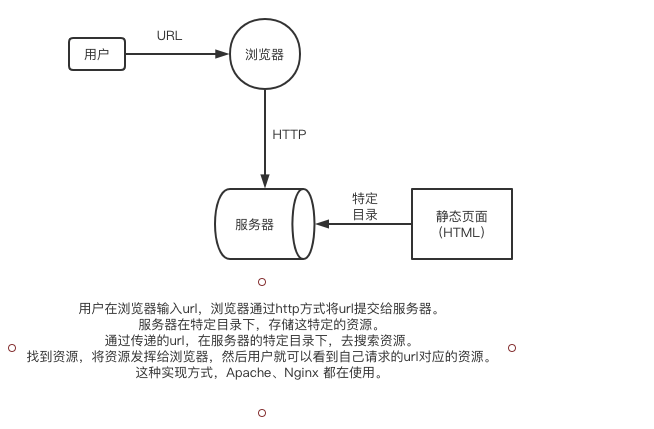
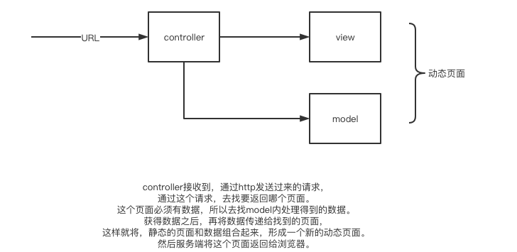

## Java Web 发展史

springboot是当前Java社区最为火热的框架之一。那么springboot为什么这么火热呢？它在Java web的发展历史中充当了什么样的角色呢？Java web又是如何演变到今天这个样子的？springboot的兴起是在什么样的历史条件下的？

### 1. web的产生

静态资源的发布媒介，通过html作为展示，http作为请求的方式，url作为请求的地址。
三者的合作方式：


再然后，我们希望有有动态资源的展示，比如说，特定的人看到不同信息。通过http发送请求，url携带参数，通过参数的不同，返回不同的信息。为了实现这个需求，CGI诞生了。

### 2. CGI的诞生

CGI本质是一种协议/标准。是人们约定俗成、达成共识的一种东西。CGI的规则是这样的，当web服务器接送到http请求的时候，把动态的参数写入环境变量中，然后启动CGI的进程，去处理这个环境变量（获取参数进行处理）。处理完之后，将处理的结果返回给服务器，服务器再返回给浏览器。

有一个问题：一笔请求，就要启动一个CGI程序。耗费资源。当时互联网使用人数还较少的情况下，可以满足条件。但是在今天，这种大数据量的环境下，CGI承担了一定历史时期的任务之后，被淘汰了。（但是，"腾讯"的部分业务还是使用CGI的。C++写服务器代码，php写前端页面。）

### 3. Java的解决方案

- applet，一种浏览器插件。其本质是，将服务器传过来的Java代码在插件中解释执行（客户端执行）。这也有一个弊端，就是代码不能太复杂。所以说，在客户端执行代码不好，随之而来，就有了Servelet。

- servelet = server applet，服务端的解决方案。代码还是放在服务端执行，服务端接收到浏览器发送的http请求之后，要动态的组合一个页面，然后返回给浏览器，让浏览器去展示。
  如何做到动态的组装页面呢？本质就是，将HTML元素和动态的Java代码放到一个大的Servelet类中，然后输出，输出的内容就是我们要动态展现的页面了。

  ```java
  // HTML + Java 举例，动态的展示名字
  out.println("<html><title>");
  out.println("hello" + name);
  out.println("</title></html>")
  ```

  如果这个前端页面很大的话，那么`out.println()`就会有很多很多。整个文件就变得特别的庞大和冗余。因此就有了JSP。

- jsp = java server pages，jsp可以让我们不用写那么多`out.println()`的代码，解决样板代码问题。通过`<% %>`就可以将Java代码嵌入前端的页面中

  ```jsp
  <html>
    <title><%name%></title>
  </html>
  ```

  在前端代码中写Java代码，也有一个问题，要求工程师必须是全栈工程师。既要懂后端的搭建逻辑，又要懂前端的展示逻辑。随着业务的增加，对样式展示的需求，对业务逻辑的需求等等的增加，就要区分出前端工程师和后端工程师。服务端要专注的去写业务逻辑，前端要专注的去写展示和适配的逻辑。前端和后端工程师，看到<% %>不知道是什么，之后就产生了分层的思想。

- mvc分层思想

  ```
  model        JavaBean   数据
  view         JSP        展示
  controller   业务控制类   控制
  (controller接收请求 => 【查找返回页面+生成页面所需数据 = 和展示组合在一起】 => 动态页面)
  ```

  

- ajax，渲染部分页面，js整个技术的一个基石。最早期，整个页面的渲染都是整个页面去渲染。如果一个页面很复杂，那么请求这个页面就要等待很长时间，用户体验很不好。谷歌推出的ajax，将渲染这个页面的方式，变为渲染部分页面。这极大地增加了我们的用户体验，我们打开页面，发现只有某个部分在加载，那么我们就有耐心去等待了。这比什么都看不到，整体渲染，要好得多。

### 4. Spring

出现了mvc分层思想之后，实现这一思想的技术百花齐放，其中较好的当数Spring。其实Spring的出现是为了解决当时的一个很冗余的框架——EJB（当时主流的企业级开发框架，使用起来很复杂，而且其分布式技术，将分层做的很严格，让人用起来很受限。）。当时Spring创始人，发表文章阐述没有EJB行不行。

Spring解决这个问题主要通过两种方式：IoC和AOP。

```
ioc 控制反转 / di 依赖注入
* 本质：构建对象的技术。Spring用工厂来创建对象。
* Spring会创建一个容器，看对象之间的依赖关系。
程序获取对象时，容器会自动注入依赖对象给程序（从容器角度）=> 依赖注入
本应该程序自己来控制对象，但是交给容器帮我们控制（从程序角度）=> 控制反转

aop 面向切面编程
系统中有多个模块，模块A、模块B和模块C，三者有共同的功能：日志打印、异常获取、事务管理等等。如果每个模块都去实现这些代码，很冗余，修改也很麻烦，A、B、C都要修改。解决方式：找到各个模块的交叉关注点，设定为切点，在切点做一个一个切面，在这个切面上做公共的业务。日志打印、异常获取、事务管理这些非核心的业务逻辑，可以用通用的处理方案去解决。这就是aop在开发中充当的角色，与核心业务无关的问题，但是场景很通用，将其抽象出来，让模块A、B、C都能够使用这个交叉关注点。
```

spring看着已经很好了，但是依旧有问题。我们通过xml配置，来使用spring帮助我们管理对象，但是随着业务的增大，配置也会变得繁杂，配置多到难以维护。Spring也意识到了这个问题，从2013年开始SpringBoot项目，历时一年。

### 5. SpringBoot

引导你更便捷的使用Spring。

### 6. 未来

我们已经知道web的发展，经历了静态又经历了动态；经历了CGI又经历了Servelet；衍生出了一系列的框架，最后有一个集大成者——Spring。Spring在使用上还有其复杂性，所以出现了SpringBoot。

我们可以知道，一个新的技术的诞生，是解决一些现存技术的痛点。

**未来——异步化**

