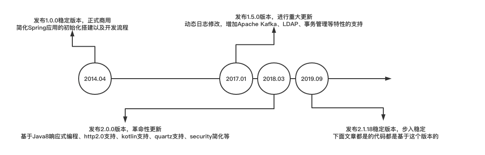

#### SpringBoot的发展

#### SpringBoot与SpringCloud及微服务的关系

SpringCloud是一个大管家，是用来简化分布式系统开发的。比如说，SpringCloud可以帮我们做`"配置管理", "服务注册与发现", "熔断、服务追踪"`等等。将来我们面对的那种大型分布式项目，其实是部署在成百上千台机器上的应用。那么这么多的应用、这么多的机器，我们怎么管理它们的配置、怎么去发现它们的接入服务是否可用、有没有宕机、需不需要熔断、能不能追踪问题，其实是一个非常复杂的过程。SpringCloud其实就是帮助我们解决这些问题的大管家。**在应用程序向单机向集群向云的发展过程中，SpringCloud能更轻松的开发出基于云的应用程序。**SpringCloud本身也是基于SpringBoot，两者相辅相成集成一种微服务，部署在云上的一种架构。

- 微服务是一种分布式系统架构，是一种思想，是一种设计原则。（了解微服务还需要了解：soa、zookeeper、dubbo等等）
- 通过SpringBoot来创建服务，而SpringCloud是关注全局的服务治理框架。
- 基于SpringBoot的特性，我们可以快速构建独立的微服务，是Java领域最优秀的微服务架构落地技术。

#### SpringBoot的特性和优势

##### Features

- Create stand-alone Spring applications
  创建标准、独立的spring应用
- Embed Tomcat, Jetty or Undertow directly (no need to deploy WAR files)
  直接内嵌Tomcat、Jetty、Undertow容器（无需部署war包）
- Provide opinionated 'starter' dependencies to simplify your build configuration
  提供starter依赖，简化构造配置
- Automatically configure Spring and 3rd party libraries whenever possible
  尽可能自动化spring配置和第三方库
- Provide production-ready features such as metrics, health checks, and externalized configuration
  提供准生产环境的特性，如指标、健康检查和外化配置
- Absolutely no code generation and no requirement for XML configuration
  绝对不要代码生成和xml文件

##### 优势

- 使编码更简单
  遵循"约定优于配置"原则
- 使测试更简单
  内置7种测试框架（Junit、SpringBootTest、AssertJ、Hamcrest、Mockito、JSONassert、JsonPath）
- 使部署更简单
  内嵌容器，集成jenkins，支持容器化
- 使监控更简单
  Actuator监控应用健康情况，SpringBoot Admin集群监控工具