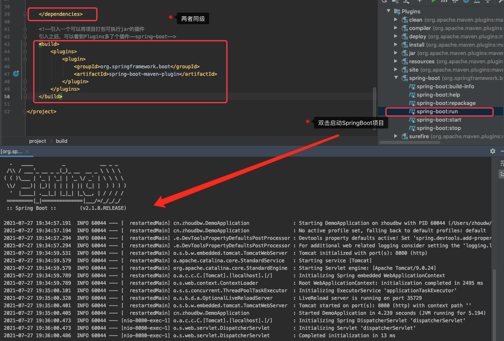
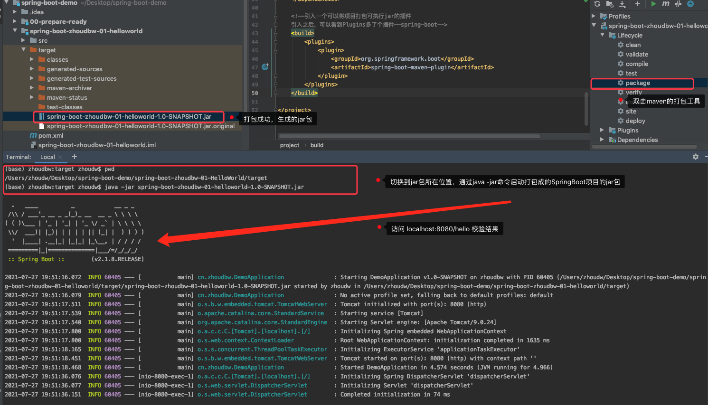

## HelloWorld

### 搭建HelloWorld

- 在pom.xml文件中引入SpringBoot的parent依赖

  ```xml
  <!--超级父pom，是springboot的父依赖
  帮我们集成了很多子依赖，而且声明了版本号
  引入这个父pom，也标志着我们要创建一个SpringBoot的项目-->
  <parent>
    <groupId>org.springframework.boot</groupId>
    <artifactId>spring-boot-starter-parent</artifactId>
    <version>2.1.8.RELEASE</version>
    <relativePath/> <!-- lookup parent from repository -->
  </parent>
  ```

- 创建的是web项目，将web所需要的依赖引入

  ```xml
  <!--创建SpringBoot的web项目所需的依赖
  明显，缺少version这项，是因为版本号已经在parent里面声明过了-->
  <dependency>
    <groupId>org.springframework.boot</groupId>
    <artifactId>spring-boot-starter-web</artifactId>
  </dependency>
  ```

- 创建程序入口DemoApplication.java

  ```java
  package cn.zhoudbw;
  
  import org.springframework.boot.SpringApplication;
  import org.springframework.boot.autoconfigure.SpringBootApplication;
  
  /**
   * @author zhoudbw
   * <p>
   * 这个DemoApplication是程序的入口，所以需要主方法main()
   * 通过SpringApplication类的run()方法，启动SpringBoot程序
   * 通过@SpringBootApplication 声明这个类是SpringBoot类的入口类
   */
  @SpringBootApplication
  public class DemoApplication {
      public static void main(String[] args) {
          // 使用SpringApplication类的静态方法，启动SpringBoot程序
          // 方法参数：程序入口类 main函数的参数
          SpringApplication.run(DemoApplication.class, args);
      }
  }
  ```

- 在入口类的平级目录下创建我们逻辑控制类。（【注意，一定是入口类的同级目录，要不然就找不到入口类了】）

  ```java
  package cn.zhoudbw.controller;
  
  import org.springframework.stereotype.Controller;
  import org.springframework.web.bind.annotation.RequestMapping;
  import org.springframework.web.bind.annotation.ResponseBody;
  
  /**
   * @author zhoudbw
   * @Controller 声明当前类是一个控制类（业务逻辑、请求分发、组装响应）
   */
  @Controller
  public class HelloController {
  
      /**
       * @return 运行该方法，直接返回 字符串"hello world !"
       * 因为返回的是一个字符串，使用@Controller声明当前类之后，会去找视图，而不是直接返回字符串，
       * 所以添加注解 @ResponseBody 直接返回JSON字符串
       * @RequestMapping 指定方法和请求之间的映射关系。
       */
      @RequestMapping("/hello") //方法hello()和请求hello，产生映射关系，请求hello找到hello()方法
      @ResponseBody
      public String hello() {
          return "hello world !";
      }
  }
  ```

- 至此，HelloWorld搭建结束，在入口类中，右键运行，在浏览器输入"localhost:8080/hello"，查看效果。

总结：HelloWorld搭建经过了如下三步：1）引入依赖    2）将SpringBoot的入口打开    3）将逻辑放进去

### 热部署配置

热部署：启动项目之后，如果更改了代码，能够准实时的生效（准实时，说明代码更新还是存在延迟的）。

- pom文件增加依赖引入

  ```xml
  <!--SpringBoot热部署工具的依赖-->
  <dependency>
    <groupId>org.springframework.boot</groupId>
    <artifactId>spring-boot-devtools</artifactId>
    <optional>true</optional>
  </dependency>
  ```

- idea的配置

  ```
  第一步：
  windows : 勾选 File -> Settings -> Build,Execution,Deployment -> Compiler -> build project automatically
  mac : 勾选Preferences ->  Compiler -> build project automatically
  
  第二步：
  windows : 按住：Ctrl + Shift + Alt + / 打开注册中心 勾选compiler.automake.allow.when.app.running
  mac : 按住：command + shift + option + / 打开注册中心 勾选compiler.automake.allow.when.app.running
  ```

注意：热部署很占用机器资源，当涉及频繁的修改代码的时候，最好将热部署关闭。每次修改一点就重启，可能会导致机器卡死。

### 打包可执行jar

SpringBoot中提供了一个插件，可以让我们的代码很方便的打成jar包。

- 在pom文件中，引入插件，和dependencies同级

  ```xml
  <!--引入一个可以将项目打包可执行jar的插件
  引入之后，可以看到Plugins多了个插件——spring-boot-->
  <build>
    <plugins>
      <plugin>
        <groupId>org.springframework.boot</groupId>
        <artifactId>spring-boot-maven-plugin</artifactId>
      </plugin>
    </plugins>
  </build>
  ```

- 有了spring-boot这个插件之后，我们又增加了一种启动SpringBoot项目的方式，双击spring-boot:run
  

- 上面这幅图，增加了SpringBoot的一种新的启动方式，下面进行打包，再提供一种新的SpringBoot的启动方式，通过java -jar启动
  

总结：三种启动SpringBoot项目的方式，
1）直接在入口类右键run    2）引入插件，双击spring-boot:run    3）打包成jar，通过java -jar启动。

注意：启动之后，一定要记得关闭，否则进程将始终占据8080端口。

### 补充：官网HelloWorld搭建

https://spring.io/guides/gs/rest-service/

#### 需求

The service will handle `GET` requests for `/greeting`, optionally with a `name` parameter in the query string. The `GET` request should return a `200 OK` response with JSON in the body that represents a greeting. It should resemble the following output:

```JSON
{
    "id": 1,
    "content": "Hello, World!"
}
```

The `id` field is a unique identifier for the greeting, and `content` is the textual representation of the greeting.

#### 步骤

##### Starting with Spring Initialize

The following listing shows the `pom.xml` file that is created when you choose Maven:

```xml
<?xml version="1.0" encoding="UTF-8"?>
<project xmlns="http://maven.apache.org/POM/4.0.0" xmlns:xsi="http://www.w3.org/2001/XMLSchema-instance"
	xsi:schemaLocation="http://maven.apache.org/POM/4.0.0 https://maven.apache.org/xsd/maven-4.0.0.xsd">
	<modelVersion>4.0.0</modelVersion>
	<parent>
		<groupId>org.springframework.boot</groupId>
		<artifactId>spring-boot-starter-parent</artifactId>
		<version>2.5.2</version>
		<relativePath/> <!-- lookup parent from repository -->
	</parent>
	<groupId>com.example</groupId>
	<artifactId>rest-service-initial</artifactId>
	<version>0.0.1-SNAPSHOT</version>
	<name>rest-service-initial</name>
	<description>Demo project for Spring Boot</description>
	<properties>
		<java.version>1.8</java.version>
	</properties>
	<dependencies>
		<dependency>
			<groupId>org.springframework.boot</groupId>
			<artifactId>spring-boot-starter-web</artifactId>
		</dependency>

		<dependency>
			<groupId>org.springframework.boot</groupId>
			<artifactId>spring-boot-starter-test</artifactId>
			<scope>test</scope>
		</dependency>
	</dependencies>

	<build>
		<plugins>
			<plugin>
				<groupId>org.springframework.boot</groupId>
				<artifactId>spring-boot-maven-plugin</artifactId>
			</plugin>
		</plugins>
	</build>

</project>
```

##### Create a Resource Representation Class

To model the greeting representation, create a resource representation class. To do so, provide a plain old Java object with fields, constructors, and accessors for the `id` and `content` data, as the following listing (from `src/main/java/cn/zhoudbw/restservice/Greeting.java`) shows.

##### Create a Resource Controller

In Spring’s approach to building RESTful web services, HTTP requests are handled by a controller. These components are identified by the [`@RestController`](https://docs.spring.io/spring/docs/current/javadoc-api/org/springframework/web/bind/annotation/RestController.html) annotation, and the `GreetingController` shown in the following listing (from `src/main/java/cn/zhoudbw/restservice/GreetingController.java`) handles `GET` requests for `/greeting` by returning a new instance of the `Greeting` class.

#### 选择一种启动方式，测试。

**官网是如下的方式**

You can run the application from the command line with Gradle or Maven. You can also build a single executable JAR file that contains all the necessary dependencies, classes, and resources and run that. Building an executable jar makes it easy to ship, version, and deploy the service as an application throughout the development lifecycle, across different environments, and so forth.

If you use Maven, you can run the application by using `./mvnw spring-boot:run`. Alternatively, you can build the JAR file with `./mvnw clean package` and then run the JAR file, as follows:

```
java -jar target/gs-rest-service-0.1.0.jar
```

