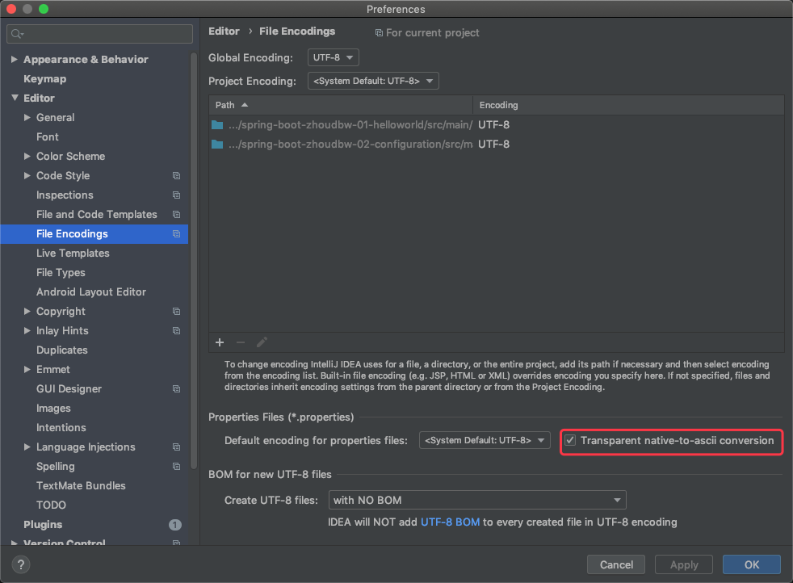
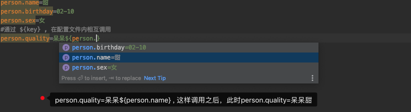
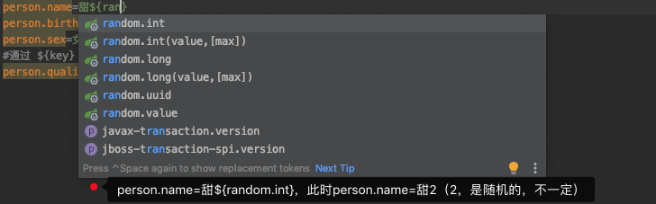
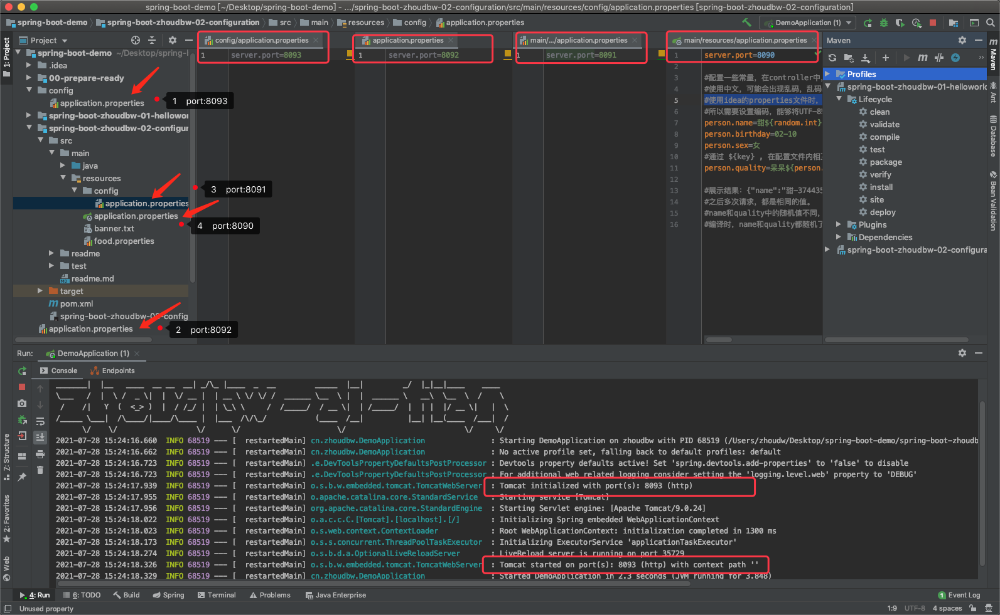

## SpringBoot配置

常用功能查询地址：https://docs.spring.io/spring-boot/docs/current/reference/html/common-application-properties.html

### banner的配置

```bash
- maven工程下，在resource目录下，新建文件banner.txt
- 将自己想要替换的banner放入新建的banner.txt中
- 启动SpringBoot项目，发现banner.txt生效
```

### 启动端口的配置

```
更改启动端口：

方式1 内部配置使用
	- maven工程下，在resource目录下，创建application.properties文件
		& application.properties是一个默认配置名，新建之后，直接写配置即可，可以被识别
	- 写入：server.port=8090
	
方式2 外部配置使用
  - 打包需要启动的jar，假设名字为jarName
  - 通过该命令指定端口，启动打包程序：java -jar jarName.jar --server.port=8090
```

### Json数据格式说明

我们在HelloWorld程序中，为了返回"hello world !"，我们在HelloController.hello()方法上添加了@ResponseBody注解，从而返回JSON格式的字符串。

```java
package cn.zhoudbw.controller;

import cn.zhoudbw.bean.Person;
import org.springframework.web.bind.annotation.RequestMapping;
import org.springframework.web.bind.annotation.RestController;

/**
 * @author zhodbw
 * 这个类，是用来控制返回的数据类型是ＪＳＯＮ的。
 * <p>
 * 如果我们像spring-boot-zhoudbw-01-helloworld中的HelloController一样，用@Controller声明该类是控制类
 * 那么我们使用@RequestMapping映射方法时，方法返回的不是一个字符串，而是一个视图，通过返回的这个字符串去找是否存在这样一个同名的视图
 * <p>
 * 这里，使用@RestController专门用来返回JSON字符串形式的响应结果，而不是视图（像，jsp，html...）
 * 因为@RestControllery源码如下：
 * @Target({ElementType.TYPE})
 * @Retention(RetentionPolicy.RUNTIME)
 * @Documented
 * @Controller
 * @ResponseBody
 * public @interface RestController {
 *     @AliasFor( annotation = Controller.class)
 *     String value() default "";
 * }
 * @RestController实际上就是@Controller和@ResponseBody的组合
 */

@RestController
public class JsonController {

    /**
     * 请求json，返回"Hello Json !"
     * @return  "Hello Json !"
     */
    @RequestMapping("/json")
    public String json() {
        return "Hello Json !";
    }

    /**
     * 只是返回一个单独的字符串，效果还不够明显
     * 我们来看返回一个对象，结果是什么样的？
     *      结果：{"name":"甜","birthday":"02-10","sex":"女","quality":"呆呆"}
     * @return 返回对象信息的json形式
     */
    @RequestMapping("/person")
    public Person person() {
        Person person = new Person("甜", "02-10", "女", "呆呆");
        return person;
    }
}
```

总结：
在spring中json接口开发流程：1）添加JackJSON等相关jar包   2）配置Spring Controller 扫描   3）对接的方法添加@ResponseBody
在springboot中开发流程：1）控制类直接使用注解RestController

### 配置常量

在`application.properties`中配置常量.

```properties
#配置常量
person.name=甜
person.birthday=02-10
person.sex=女
person.quality=呆呆
```

##### 使用注解@Value("${key}")获取常量

```properties
#配置一些常量，在controller中，通过 @Value("${key}") 获取
#使用中文，可能会出现乱码，乱码的出现都是编码格式不同导致的
#使用idea的properties文件时，文件识别的是UTF-8，而项目识别的是ASCII.
#所以需要设置编码，能够将UTF-8转化为ASCII。 settings内搜索encoding，勾选Transparent native-to-ascii conversion
```

设置截图


```java
/**
* 获取application.properties中已经定义的常量
* 通过 @Value("${key}") 为对应的属性赋值
*/
@Value("${person.name}")     private String name;
@Value("${person.birthday}") private String birthday;
@Value("${person.sex}")      private String sex;
@Value("${person.quality}")  private String quality;

/**
* 直接通过上面注入的值进行赋值
* @return person信息的json表现形式
* 展示结果：{"name":"甜","birthday":"02-10","sex":"女","quality":"呆呆"}
*/
@RequestMapping("/value")
public Person value() {
  Person person = new Person(name, birthday, sex, quality);
  return person;
}
```

###### 配置的常量在配置文件内相互调用



###### 配置的常量在文件中支持随机值



注意：这个随机值，在properties编译时就确定了，所以随机值，只随机一次，后面就确定了。

#### 绑定bean获取常量（官方推荐）

- 创建一个需要与配置文件绑定的bean

  ```java
  package cn.zhoudbw.cn.zhoudbw.config;
  
  
  /**
   * @author zhoudbw
   * 这个类是为了绑定application.properties中的常量的
   * 主要问题就是，怎么说明，这个类就是我们配置文件对应的类？—— 通过@ConfigurationProperties声明 —— 声明这是一个配置文件对应的类
   * 注意，需要引入依赖：看看官方文档怎么说：
   * You can easily generate your own configuration metadata file
   * from items annotated with @ConfigurationProperties by using the spring-boot-configuration-processor jar.
   * The jar includes a Java annotation processor which is invoked as your project is compiled.
   * To use the processor, include a dependency on spring-boot-configuration-processor.
   */
  
  import org.springframework.boot.context.properties.ConfigurationProperties;
  
  /**
   * 在@ConfigurationProperties中指定prefix，代表我们从配置文件的哪个路径下去查找，也就是一级目录
   * 我们的配置文件是这样配置的：
   * person.name=甜${random.int}
   * person.birthday=02-10
   * person.sex=女
   * person.quality=呆呆${person.name}
   * 所以，一级目录就是 person
   * @author zhoudw
  package cn.zhoudbw.cn.zhoudbw.config;
  
  
  /**
   * @author zhoudbw
   * 这个类是为了绑定application.properties中的常量的
   * 主要问题就是，怎么说明，这个类就是我们配置文件对应的类？—— 通过@ConfigurationProperties声明 —— 声明这是一个配置文件对应的类
   * 注意，需要引入依赖：看看官方文档怎么说：
   * You can easily generate your own configuration metadata file
   * from items annotated with @ConfigurationProperties by using the spring-boot-configuration-processor jar.
   * The jar includes a Java annotation processor which is invoked as your project is compiled.
   * To use the processor, include a dependency on spring-boot-configuration-processor.
   */
  
  import org.springframework.boot.context.properties.ConfigurationProperties;
  
  /**
   * 在@ConfigurationProperties中指定prefix，代表我们从配置文件的哪个路径下去查找，也就是一级目录
   * 我们的配置文件是这样配置的：
   * person.name=甜${random.int}
   * person.birthday=02-10
   * person.sex=女
   * person.quality=呆呆${person.name}
   * 所以，一级目录就是 person
   * @author zhoudw
   */
  @ConfigurationProperties(prefix = "person")
  public class PersonConfig {
  
      private String name;
      private String birthday;
      private String sex;
      private String quality;
  
      /**
       * 只写有参数构造方法，不写无参构造方法造成如下问题：
       * Parameter 0 of constructor in cn.zhoudbw.cn.zhoudbw.config.PersonConfig required a bean of type 'java.lang.String' that could not be found.
       *
       * The injection point has the following annotations:
       * 	- @org.springframework.beans.factory.annotation.Autowired(required=true)
       *
       * 这个问题是因为在创建实体类时创建了一个多参的构造方法，但是springboot 自动注入的时候使用的是无参构造方法。
       * 解决办法：在实体类中添加无参构造方法。
       */
      public PersonConfig() {
      }
  
      public void setName(String name) {
          this.name = name;
      }
  
      public void setBirthday(String birthday) {
          this.birthday = birthday;
      }
  
      public void setSex(String sex) {
          this.sex = sex;
      }
  
      public void setQuality(String quality) {
          this.quality = quality;
      }
  
      public String getName() {
          return name;
      }
  
      public String getBirthday() {
          return birthday;
      }
  
      public String getSex() {
          return sex;
      }
  
      public String getQuality() {
          return quality;
      }
  }
  ```

- 引入依赖

  ```xml
  <!--添加配置处理器，为了使用@ConfigurationProperties，使得类与application.properties对应-->
  <dependency>
    <groupId>org.springframework.boot</groupId>
    <artifactId>spring-boot-configuration-processor</artifactId>
    <optional>true</optional>
  </dependency>
  ```

- 告诉入口类，这个类是一个配置类，通过@EnableConfigurationProperties(ConfigBean.class)

  ```java
  package cn.zhoudbw;
  
  import cn.zhoudbw.cn.zhoudbw.config.PersonConfig;
  import org.springframework.boot.SpringApplication;
  import org.springframework.boot.autoconfigure.SpringBootApplication;
  import org.springframework.boot.context.properties.EnableConfigurationProperties;
  
  /**
   * @author zhoudbw
   */
  @SpringBootApplication
  @EnableConfigurationProperties(PersonConfig.class)//这个注解，告诉主程序要主动引入配置，配置文件对应的类作为它的参数
  public class DemoApplication {
      public static void main(String[] args) {
          SpringApplication.run(DemoApplication.class, args);
      }
  }
  ```

- 在controller内使用

  ```java
  /**
       * 为PersonConfig注入值，并使用PersonConfig初始化Person
       * 注意springboot注入的时候使用的是无参构造方法，所以PersonConfig内的无参构造器不能少。
       */
      @Autowired
      private PersonConfig personConfig;
      @RequestMapping("/bean")
      public Person bean() {
          Person person = new Person(personConfig.getName(),
                                      personConfig.getBirthday(),
                                      personConfig.getSex(),
                                      personConfig.getQuality());
          return person;
      }
  ```

- 启动springboot，访问localhost:8090/bean 查看效果。


**上面的情况是，一个bean、一个配置文件。那么如果存在现在的情况是多个配置文件呢？**

- 添加新的配置文件：食物（地三鲜）

  ```properties
  #food.properties -> 对应食物中的地三鲜
  food.potato=土豆
  food.eggplant=茄子
  food.greenPepper=青椒
  ```

- 创建food.properties对应的配置类FoodConfig

  ```java
  package cn.zhoudbw.cn.zhoudbw.config;
  
  import org.springframework.boot.context.properties.ConfigurationProperties;
  import org.springframework.context.annotation.Configuration;
  import org.springframework.context.annotation.PropertySource;
  
  /**
   * @author zhoudbw
   * 通过三个注解去将该配置类和配置文件构成映射关系
   * food.potato=土豆
   * food.eggplant=茄子
   * food.greenPepper=青椒
   *
   * @Configuration  声明这是一个配置类，在spring中可以替代xml文件，因为springboot说，绝对不要xml，所以我们用这个来声明的
   * @ConfigurationProperties(prefix = "food")  声明该类对应一个配置文件，并且声明前缀
   * @PropertySource("classpath:food.properties")   声明配置文件所在的地址，创建在了resource目录下面，所以使用classpath代表resource，跟文件名字
   *
   */
  
  @Configuration
  @ConfigurationProperties(prefix = "food")
  @PropertySource("classpath:food.properties")
  public class FoodConfig {
  
      private String potato;
      private String eggplant;
      private String greenPepper;
  
      public FoodConfig() {}
  
      public String getPotato() {
          return potato;
      }
  
      public void setPotato(String potato) {
          this.potato = potato;
      }
  
      public String getEggplant() {
          return eggplant;
      }
  
      public void setEggplant(String eggplant) {
          this.eggplant = eggplant;
      }
  
      public String getGreenPepper() {
          return greenPepper;
      }
  
      public void setGreenPepper(String greenPepper) {
          this.greenPepper = greenPepper;
      }
  }
  ```

- 创建FoodConfig对应的数据接收类Food

  ```java
  package cn.zhoudbw.bean;
  
  /**
   * @author zhoudbw
   * 配合配置类来使用，充当数据的容器（数据接收）
   * 也许我们回想，直接返回FoodConfig 不就好了，分层的设计思想，让我们规范化
   */
  public class Food {
  
      private String potato;
      private String eggplant;
      private String greenPepper;
  
      /**
       * 数据接收类的全参构造方法，方便赋值
       * @param potato 土豆
       * @param eggplant 茄子
       * @param greenPepper 青椒
       */
      public Food(String potato, String eggplant, String greenPepper) {
          this.potato = potato;
          this.eggplant = eggplant;
          this.greenPepper = greenPepper;
      }
  
      public String getPotato() {
          return potato;
      }
  
      public String getEggplant() {
          return eggplant;
      }
  
      public String getGreenPepper() {
          return greenPepper;
      }
  }
  ```

- 在controller中使用，然后访问验证

  ```java
  /**
  * 具有多个配置文件时，如何进行bean的绑定
  * 通过@Configuration @ConfigurationProperties(prefix = "xxx") @PropertiesSource("classpath:xxx.properties")
  *
  * 访问：localhost:8090/beans
  * 展示：{"potato":"土豆","eggplant":"茄子","greenPepper":"青椒"}
  */
  @Autowired
  private FoodConfig foodConfig;
  @RequestMapping("/beans")
  public Food beans() {
    return new Food(foodConfig.getPotato(),
                    foodConfig.getEggplant(),
                    foodConfig.getGreenPepper());
  }
  ```

### 配置文件的优先级

```
1. 在相对于应用程序运行目录的 /congfig子目录里。 外置，优先级最高

2. 在应用程序运行的目录里。外置优先级次高

3. src/main/resources/config下。内置，优先级第三高

4. src/main/resources下。内置优先级最低

* application.properties和application.yml在同一位置时，properties的优先级更高。
```

我们通过端口的配置，来演示配置文件所处位置的优先级。

- `在resources目录下创建 application.properties`

  ```properties
  server.port=8090
  #此时启动springboot项目，端口为8090
  ```

- `在resources目录下创建 /cn.zhoudbw.config/application.properties`

  ```properties
  server.port=8091
  #此时启动springboot项目，端口为8091
  #说明该配置文件，优先级更高
  ```

- `在项目的根路径下创建 application.properties,需要注意的是我们创建的是模块，所以根目录应该是在模块之外`

  ```properties
  server.port=8092
  #此时启动springboot项目，端口为8092
  #说明该配置文件，优先级更高
  ```

- `在项目的根路径下创建 /cn.zhoudbw.config/application.properties`

  ```properties
  server.port=8093
  #此时启动springboot项目，端口为8093
  #说明该配置文件，优先级更高
  ```



说明：虽然我们看到端口改变了，但是最高优先级的配置文件中是没有数据的，但是我们发送请求，却可以拿到展示数据这是怎么回事呢？其实，每个配置文件都被读取了，只不过出现重复设置的配置时，最高优先级的被作用于整个工程，其他的不被作用。没有重复设置的配置，即使是最低优先级的也会被显示。—— 互不配置的原则。

```
补充：
* 指定配置文件的位置可以使用spring.cn.zhoudbw.config.location，各文件均会加载，互补配置。
在edit configuration的program arguments中配置，比如想要/User/zhoudbw/application.properties作为配置文件：
--spring.cn.zhoudbw.config.location=/User/zhoudbw/application.properties
在program arguments内配置的参数，就相当于是执行java -jar 所携带的参数。

也可以在VM options中配置，比如想要/User/zhoudbw/application.properties作为配置文件：
-Dspring.cn.zhoudbw.config.location=/User/zhoudbw/application.properties

这种指定外部文件作为配置文件的方案其实是很好用的，因为我们使用互不配置的原则来加载配置文件，当项目已经打包好了，发现少了一些配置或者要更改一些配置，那么就可以通过这种外部配置的方式，灵活的进行增加和删除，因为优先级的问题，会被覆盖。
```

### 多环境配置使用

#### 以前多环境使用的方式

通过配置文件名字的不同，来标识不同的生产环境。

文件名字的格式：application-{profile}.properties，其中{profile}对应你的环境标识，如：application-dev.properties对应开发环境、 application-prod.properties对应生产环境 。

#### 当前多环境使用的方式

用@Profile注解来进行配置，例如数据库配置spring.profiles.active=testdb
同时支持外部命令 java -jar xxx.jar --spring.profiles.active=dev 

除了spring.profiles.active来激活一个或者多个profile之外，还可以用spring.profiles.include来叠加profile。
spring.profiles.active: testdb
spring.profiles.include: proddb,prodmq 