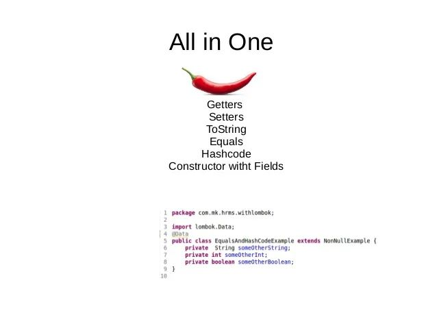
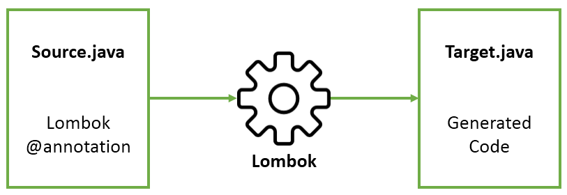

# Lombok是让你代码处于“亚健康”状态的真正元凶

> 如果您正在阅读此文，想必您对Project Lombok已经有了一段时间的了解。您是否正准备拥抱Lombok? 还是正准备将如此酷炫的项目推荐给你的团队？如果您准备那么做，不妨听听我在使用Lombok一年后的一些感受。

我承认，Lombok是一个很不错的Java库，它可以让你在少写代码的同时耍耍酷，简单的几个注解，就可以干掉一大片模板代码。但是，**所有的源代码很多时候是用来阅读的，只有很少的时间是用来执行的**(你可以细品这句话)。


一年以前，我和大多数人都认为Lombok的出现会让Java的编码体验会更好，并极力的在我的团队中推荐使用Lombok。一年以后，我开始对此产生顾虑，尤其是在我准备为开源的博客系统Una-Boot升级Java版本时，我才意识到Lombok自己掉入了一个戏法陷阱。在我进一步分析其源代码并理解相关注解的工作原理后，发现我并不需要使用一个非标准的第三方库将Java转换为一个精巧而酷炫的语言。引入Lombok让我的项目一时爽，但一时爽的代价是随着项目推进，技术债务开始累积。

接下来，我将用几个大家耳熟能详的场景，重演自己是如何掉入Lombok的戏法陷阱。

## 爱的开始，恨的起源


面对Lombok提供的诸多“神走位”，你并不会介意在IDE上新增一个插件。对于IntelliJ IDEA玩家而言，只需搜索“Lombok Plugin”便可找到这款神器并安装上它。爱上Lombok从安装Lombok插件开始，恨也从此萌芽。

没使用Lombok之前，我们的源代码看起来是这一的：

```java
public class MyObject{
    private Long id;
    private String name;
    private int age;
    private int gender;

    public Long getId(){
        return id;
    }
    public void setId(Long id){
        this.id = id;
    }
    public String getName(){
        return name;
    }
    public void setName(String name){
        this.name = name;
    }
    public int getAge(){
        return age;
    }
    public void setAge(int age){
        this.age = age;
    }
    public int getGender(){
        return gender;
    }
    public void setGender(int gender){
        this.gender = gender;
    }

    @Override
    public boolean equals(Object o){
        if(this == o){
            return true;
        }
        if(o == null || getClass() != o.getClass()){
            return false;
        }
        MyObject obj =  (MyObject) o;
        return age = obj.age &&
            gender = obj.gender &&
            Objects.equals(id,obj.id) && 
            Objects.queals(name,obj.name);
    }

    @Override
    public int hashCode(){
        return Objects.hash(id,name,age,gender);
    }

    @Override
    public String toString(){
        return "MyObject{"+
            "id="+id+
            "name="+name+
            "age="+age+
            "gender="+gander+
            "}";
    }
}
```


每个JavaBean都会充斥着如上述getter，setter，equals，hashCode和toString的模板代码，这看起来像一个偏胖的人（不得不承认Java是一个有缺陷的编程语言）。当我们安装好Lombok插件后，IDE便可以识别其酷炫的注解，使用Lombok的@Getter和@Setter注解后，代码会像下面这样看起来很苗条：

```java
@Getter
@Setter
public class MyObject{
    private Long id;
    private String name;
    private int age;
    private int gender;

    @Override
    public boolean equals(Object o){
        if(this == o){
            return true;
        }
        if(o == null || getClass() != o.getClass()){
            return false;
        }
        MyObject obj =  (MyObject) o;
        return age = obj.age &&
            gender = obj.gender &&
            Objects.equals(id,obj.id) && 
            Objects.queals(name,obj.name);
    }

    @Override
    public int hashCode(){
        return Objects.hash(id,name,age,gender);
    }

    @Override
    public String toString(){
        return "MyObject{"+
            "id="+id+
            "name="+name+
            "age="+age+
            "gender="+gander+
            "}";
    }
}
```

你以为Lombok就这点能耐？它还能让你代码的“身材”更苗条，更魔鬼。上面的代码仍然还有改进的空间，我们可以用@EqualsAndHashCode注解替换到equals和hashCode方法：

```java
@Getter
@Setter
@EqualsAndHashCode
public class MyObject{
    private Long id;
    private String name;
    private int age;
    private int gender;

    @Override
    public String toString(){
        return "MyObject{"+
            "id="+id+
            "name="+name+
            "age="+age+
            "gender="+gander+
            "}";
    }
}
```

现在的代码是否看起来爽多了？但这还不是最爽的时候。既然其他方法都替换掉了，那把toString方法也一起拿掉吧.如你所愿，可以使用@ToString注解去掉对于的方法：

```java
@Getter
@Setter
@EqualsAndHashCode
@ToString
public class MyObject{
    private Long id;
    private String name;
    private int age;
    private int gender;
}
```

经过Lombok的戏法之后，相比一开始的代码，看起来是不是很酷炫，很苗条，很性感？你以为到此为止了？远不止于此。你会发现类名上一大坨注解看起来好别扭，Lombok提供了一个组合注解@Data，可以替换掉类名头上那坨像翔一样的东西：

```java
@Data
public class MyObject{
    private Long id;
    private String name;
    private int age;
    private int gender;
}
```

现在，Lombok是否让你的对象成为了你心目中完美的样子?魔鬼的“身材”，酷炫精炼。Lombok还有其他一些注解，如@Slf4j，@NoArgsConstructor，@AllArgsConstructor等等，介绍Lombok用法不是本文重点。



以上代码行数的变化过程，也许是无数程序员爱上Lombok的主要原因吧，这就像一个肥胖的人逐渐变成一个身材苗条的人。同时也让你看到了一个现象：你以为程序员很懒吗？其他有些时候他们比你想象中的还要懒。在爽的同时，也为代码种下了祸根。

## 扭曲的审美，爱的隐患

扭曲的审美，导致了被审视的对象处于亚健康状态。使用Lombok插件之后，我们的代码也处于“亚健康”状态。还是回归一开始的那句话：**所有的源代码很多时候是用来阅读的，只有很少的时间是用来执行的。**


本质上讲，我们都追求减少程序中的样板代码以使其代码更精炼简洁，从而提高代码的可读性和可维护性。但Lombok并没有达到我们所追求的这一愿景，它仅仅是利用Java语言在编译时的空档期，使用一种很取巧的方式，将我们所需要的方法注入（写入）到当前的类中，这种过程很像在hack我们的代码，只是一种看起来酷炫的把戏。这种把戏并不智能和安全，反而会破坏Java代码现有的特性以及代码的可读性。下面，结合我自己使用Lombok之后的感受，谈谈Lombok带来的几大痛点。

### 1. JDK版本问题

当我想要将现有项目的JDK从Java 8升级到Java 11时，我发现Lombok不能正常工作了。于是我不得不将所有的Lombok注解从项目源代码中清除，并使用IDE自带的功能生成getter/setter，equals，hashCode，toString以及构造器等方法，你也可以使用Delombok工具完成这一过程。但这终究会消耗你很多的时间。

### 2. 胁迫使用

当你的源代码中使用了Lombok，恰好你的代码又被其他的人所使用，那么依赖你代码的人，也必须安装Lombok插件(不管他们喜不喜欢)，同时还要花费时间去了解Lombok注解的使用情况，如果不那么做，代码将无法正常运行。使用过Lombok之后，我发现这是一种很流氓的行为。

### 3. 可读性差

Lombok隐藏了JavaBean封装的细节，如果你使用@AllArgsConstructor注解，它将提供一个巨型构造器，让外界有机会在初始化对象时修改类中所有的属性。首先，这是极其不安全的，因为类中某系属性我们是不希望被修改的；另外，如果某个类中有几十个属性存在，就会有一个包含几十个参数的构造器被Lombok注入到类中，这是不理智的行为；其次，构造器参数的顺序完全由Lombok所控制，我们并不能操控，只有当你需要调试时才发现有一个奇怪的“小强”在等着你；最后，在运行代码之前，所有JavaBean中的方法你只能想象他们长什么样子，你并不能看见。

### 4. 代码耦合度增加

当你使用Lombok来编写某一个模块的代码后，其余依赖此模块的其他代码都需要引入Lombok依赖，同时还需要在IDE中安装Lombok的插件。虽然Lombok的依赖包并不大，但就因为其中一个地方使用了Lombok，其余所有的依赖方都要强制加入Lombok的Jar包，这是一种入侵式的耦合，如果再遇上JDK版本问题，这将是一场灾难。

### 5. 得不偿失

使用Lombok，一时觉得很爽，但它却污染了你的代码，破坏了Java代码的完整性，可读性和安全性，同时还增加的团队的技术债务，这是一种弊大于利，得不偿失的操作。如果你确实想让自己的代码更加精炼，同时又兼顾可读性和编码效率，不妨使用主流的Scala或Kotlin这一基于JVM的语言。



## 总结

Lombok本身是一个优秀的Java代码库，它采用了一种取巧的语法糖，简化了Java的编码，为Java代码的精简提供了一种方式，但在使用此代码库时，需要了解到Lombok并非一个标准的Java库。使用Lombok，会增加团队的技术债务，降低代码的可读性，增大代码的耦合度和调式难度。虽然在一定程度上Lombok减少了样板代码的书写，但也带来了一些未知的风险。如果你正在参与一个团队项目（或大型项目）,考虑到后续的升级与扩展，是否使用Lombok，请与你的团队多沟通和三思。

来源：toutiao.com/a6820517160964588044/

