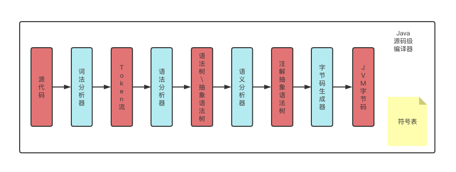

## Lombok插件

Lombok是一个可以通过注解形式来帮助我们简化消除样板式代码的工具。通过使用注解，可以在编译源码的时候生成对应的方法。

### Lombok插件的使用

`1. idea安装插件`

```
File -> setting -> plugins -> 查找lombok后安装重启 
File -> Setting -> Compiler -> Annotation Processors -> Enable annotation processing勾选 
```

`2. pom引入依赖 `

```xml
<dependency> 
  <groupId>org.projectlombok</groupId> 
  <artifactId>lombok</artifactId> 
  <version>1.18.10</version> 
</dependency>
```

`3. lombok插件常用注解`

```apl
@Getter / @Setter：可以作用在类上和属性上，
放在类上，会对所有的非静态(non-static)属性生成 Getter/Setter方法，
放在属性上，会对该属性生成Getter/Setter方法。
并可以指定Getter/Setter方法的访问级别。 

@EqualsAndHashCode：默认情况下，会使用所有非瞬态(non-transient)和非静态(non-static)字段来生成equals和hascode方法，也可以指定具体使用哪些属性。 

@ToString：生成toString方法，默认情况下， 会输出类名、所有属性，属性会按照顺序输出，以逗号分割。 

@NoArgsConstructor, @RequiredArgsConstructor and @AllArgsConstructor：无参构造器、部分参数构造器、全参构造器 

@Data：包含@ToString, @EqualsAndHashCode, 所有属性的@Getter, 所有non-final属性的@Setter 和@RequiredArgsConstructor的组合，通常情况下，基本上使用这个注解就足够了。 

@Budilder：可以进行Builder方式初始化。 

@Slf4j：等同于：private final Logger logger = LoggerFactory.getLogger(XXX.class);
```

### Lombok插件实现的原理

#### java编译

Java的编译实际上就是我们使用的javac命令，其实际上是一种编译器。所谓编译，就是将一种语言规范转化成另一种语言规范的过程。所谓javac，就是将人们能够理解的Java语言转化成JVM能够理解的二进制字节。

#### java编译过程



Java的编译过程如果从大的角度去说，分为四步：词法分析、语法分析、语义分析、字节码生成。

```
词法分析：找出关键词（if、else、for、break、...）；分析的结果，就是从源代码中找出了一些规范化的token流(一个关键词当做一个token，很多关键词组合在一起就是token流)。

语法分析：检查关键词组合在一起（一个一个代码块）是否符合Java语言规范，并将词组组成语句。分析的结果，就是形成一个符合Java语言规定的抽象语法树（结构化的语法表达形式）。 

语义分析：把一些难懂的，复杂的语法转化成更简单的语法（foreach转化为for等等）。分析的结果，生成注解的抽象语法树。

字节码生成：遍历抽象语法树生成符合JVM规范的二进制代码。
```

总结来说就是：通过分析分解，按照一定的方式，先转化成简单的流、再将流转化为简单的框架（简单的树）、再通过把复杂的解析成简单的，细致化这颗树的内容、最后将这棵树（也就是语法内容）转化成JVM能够解析的二进制代码。

#### Lombok插件原理

```
实现的原理：主要是通过抽象语法树(AST)，在编译处理后，匹配到有其注解的类，那么注解编译器就会自动去匹配，项目中的注解对应到在lombok语法树中的注解文件，并经过自动编译匹配来生成对应类中的注解所对应的方法，达到简化代码的目的。

* 其注解的类：指的是写有Lombok提供给我们的注解的类
* 项目中的注解：指的是我们添加的@Setter、@Getter、@Data等注解

举个例子来说：
@Getter@Setter
public class Person {
	private String name;
	private String sex;
}
在编译的时候，我们写了Lombok的两个注解@Getter和@Setter，最终生成注解抽象语法树，此时Lombok的注解是在这颗注解抽象语法树上的，接下来是要将这个抽象语法树上的内容转化为JVM认识的二进制代码，在这过程中，Lombok匹配到自己的注解，在自己的语法树上找到解析完毕的注解文件，从而生成对应类的getter和Setter方法的二进制代码，起到简化代码的作用。

* 其本质上是，定义了一个语法结构，让我们去使用。在最终分析的时候，让抽象语法树能够变化。
```

