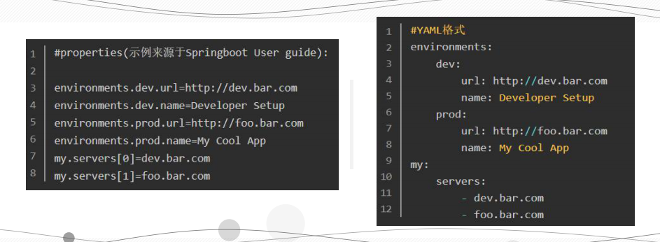

## YAML（官方推荐的配置文件）

为什么yaml能够打败xml、打败json、打败properties，成为官方最推荐的一种文件格式呢？

properties的展示形式是平铺的，不是很清晰的看到层次结构。yaml能够清晰的看到层级关系，对于复杂的结构能够清晰的展现出来（定义了一些yaml支持的语法格式）。


```
总结：
① 在Springboot中，推荐使用properties或者YAML文件来完成配置，但是对于较复杂的数据结构来说，YAML远远优于properties。 
② properties需要使用大量的路径来描述层级。 其次，对于较为复杂的结构，比如数组，写起来更为复杂。
```

- YAML = **YAML Ain't Markup Language**。设计目标：方便读写。

### 语法规则

#### YAML 的书写规范

```
* 大小写敏感 
* 使用缩进表示层级关系 
* 缩进时不允许使用Tab键，只允许使用空格。 
* 缩进的空格数目不重要，只要相同层级的元素左侧对齐即可 
* # 表示注释，从这个字符一直到行尾，都会被解析器忽略。
```

#### 示例

`* 利用yaml改写下面的properties文件，并启动springboot项目，验证效果：`

```properties
server.port=8090
person.name=甜
person.birthday=02-10
person.sex=女
person.quality=呆呆
```

```yaml
server:
  port: 8090

person:
  name: 甜
  birthday: 02-10
  sex: 女
  quality: 呆呆
# key: value , 冒号之后一定要有空格，然后再写值。
```

```
YAML 支持的数据结构有三种：
* 对象：键值对的集合，又称为映射（mapping）/ 哈希（hashes） / 字典 （dictionary）
* 数组：一组按次序排列的值，又称为序列（sequence） / 列表（list）
* 纯量（scalars）：单个的、不可再分的值
```

#### yaml对象

```abap
语法规则 

* 使用冒号
  key: value 

* 使用缩进 
	key: 
	  child-key: value 
	  child-key2: value2 

* 流式(flow)语法
  key: {child-key: value, child-key2: value2}
```

#### 示例

```yaml
#使用流式语法，改写上述person
person: {name: 甜, birthday: 02-10, sex: 女, quality: 呆呆}
```

#### yaml数组

```abap
语法规则

* 使用一个短横线加一个空格代表一个数组项
  cn.zhoudbw.config: 
    - Properties 
    - YAML 

* 简化版
  - 
    - Properties 
    - YAML
    
* 复杂例子 
  configs: 
    -
      id: 1
      name: Properties
      feature: Common
    - 
      id: 2 
      name: YAML
      feature: Simple
```

#### 示例

```yaml
person:
  name: 甜
  birthday: 02-10
  sex: 女
  quality:
          - 呆呆
          - 胖胖
```

#### yaml纯量

```abap
包括：整数，浮点数，字符串，NULL，日期，布尔，时间。 

* boolean: 
    - TRUE #true,True都可以
    - FALSE #false，False都可以 

* float:
    - 3.14 
    - 6.8523015e+5 #可以使用科学计数法

* int:
    - 123 
    - 0b1010_0111_0100_1010_1110 #二进制表示 
    
* null:
    nodeName: 'node'
    parent: ~ #使用~表示null

* string: 
    - 哈哈 #字符串默认不使用引号
    - 'Hello world' #可以使用双引号或者单引号包裹特殊字符
    - newline 
      newline2 #字符串可以拆成多行，每一行会被转化成一个空格

* date: 
    - 2018-02-17 #日期必须使用ISO 8601格式，即yyyy-MM-dd

* datetime:
    - 2018-02-17T15:02:31+08:00 #时间使用ISO 8601格式，时间和日期之间使用T连接，最后使用+代表时区
```

#### Yaml中一些特殊符号

```
* --- YAML可以在同一个文件中，使用---表示一个文档的开始。 
	& 一个yaml文件可以同时表达多个yaml文件，通过---表示各自文件的开始

* ... 和---配合使用，在一个配置文件中代表一个文件的结束。 

* !! YAML中使用!!做类型强行转换 

* >在字符串中折叠换行，| 保留换行符 

* 引用：重复的内容在YAML中可以使用&来完成锚点定义，使用*来完 成锚点引用。 

* 合并内容：主要和锚点配合使用，可以将一个锚点内容直接合并到一 个对象中。
```

```yaml
* 演示多环境使用, 演示不同环境下，选择的配置文件不同，从而启动的端口不一样。

person:
  name: 甜
  birthday: 02-10
  sex: 女
  quality: 呆呆

# 通过spring.profiles.active 选择需要激活的配置
spring:
  profiles:
    active: dev

# 通过选择不同的yaml，来选择不同的端口，演示多环境使用

---
# 开发环境
spring:
  profiles: dev
server:
  port: 8090

---
# 生产环境
spring:
  profiles: prod
server:
  port: 8010
```

