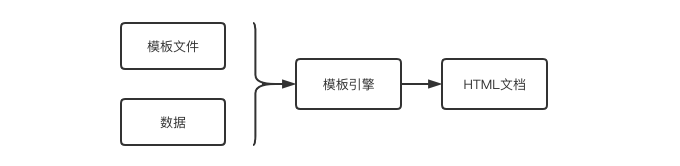
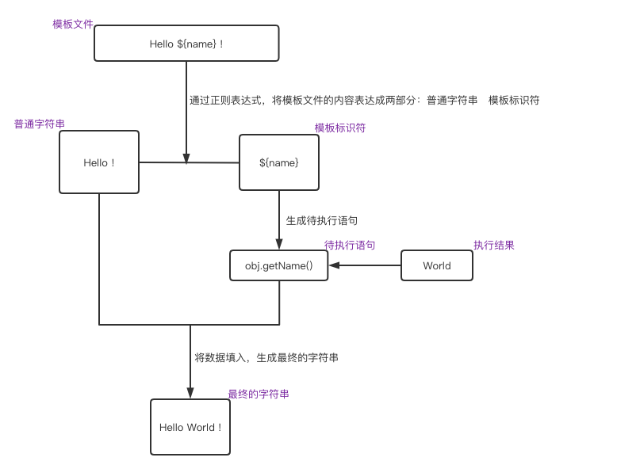
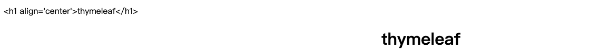

## 模板引擎发展史

java web的前后端分离路程分为三个阶段：jsp / 模板引擎(freemarker、thymeleaf、beetl) / 彻底分离vue、react。

### 模板发展阶段

- **jsp**
  jsp的本质就是`html + java代码`组成一个大的`Servelet类`，将其放到`容器`中执行。有一个问题，因为这个类即放了java代码又放了html，显得很庞杂，也不利于维护。其本质也是一种模板。通过规则和标签抽象出来的一种模板。

- **模板引擎**
  freemarker、velocity、thymeleaf、beet(国人开创，据说性能很高)

- **基于api的前后端分离**
  后端只提供api，前端去开发HTML的页面。要想深切的了解前后端分离，需要明确几个概念：

  - web服务器：解析静态资源（比如：Nginx、Apache）
  - 应用服务器：解析静态和动态资源。（解析静态资源的能力没有web服务器好，如：Tomcat、Jetty）
  - 对比web服务器和应用服务器的关系：web服务器就相当于"前台接待"，应用服务器就相当于"核心价值提供者"。一般web服务器是被用来外网访问的，而应用服务器是被web服务器访问的，只能内网访问。

  前后端分离的解决方案（一种通用的解决方案）：Tomcat + Nginx。将服务端代码部署到应用服务器上，将前端代码部署到web服务器上。web服务器通过ajax请求去访问应用服务器的api，应用服务器响应json数据给web服务器，然后页面和数据组合，形成最终的页面。

  `nginx(前端代码) -> ajax请求api -> tomcat(服务端代码) -> json格式数据`

### 模板引擎的原理

 

模板的诞生是为了将显示与数据相分离，其本质是将模板文件和数据通过模板引擎生成最终的HTML代码。模板引擎的实现方式，是利用正则表达式识别模板标识，然后将数据替换其中的标识符。

```
引擎执行过程：
• 利用正则表达式分解出普通字符串和模板标识符 
• 将模板标识符转换成普通的语言表达式 
• 生成待执行语句 
• 将数据填入执行，生成最终的字符串
```



## FreeMarker整合

`1. 引入freemarker的maven依赖`

```xml
<!--freemarker模板的依赖-->
<dependency>
  <groupId>org.springframework.boot</groupId>
  <artifactId>spring-boot-starter-freemarker</artifactId>
</dependency>
```

`2. 指定模板文件的存储位置,在application.yaml中配置`

```yaml
# 设置模板页面的位置（模板是spring.mvc.view层）
spring:
  mvc:
    view:
      prefix: /template/  # 路径(文件位置)，这个位置不能修改，默认就是这个位置，且template前后 / 不能遗漏
      suffix: .ftl        # 后缀(文件类型)，由于使用的是freemarker，而freemarker的后缀是.ftl，所以设置.ftl
```

`3. 编写页面代码，确定需要哪些数据`

```freemarker
<!DOCTYPE html>
<html>
<head lang="en">
    <meta charset="UTF-8"/>
    <title></title>
</head>
<body>

<#--从下述代码我们可以看出，freemarker可以通过${key}取值
可以通过${string ${key}} 大括号套大括号的形式拼接值
可以通过${string + key + string} 加号的形式拼接字符串
-->
Hi FreeMarker. 现在时间是 ${now} !<br/>
${"Hi FreeMarker. 现在时间是 ${now} !"}<br/>
${"Hi FreeMarker. 现在时间是 " + now+ " !"}<br/>

<#--我们知道，这个模板文件需要数据，那么怎么将数据传递过来的呢？
根据mvc的思想，我们知道数据来自模型层，
其实，这里的数据就是通过Model传递过来的。-->
</body>
</html>
```

`4.编写controller，传递模板文件所需的数据`

```java
package cn.zhoudbw.controller;

import org.springframework.stereotype.Controller;
import org.springframework.ui.Model;
import org.springframework.web.bind.annotation.RequestMapping;

import java.util.Date;

/**
 * @author zhoudbw
 * 演示freemarker整合的controller类
 * 需要跳转到一个视图所以使用@Controller，而不是RestController
 * @Controller 视图层使用的注解
 * @RestController 返回JSON数据使用的注解
 */

@Controller
public class FtlController {

    /**
     * 请求ftl，返回index视图，这个index是freemarker书写的
     * @param model Model就是数据层，是模板文件中需要的数据。
     * @return 返回名字为index的视图层文件
     */
    @RequestMapping("/ftl")
    public String index(Model model) {
        // 给模板文件传递数据
        model.addAttribute("now", new Date().toString());
        return "index";
    }
}
```

`5. 启动springboot项目，访问 localhost:8090/ftl 查看结果`

## Thymeleaf

官方推荐疗，网站：`spring.io`的页面就是此模板渲染的。

### Thymeleaf简介

```
"thyme leaf" 英文寓意为"百里香的叶子" 

Thymeleaf 与其它模板引擎相比，最大的特点是 
1）能够直接在浏览器中打开并正确显示模板页面，而不需要启动整个 Web 应用。便于前后端联调。 
2）模板语法并不会破坏文档的结构，只会在运行期替换掉静态值。 

说明：
freemarker、velocity这类老牌的模板引擎，它们都有一个共性：类似于JSP(<form:inputText name="userName" value="${user.name}" />)将HTML页面和java属性是集成在一起的，这个文件不能够直接打开，就上面这行代码来说，必须value必须有了数据值才能渲染出来。
而Thymeleaf是一种自然的模板。将动态和静态分离开来了，也就是动静结合。比如下面这行代码，<input type="text" name="userName" value="e-learn" th:value="${user.name}" />，value本身给了固定的值，页面是可以直接打开的。然后，动态的值是通过th:value的形式，赋值进来的。这样的好处，就是能够直接打开页面，方便联调。并且这种语法不会破坏文档本省的结构，只是运行期用th:value这样的动态值，替换value这样的静态值。。

主要目标是提供一个优雅和高度可维护的创建模板的方式。 为了实现这一点，它建立在自然模板的概念之上。 

可以处理HTML、XML、TEXT、JAVASCRIPT、CSS、RAW(无操作模板)六种模板
```

### Thymeleaf整合

`1. 在pom.xml中加入Thymeleaf依赖`

```xml
<!--thymeleaf模板的依赖-->
<!--启动器形式的Thymeleaf的依赖-->
<dependency>
  <groupId>org.springframework.boot</groupId>
  <artifactId>spring-boot-starter-thymeleaf</artifactId>
</dependency>
<!--thymeleaf本身的额外布局的依赖-->
<dependency>
  <groupId>nz.net.ultraq.thymeleaf</groupId>
  <artifactId>thymeleaf-layout-dialect</artifactId>
</dependency>
```

`2. 在main/resources目录下，创建templates文件夹，创建html文件，在文件中引入<html xmlns:th="http://www.thymeleaf.org">，获取对标签的提示 ，编写HTML文件`

```html
<!DOCTYPE html>
<!--引入xmlns:th="http://www.thymeleaf.org"，获取Thymeleaf相关的提示-->
<html lang="en" xmlns:th="http://www.thymeleaf.org">
<head>
    <meta charset="UTF-8">
    <title></title>
</head>
<body>
<!--我们可以看到，标签内已经默认有一个name，只不过是th:text=${name}多了一个动态的值-->
<!--当获取到动态的值，会将静态的值替换掉，也就是：-->
<!--把 name 的值显示在当前 p里，用的是th开头的属性: th:text, 而取值用的是 "${name}" 这种写法叫做 ognl。
通过这种方式取出来动态值，放进p 里，从而替换到 原来p 标签里的 4个字符 "name"-->
<p th:text="${name}">name</p>
</body>
</html>
```

`3. 编写controller`

```java
package cn.zhoudbw.controller;

import org.springframework.stereotype.Controller;
import org.springframework.ui.Model;
import org.springframework.web.bind.annotation.RequestMapping;

/**
 * @author zhoudbw
 * 演示thymeleaf整合的controller类
 * 需要跳转到一个视图所以使用@Controller，而不是RestController
 * @Controller 视图层使用的注解
 * @RestController 返回JSON数据使用的注解
 */

@Controller
public class ThymeController {

    /**
     * 请求thyme，响应视图：thymeleaf文件夹下的名为index的模板文件
     * 该视图的数据，通过Model传递过去
     * @param model 传递模板文件中，所需的数据
     * @return 返回视图
     */
    @RequestMapping("/thyme")
    public String index(Model model) {
        model.addAttribute("name", "thymeleaf");
        return "/thymeleaf/index";
    }
}
```

`4. 访问localhost:8090/thyme ，校验结果。`

### Thymeleaf语法

```flow
简单表达式： 
• 变量表达式： ${...} 
    • OGNL（对象导航图语言）表达式，如果将Thymeleaf与Spring集成在上下文变量上(也称为Spring术语中的模型属性)，则为SpringEL。 
    
• 选择变量表达式： *{...} 
    • 它们不是整个上下文变量映射上执行，而是在先前选择的对象。 
    
• 链接URL表达式： @{...} 
    • 在构建URL并向其添加有用的上下文和会话信息。 

• 消息表达式： #{...} 
    • 消息表达式(通常称为文本外部化，国际化或i18n)允许从外部源(如:.properties)文件中检索特定于语言环境的消息，通过键来引用这引用消息。在Spring应用程序中，它将自动与Spring的MessageSource机制集成。 
    
• 片段表达式： ~{...} 
    • 一种简单的方法用来表示标记的片段并将其移动到模板中。 由于这些表达式，片段可以被复制，传递给其他模板的参数等等。
```

#### 变量表达式： ${...}

${}的功能：获取对象的属性值、调用方法、使用内置的对象。

通过${}进行取值时，使用th:text来接收数据。除此以外，还有th:utext。首先来演示一下这两者的效果：

```ASN.1
我们将修改controller为：
@RequestMapping("/thyme")
public String index(Model model) {
	model.addAttribute("name", "<h1 align='center'>thymeleaf</h1>");
	return "/thymeleaf/index";
}

我们将index.html改为：
<p th:text="${name}">name</p>
<p th:utext="${name}">name</p>

启动springboot，查看结果：
```



从运行结果图，我们可以看出，两者的区别，`text`不解析标签；`utext`解析标签。即，text不会解析标签，传什么展示什么；utext会解析标签。

接着来看变量表达式，通用的格式，形如：${session.user.name} ，可以这样理解：user是session的属性，name是user的属性。默认转化成get方法的形式。

```
比如说：<span th:text="${book.author.name}"> 等价于 ((Book)context.getVariable("book")).getAuthor().getName() 
```

再比如说，返回一个对象的示例

```bash
<!--index2.html代码如下:-->
<!DOCTYPE html>
<!--引入xmlns:th="http://www.thymeleaf.org"，获取Thymeleaf相关的提示-->
<html lang="en" xmlns:th="http://www.thymeleaf.org">
<head>
    <meta charset="UTF-8">
    <title></title>
</head>
<body>
    student:
    <span th:text="${student.name}">name</span>
    <span th:text="${student.grade}">grade</span>
    <span th:text="${student.getSex()}">sex</span>
</body>
</html>

-------

// 实体类：Student代码如下
package cn.zhoudbw.bean;

import lombok.AllArgsConstructor;
import lombok.Getter;
import lombok.Setter;

/**
 * @author zhoudbw
 * 使用Thymeleaf返回这个对象
 */

@AllArgsConstructor
@Getter //getter方法必须得写，因为Thymeleaf，获取属性值就是利用getter方法获取的，如果不写，会出现问题。
@Setter
public class Student {

    private String name;
    private String grade;
    private String sex;
}

-------

// controller的代码如下：
/**
* 传递一个对象的数据信息给模板文件
*/
@RequestMapping("/thyme2")
public String index2(Model model) {
  Student student = new Student("呆小甜", "一年级", "女");
  model.addAttribute("student", student);
	return "/thymeleaf/index2";
}

-------

运行结果如下：
student: 呆小甜 一年级 女
```

#### 选择变量表达式： *{...} 

选择变量表达式，本身也是对变量的一种表达方式，只是说，它是在选择一个对象(object)的情况下，用*{} 来获取属性值，这个\*就代指了这个对象。

比如说：

```html
<div th:object="${session.user}"> 
	<p>Name: <span th:text="*{firstName}">Sebastian</span>.</p> 
	<p>Surname: <span th:text="${session.user.lastName}">Pepper</span>.</p> 
	<p>Nationality: <span th:text="*{nationality}">Saturn</span>.</p> 
</div> 

这等价于： 

<div> 
	<p>Name: <span th:text="${session.user.firstName}">Sebastian</span>.</p> 
	<p>Surname: <span th:text="${session.user.lastName}">Pepper</span>.</p> 
	<p>Nationality: <span th:text="${session.user.nationality}">Saturn</span>.</p> 
</div> 

从上面的例子，我们可以直观的认识到 * 的作用，*代替的就是th:object对应的对象。
* 让我们可以不重复的写相同的对象，而通过* 就来代替这个对象。
同时也说明：美元符号语法与星号语法可以混合使用。
```

#### 链接URL表达式： @{...} 

url有不同的类型：

-  绝对URL，形如：http://www.thymeleaf.org
- 相对URL，可以是： 
  - 相对于网页： user/login.html 
  - 相对于上下文： /itemdetails?id=3 （服务器上，上下文的名字会被自动添加） 
  - 相对于服务器： ~/billing/processInvoice （允许在另一个上下文里调用URL（= application），在同一个服务器上
  - 相对于协议的URL： //code.jquery.com/jquery-2.0.3.min.js 

**示例**

```html
<!--该页面是起始页，点击发生在该页面：index3.html-->
<!DOCTYPE html>
<!--引入xmlns:th="http://www.thymeleaf.org"，获取Thymeleaf相关的提示-->
<html lang="en" xmlns:th="http://www.thymeleaf.org">
<head>
    <meta charset="UTF-8">
    <title></title>
</head>
<body>
<!--链接URL表达式-->
<!--对点击welcome you的时候，跳转到@{welcome}表示的welcome请求，而不是 123 请求-->
<a href="/123" th:href="@{/welcome}">welcome you</a>
</body>
</html>
```

```html
<!--该页面是点击了 welcome you后跳转到的页面：welcome.html-->
<!DOCTYPE html>
<!--引入xmlns:th="http://www.thymeleaf.org"，获取Thymeleaf相关的提示-->
<html lang="en" xmlns:th="http://www.thymeleaf.org">
<head>
    <meta charset="UTF-8">
    <title>welcome</title>
</head>
<body>
<h4>在welcome.html中，看到welcome</h4>
</body>
</html>
```

```java
// 该controller类中的方法，负责将请求和方法映射到一起：ThymeleafController
/**
* 链接url表达式
*/
@RequestMapping("/thyme3")
public String index3() {
  return "/thymeleaf/index3";
}
@RequestMapping("/welcome")
public String welcome(Model model) {
  return "/thymeleaf/welcome";
}
```

 到这里，对`@{}`的认识可能还是模糊的，总结一下，`@{}` 和` th:href` 一起使用，用来替换原本页面中的href属性的值。我们来具体解释一下这行代码：

```html
<a href="/123" th:href="@{/welcome}">welcome you</a>
```

这里使用@{/welcome}的效果就是，将`/123`替换成了`/welcome`，所以我们发送的请求是`welcome`。不需要借助`Model`的帮助，`@{}`直接用其内部的值，替换`href`处的值。

#### 消息表达式： #{...} 

用于显示页面静态文本。静态文本存储（维护）在properties文件中。

**示例**

`1. 在src/resources目录下,创建messages.properties,这是消息表达式默认会读取的文件路径。`

```properties
#维护静态文本，消息会默认读取的文件
something=好好学习，天天向上。
```

`2. 编写index4.html代码，用于展示静态文本`

```html
<!DOCTYPE html>
<!--引入xmlns:th="http://www.thymeleaf.org"，获取Thymeleaf相关的提示-->
<html lang="en" xmlns:th="http://www.thymeleaf.org">
<head>
    <meta charset="UTF-8">
    <title></title>
</head>
<body>
<!--消息表达式-->
<p th:utext="#{something}">来自properties的静态文本</p>
</body>
</html>
```

`3. 在ThymeController中补充，请求响应的映射方法`

```java
/**
* 消息表达式
*/
@RequestMapping("/thyme4")
public String index4() {
  return "/thymeleaf/index4";
}
```

`4. 启动springboot，访问localhost:8090/thyme4,查看校验结果。`

#### 片段表达式： ~{...} 

片段模板是由`th:fragment`构成的，片段模板对我们的一个直观作用就是，可以减少我们书写重复代码，当我们需要重复某段代码的时候，我们可以将其写为片段，通过`insert、replace、include`三个关键字获取。最常见的是使用th:insert或th:replace来插入片段。

```
th:insert ：保留主标签，保留th:fragment的主标签。 
th:replace ：替换主标签，保留th:fragment的主标签。 
th:include ：保留主标签，不要th:fragment的主标签。（官方3.0后不推荐）
```

```html
例如如下模板： 
<footer th:fragment="copy"> &copy; 2021</footer> 

我们通过th:insert 、 th:replace 、 th:include 来加载模板 
<div th:insert="footer :: copy"></div> 
<div th:replace="footer :: copy"></div> 
<div th:include="footer :: copy"></div> 

返回的HTML如下： 
<div><footer> &copy; 2021</footer></div> 
<footer> &copy; 2021</footer> 
<div> &copy; 2021</div>
```

**示例**

`1. 在template下面创建片段，否则会找不到：/template/footer.html`

```html
<!--需要引入的片段-->
<footer th:fragment="copy"> &copy; 2021</footer>
```

`2. 在index5.html中通过三种不同的方式引用`

```html
<!DOCTYPE html>
<!--引入xmlns:th="http://www.thymeleaf.org"，获取Thymeleaf相关的提示-->
<html lang="en" xmlns:th="http://www.thymeleaf.org">
<head>
    <meta charset="UTF-8">
    <title></title>
</head>
<body>
<div th:insert="footer :: copy"></div>
<div th:replace="footer :: copy"></div>
<div th:include="footer :: copy"></div>
</body>
</html>
```

`3. 在ThymeController中添加请求`

```java
/**
* 片段表达式
*/
@RequestMapping("/thyme5")
public String index5() {
  return "/thymeleaf/index5";
}
```

`4. 启动springboot，访问localhost:8090/thyme5, 校验结果`

#### Thymeleaf字面量、文本运算、比较、特殊标记

```bash
字面量:
	文本字面量： 'one text', 'Another one!',…
	数字字面量： 0, 34, 3.0, 12.3,…
	布尔字面量： true, false
	Null字面量： null
	字面量标记：one, sometext, main,…
	
比较和相等:
	比较： >, <, >=, <= (gt, lt, ge, le)
	相等运算符： ==, != (eq, ne)
	条件运算符：
		If-then: (if) ? (then)
		If-then-else: (if) ? (then) : (else)
		Default: (value) ?: (defaultvalue)
		
文本运算:
	字符串拼接: +
	字面量置换: |The name is ${name}|
	算术运算:
		二元运算符: +, -, *, /, %
		负号（一元运算符）: 
			(unary operator): - 
		布尔运算:
			二元运算符: and, or 
			布尔非（一元运算符）: !, not
			
特殊标记:
	无操作: _
```

