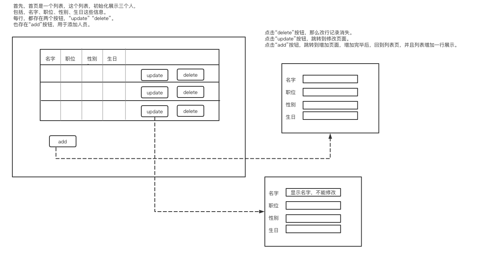
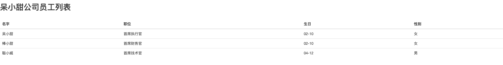
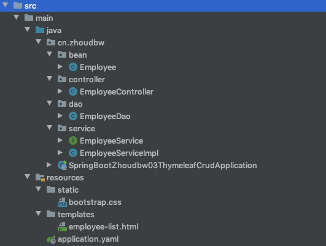

## SpringBoot + Thymeleaf

### 需求

```
**公司人员的增删改查。**
增：add按钮, 新增一条人员记录
删：delete按钮, 删除一条人员记录
改：update按钮, 修改一条人员记录
查：列表页面, 查询所有的人员记录展示
```

### 用户界面



### 交互设计

```
1）首先展示列表页，页面中有多个按钮，每一行上面有更改和删除按钮，列表下方有增加按钮
2）点击增加时，出现新的页面，页面需要填入名字等基本信息，填写好提交放回列表页
3）点击删除时，列表页更新
4）点击更改时，出现新的编辑页面，名字不可改，其他基本信息可修改，修改提交后返回列表页
```

### 系统设计

```
1）实体类：Employee  属性：name、job、sex、birthday
2）操作Model的方式：EmployeeDao，初始化数据，数据的增删改查处理
3）业务控制逻辑：EmployeeController，接收请求，逻辑处理，返回相应的页面
4）逻辑处理EmployeeService去调用响应的Dao
---
三层的架构模式：
Controller层接收请求，进行具体的逻辑处理，
具体的逻辑处理，会调用service层，
然后service层，去调用dao层进行真正的增删改查，
dao将结果返回service，
service再返回controller，
最终响应到页面给用户来查看。
```

### 具体实现

#### 展示列表页的实现

`1. 实体类的编写：Employee.java`

```java
package cn.zhoudbw.bean;

import lombok.AllArgsConstructor;
import lombok.Getter;
import lombok.Setter;

/**
 * @author zhoudbw
 * 实体类，代表员工
 */

@Getter
@Setter
@AllArgsConstructor
public class Employee {

    private String name;
    private String job;
    private String birthday;
    private String sex;
}
```

`2. 编写EmployeeController.java`

```java
package cn.zhoudbw.controller;

import cn.zhoudbw.bean.Employee;
import cn.zhoudbw.service.EmployeeService;
import org.springframework.beans.factory.annotation.Autowired;
import org.springframework.stereotype.Controller;
import org.springframework.ui.Model;
import org.springframework.web.bind.annotation.RequestMapping;

import java.util.List;

/**
 * @author zhoudbw
 * 业务控制类 返回视图
 */

@Controller
public class EmployeeController {

    private final EmployeeService employeeService;

    /**
     * 使用构造方法上添加@Autowire的方式，将EmployeeService注入EmployeeController
     * @param employeeService
     */
    @Autowired
    public EmployeeController(EmployeeService employeeService) {
        this.employeeService = employeeService;
    }

    /**
     * 发送 /employee/list请求，该请求，被controller接收到，通过service_dao_service，最终controller拿到数据，传递给前台。
     * 最终返回employ-list视图
     * @param model 传递employeeList数据给模板
     * @return 返回employ-list视图
     */
    @RequestMapping("/employee/list")
    public String employeeList(Model model) {
        // 员工列表页，需要人员信息数据 —— controller调用service获取数据
        List<Employee> employeeList = employeeService.employList();
        // 将结果返回给页面
        model.addAttribute("employeeList", employeeList);
        // 返回员工列表页
        return "employee-list";
    }
}
```

该类的编写并不是，直接编写完的，以为controller需要传递数据给模板页面，而数据来自service，service又需要dao的支持，所以编写controller的时候，编写service，编写dao。

dao编写完成之后，有了数据支持，然后service调用dao，拿到数据；controller调用service拿到数据；controller将数据传递给前端。前端模板文件拼接数据，完成整个流程。

`3. 编写EmployeeService.java`

```java
package cn.zhoudbw.service;

import cn.zhoudbw.bean.Employee;
import org.springframework.stereotype.Service;

import java.util.List;

/**
 * @author zhoudbw
 * 将service写成接口，通过子类去实现，这里给出，需要提供的服务
 * @Service 声明是Service
 */

@Service
public interface EmployeeService {
    /**
     * 这个方法，是为了得到所有的员工信息的。
     * @return 返回一个存储了所有员工的列表
     */
    List<Employee> employList();
}
```

`4. 实现EmployeeService接口，编写EmployeeServiceImpl.java`

```java
package cn.zhoudbw.service;

import cn.zhoudbw.bean.Employee;
import cn.zhoudbw.dao.EmployeeDao;
import org.springframework.beans.factory.annotation.Autowired;
import org.springframework.stereotype.Service;

import java.util.List;

/**
 * @author zhoudbw
 * 实现了EmployeeService接口，重写其所有的方法，真正的做事情的类
 */

@Service
public class EmployeeServiceImpl implements EmployeeService {

    private final EmployeeDao employeeDao;

    @Autowired
    public EmployeeServiceImpl(EmployeeDao employeeDao) {
        this.employeeDao = employeeDao;
    }

    @Override
    public List<Employee> employList() {
        // service 调用 dao去真正增删改查，通过dao拿到所有的人员列表
        return employeeDao.employeeList();
    }
}
```

`5. 编写EmployeeDao.java`

```java
package cn.zhoudbw.dao;

import cn.zhoudbw.bean.Employee;
import org.springframework.stereotype.Repository;

import java.util.ArrayList;
import java.util.List;

/**
 * @author zhoudbw
 * 实际和数据库交互的类，这里我们使用固定初始化，不涉及数据库的逻辑。
 * @Repository 声明这是dao
 */

@Repository
public class EmployeeDao {

    /**
     * // 初始化List<Employee>
     */
    static List<Employee> employeeList = new ArrayList<>();
    static {
        employeeList.add(new Employee("呆小甜", "首席执行官", "02-10", "女"));
        employeeList.add(new Employee("棒小甜", "首席财务官", "02-10", "女"));
        employeeList.add(new Employee("聪小威", "首席技术官", "04-12", "男"));
    }

    /**
     * 获取所有员工的信息
     * @return 返回员工信息列表
     */
    public List<Employee> employeeList() {
        return employeeList;
    }
}
```

最先完成的其实是该类，然后service调用dao，controller调用service，一层一层完善了代码。

`6. 编写视图employee-list.html`

```html
<!DOCTYPE html>
<html lang="en" xmlns:th="http://www.thymeleaf.org">
<head>
    <meta charset="UTF-8">
    <title>人员列表-首页</title>
    <!--引入/src/resources/static下的css资源-->
    <link rel="stylesheet" th:href="@{/bootstrap.css}">
</head>
<body>
<h2>呆小甜公司员工列表</h2><br/>
<table class="table table-hover"><!--添加悬停样式-->
<!--    表头-->
    <thead>
        <tr>
            <th>名字</th>
            <th>职位</th>
            <th>生日</th>
            <th>性别</th>
        </tr>
    </thead>
<!--    显示每个员工的具体信息-->
    <tbody>
        <!--这里需要遍历每个人员的名字、职位、生日、性别-->
        <!--通过each进行遍历，下面的含义是：获得employee对象,该对象来最传递过来的 employList-->
        <tr th:each="employee:${employeeList}">
            <!--拿到一个具体的对象后，就相当于拿到一行具体的数据了，开始赋值-->
            <!--分别给，静态和动态的值. 执行时，有动态值动态值替换，没有动态值显示静态值-->
            <td th:text="${employee.name}">name</td>
            <td th:text="${employee.job}">job</td>
            <td th:text="${employee.birthday}">birthday</td>
            <td th:text="${employee.sex}">sex</td>
        </tr>
    </tbody>
</table>
</body>
</html>
```

`7. 启动springboot进行验证，访问localhost:8080/employee/list`

```java
package cn.zhoudbw;

import org.springframework.boot.SpringApplication;
import org.springframework.boot.autoconfigure.SpringBootApplication;

/**
 * @author zhoudw
 */
@SpringBootApplication
public class SpringBootZhoudbw03ThymeleafCrudApplication {

    public static void main(String[] args) {
        SpringApplication.run(SpringBootZhoudbw03ThymeleafCrudApplication.class, args);
    }
}
```

#### 展示列表页的效果



#### Demo目录


