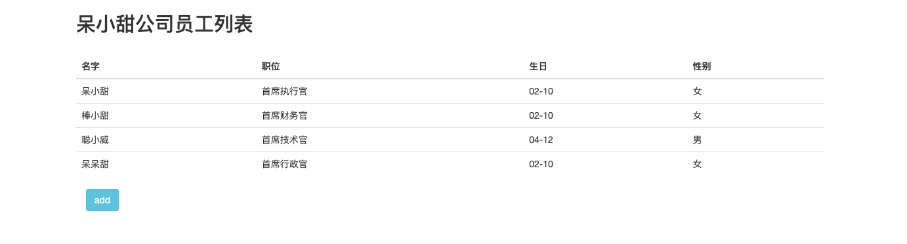
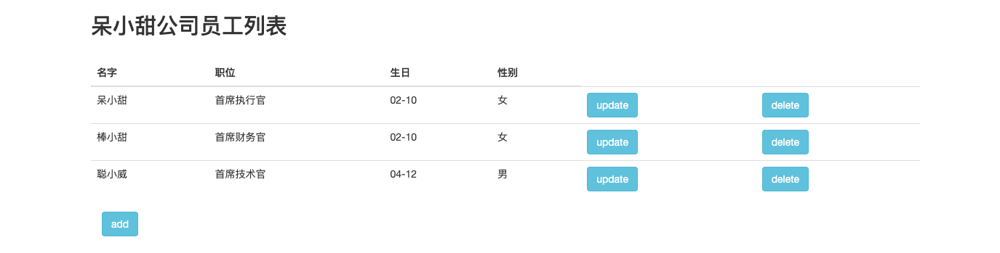
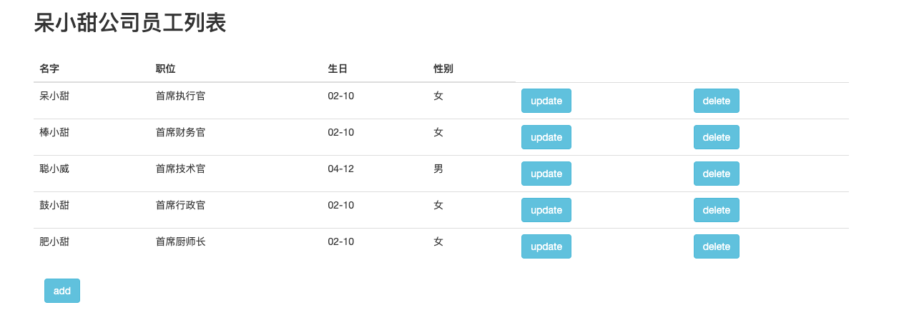
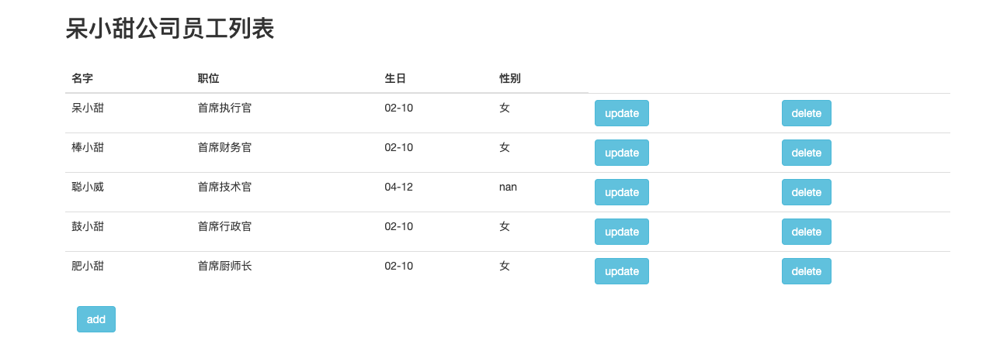
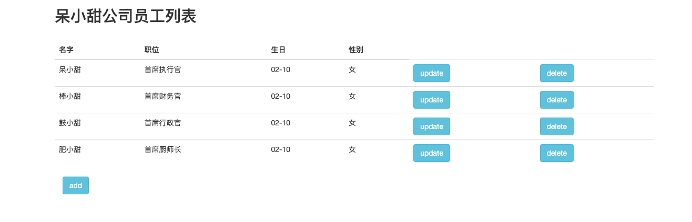

## SpringBoot + Thymeleaf

现在我们已经实现了列表展示，那么接下来我们需要做的是，在每一行后面增加两个按钮"update"和"delete"，在表格的底部增加"add"按钮。

那么需要几个接口呢？

```
查询列表的接口(已经写好了)、增加员工的接口、修改员工的接口、删除员工的接口
```

### 接口设计

```
1）/employee/list    查询列表      无查询参数        		 返回结果：List<Employee>

2）/employee/toadd   点击增加按钮   返回add.html，需要填写名字，职位，生日，性别信息。
   /employee/add     增加操作      传参为Employee     	返回结果：跳转到employee-list页面
   
3）/employee/toupdate 点击修改按钮  传递参数employeeName 返回update.html，名字固定，其他基本信息可改
   /employee/update  修改操作      传参为Employee       返回结果：跳转到employee-list页面
   
4）/employee/delete  删除操作      传参Employee.name    返回结果：跳转到employee-list页面
```

### 添加人员的实现思路

我们设计好了接口，那么接下来开始编写代码了。

`1. 点击增加按钮，发送toadd请求，所以首先在employee-list.html页面添加一个按钮`

```html
<!--添加员工的按钮-->
<div class="form-group"><!--给"add"一个表单的标准样式-->
    <div class="col-sm-2 control-label">
        <a href="/employee/toadd" th:href="@{/employee/toadd}"
           class="btn btn-info">add</a>
    </div>
</div>
```

`2. 接收请求，所以在EmployeeController增加toadd请求的映射`

```java
/**
* 增加按钮的toadd请求，跳转到add.html
*/
@RequestMapping("/employee/toadd")
public String toAdd() {
  return "add";
}
```

`3. 点击之后跳转到add.html页面，进行员工信息的录入，所以写add.html页面`

```html
<!DOCTYPE html>
<html lang="en" xmlns:th="http:www.thymeleaf.org">
<head>
    <meta charset="UTF-8">
    <title>录入员工</title>
    <!--引入/src/resources/static下的css资源-->
    <link rel="stylesheet" th:href="@{/bootstrap.css}">

</head>
<body class="container">
<h3>录入员工信息</h3>
<br/>

<form th:action="@{/employee/add}" method="post" class="form-horizontal"><!--美化表单，先设置水平-->
    <!--为了更好的接收input内的值，我们添加name属性-->
    <!--add请求，需要的参数是一个Employee对象，我们填的这些值，实际上是要被组装成Employee对象的-->
    <!--所以，我们添加name属性，这样就可以对应Employee的属性名，组成一个完整的Employee对象了。-->

    <div class="form-group"><!--表单基础样式-->
        <label class="col-sm-2 control-label">名字:</label>
        <div class="col-sm-5"><!--设置宽度-->
            <input type="text" id="name" name="name">
        </div>
    </div>
    <div class="form-group">
        <label class="col-sm-2 control-label">职业:</label>
        <div class="col-sm-5">
            <input type="text" id="job" name="job">
        </div>
    </div>
    <div class="form-group">
        <label class="col-sm-2 control-label">生日</label>
        <div class="col-sm-5">
            <input type="text" id="birthday" name="birthday">
        </div>
    </div>
    <div class="form-group">
        <label class="col-sm-2 control-label">性别</label>
        <div class="col-sm-5">
            <input type="text" id="sex" name="sex">
        </div>
    </div>

    <div class="form-group">
        <div class="col-sm-5 col-sm-offset-2"><!--添加宽度和偏移量-->
            <input type="submit" value="submit">
        </div>
    </div>
</form>
</body>
</html>
```

`4. 点击submit按钮之后提交填写的信息，发送add请求，在EmployeeController中补充该请求`

```java
/**
* 处理add请求，跳转回 /employee/list请求
*/
@RequestMapping("/employee/add")
public String add(Employee employee) {
  // 需要在employList中添加一条数据，所以需要service 和 dao的支持
  employeeService.add(employee);
  // 跳转回employee-list请求
  // 跳转到这个请求之后，controller接收到了，执行employList()方法
  // 所以我们可以看到我们新添加的信息也在展示列表中了。
  return "redirect:/employee/list";
}
```

`5. add请求，跳转到/employee/list，该请求，负责展示所有的人员信息（employeeList内含有的员工都可展示，所以我们需要将我们录入的员工信息加入employeeList内，所以在EmployeeService中增加add()方法，在EmployeeDao中增加add()方法支持。）`

`5.1 在EmployeeService接口中增加add()方法`

```java
/**
* 这个方法，是为了增加一个员工的
* @param employee 实例化的员工类，有数据
*/
void add(Employee employee);
```

`5.2 在EmployeeServiceImpl中实现接口中的add()方法`

```java
@Override
public void add(Employee employee) {
  // 添加进employList，需要dao的支持
  employeeDao.add(employee);
}
```

`5.3 在EmployeeDao中增加add()方法`

```java
/**
* 向employList插入一条信息
* @param employee 需要插入的员工
*/
public void add(Employee employee) {
  employeeList.add(employee);
}
```

`5.4 EmployServiceImpl调用EmployeeDao，EmployeeController调用EmployeeService，实现将录入的员工信息加入employeeList中`

`6. 启动项目，输入：localhost:8080/employee/list验证add按钮。`

`7. 录入效果图`




### 最终效果图总览

`1.列表展示页（访问：localhost:8080/employee/list）的页面 `



`2. 点击 "add" 按钮后，出现的页面`


`3. 录入两条信息之后，点击"submit" 跳转到列表展示页`



`4. 点击"update" 按钮之后，出现的页面`


`5. 修改之后点击"submit"， 跳转到列表展示页`



`6. 点击"delete"，删除改行信息，显示列表展示页`



