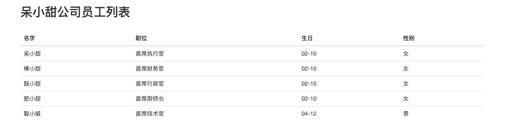

# SpringBoot数据访问

我们之前做DEMO的时候数据是来自内存（`List<Employee> employeeList = new ArrayList<>()`）,在实际项目中，我们的数据要存储在数据库中。

## ORM框架

Object-Relational Mapping（对象关系映射），本质上是将我们代码中的对象以及对象之间的关系，在数据库中做对应的映射。Orm框架帮助我们是简化编程中操作数据库的编码。 

发展到现在基本上就剩两支流，一个是宣称可以不用写一句 Sql 的 Hibernate，一个是可以灵活调试动态 Sql 的 Mybatis ,两者各有特点，在企业级系统开发中可以根据需求灵活使用。 

一个有趣的现象：传统企业大都喜欢使用 Hibernate ,互联网行业通常使用 Mybatis 。 这也取决于两种企业的不同的应用场景，比如说，传统企业，大部分场景都是面对少量的用户，或者企业的用户，所以用户量数据量不会特别的庞大，所以都喜欢用Hibernate，如果数据量很大的话，就不会用关系型数据库了，就会用非关系型数据库了。互联网行业将会面对业务场景比较复杂，不是单纯的增删改查，很多情况需要多表关联，而Hibernate在多表关联上的表现比较差，只是面对单表的时候操作比较便捷。Mybatis在面对这种复杂逻辑、复杂SQL的时候就比较灵活了。

Hibernate 特点就是所有的 Sql 都用 Java 代码来生成，不用跳出程序去写 Sql ，有着编程的完整性，发展到最顶端就是 Spring Data Jpa 这种模式，根据方法名就可以生成对应的 Sql 。 

Mybatis 初期使用比较麻烦，需要各种配置文件、实体类、Dao 层映射关联等等很多配置。而Mybatis 也发现了这个弊端，初期开发了generator可以根据表结果自动生产实体类、配置文件和 Dao 层代码，可以减轻一部分开发量；后期也进行了大量的优化可以使用注解了，自动管理 Dao 层和配置文件等，发展到最顶端就是mybatis-spring-boot- starter 这种模式。Spring Boot+ Mybatis 可以完全注解，不用配置文件。

### ORM - JPA整合

#### JPA简介

Jpa ( Java Per sis tence API) 是 Sun 官方提出的 Java 持久化规范。它为 Java 开发人员提供了一种对象/关联映射工具来管理 Java 应用中的关系数据。它的出现主要是为了简化现有的持久化开发工作和整合ORM 技术，结束现在 Hibernate，TopLink，JDO 等 ORM 框架各自为营的局面。JPA 被定义为EJB（Enterprise JavaBeans） 3.0规范的一部分。 

JPA 允许 POJO（Plain Old Java Object s）轻松地持久化，而不需要类来实现 EJB 2 CMP规范所需的任何接口或方法。 JPA 还允许通过注解或 XML 定义对象的关系映射，定义 Java 类如何映射到关系数据库表。 JPA 还定义了一个运行时 Entity Manager API，用于处理对象的查询和管理事务。 同时，JPA定义了对象级查询语言 JPQL，以允许从数据库中查询对象，实现了对数据库的解耦合，提高了程序的可移植性，而不具体依赖某一底层数据库。 

Jpa 是一套规范，不是一套产品，那么像 Hibernate他们是一套产品，如果说这些产品实现了这个 Jpa规范，那么我们就可以叫他们为 Jpa 的实现产品。Spring Boot Jpa 是 Spring 基于 ORM 框架、Jpa 规范的基础上封装的一套 Jpa 应用框架，可使开发者用极简的代码即可实现对数据的访问和操作。它提供了包括增删改查等在内的常用功能，且易于扩展！

#### JPA整合

**`1. 引入依赖`**

```xml
<!--spring-boot-starter-date-jpa依赖-->
  <dependency>
  <groupId>org.springframework.boot</groupId>
  <artifactId>spring-boot-starter-data-jpa</artifactId>
</dependency>
<!--MySQL数据库的JDBC依赖-->
<dependency>
  <groupId>mysql</groupId>
  <artifactId>mysql-connector-java</artifactId>
  <scope>runtime</scope>
</dependency>
```

**`2. 在application.properties中配置数据源 `**

```properties
# 数据库连接相关的配置
spring.datasource.url=jdbc:mysql://127.0.0.1:3306/databaseName
spring.datasource.username=root
spring.datasource.password=123456 
#driver-class-name可以配置，因为可以根据配置的url识别 
spring.datasource.driver-class-name=com.mysql.jdbc.Driver 

# JPA相关的配置
#自动创建|更新|验证数据库表结构 
spring.jpa.hibernate.ddl-auto=update 
#设置数据库引擎为InnoDB 
spring.jpa.database-platform=org.hibernate.dialect.MySQL5InnoDBDialect 
#打印sql语句，方便调试 
spring.jpa.show-sql=true
```

**使用官方推荐的进行配置**

```yaml
# 配置端口
server:
  port: 8090

# 数据库连接配置
spring:
  datasource:
    url: jdbc:mysql://localhost:3306/springdemo?useSSL=false
    username: root
    password: zhoudbw_tian
    driver-class-name: com.mysql.jdbc.Driver

  # JPA相关配置
  jpa:
    # 自动创建|更新|验证数据库表结构
    hibernate:
      ddl-auto: update
    # 设置数据库引擎为InnoDB
    database-platform:
    # 打印sql语句，方便调试，默认是FALSE
    show-sql: true
```

**`3. 创建JPA仓库`**

使用JPA就不需要dao层了。

* 创建接口继承JpaRepository，泛型说明该类要操作的实体类类型及其主键类型

```java
package cn.zhoudbw.repository;

import cn.zhoudbw.model.Employee;
import org.springframework.data.jpa.repository.JpaRepository;

/**
 * @author zhoudbw
 * 集成JPA提供给我们的JpaRepository接口，该接口存在泛型 <需要进行增删改查的类, 主键类型的类>
 * 利用接口来继承 这样就可以不用去实现接口方法了。这个接口内定义了很多增删改查的操作，直接调用方法就好了。
 */
public interface EmployeeRepository extends JpaRepository<Employee, Long> {
    /**
     * 该接口可以直接调用，JpaRepository<T, ID>提供给我们的增改查方法
     * 虽然，我们说接口不能做事，但是这里只是多态的写法，真正做事情的是该接口的具体子类。
     */
}
```

**`4. 创建JPA可以使用的实体类`**

添加了JpaRepository之后，以下事情必须做：

 * @Entity 声明该类是JpaRepository可以使用的实体类
 * @Id 声明该属性是主键
 * @Column 声明该属性是列
 * 必须有无参的构造方法
 * 必须实现序列化接口 Serializable

```java
package cn.zhoudbw.model;

import lombok.*;

import javax.persistence.Column;
import javax.persistence.Entity;
import javax.persistence.Id;
import java.io.Serializable;

/**
 * @author zhoudbw
 * 实体类，代表员工
 */

@Getter
@Setter
@AllArgsConstructor
@ToString

/**
 * @author zhoudbw
 *
 * 添加了JpaRepository之后，以下事情必须做：
 * @Entity 声明该类是JpaRepository可以使用的实体类
 * @Id 声明该属性是主键
 * @Column 声明该属性是列
 * 必须有无参的构造方法
 * 必须实现序列化接口 Serializable
 */
@Entity
public class Employee implements Serializable {

    public Employee() {}

    @Id     private Long id;
    @Column private String name;
    @Column private String job;
    @Column private String birthday;
    @Column private String sex;
}
```

**`4. 创建逻辑控制类`**

进行增删改查服务时以下事情必须做：

```java
package cn.zhoudbw.service;


import cn.zhoudbw.model.Employee;
import cn.zhoudbw.repository.EmployeeRepository;
import org.springframework.beans.factory.annotation.Autowired;
import org.springframework.stereotype.Service;

import java.util.List;

/**
 * @author zhoudbw
 * 实现了EmployeeService接口，重写其所有的方法，真正的做事情的类
 * <p>
 * 使用JpaRepository之前：
 * 必须将JpaRepository注入该service类
 * 然后就可以调用仓库中的增删改查方法啦。
 */

@Service
public class EmployeeServiceImpl implements EmployeeService {

    private final EmployeeRepository employeeRepository;

    @Autowired
    public EmployeeServiceImpl(EmployeeRepository employeeRepository) {
        this.employeeRepository = employeeRepository;
    }

    @Override
    public List<Employee> employList() {
        // 直接通过JpaRepository获取结果，不需要dao的支持了。
        return employeeRepository.findAll();
    }
}
```

---

**`补充一下Controller和前台页面`**

```java
/**
 * @author zhoudbw
 * 业务控制类 返回视图
 * @RequestMapping("/xxx") 放在类上，代表类里面的方法都是以此开头的。
 */

@Controller
@RequestMapping("/employee") // 将RequestMapping提前到类上，表示该类下的所有请求方法都是以employee开头的
public class EmployeeController {

    private final EmployeeService employeeService;

    @Autowired
    public EmployeeController(EmployeeService employeeService) {
        this.employeeService = employeeService;
    }

    @RequestMapping(method = RequestMethod.GET) // 指明该请求的HTTP方法，用于确定该请求的作用，不指定默认也是GET <=> @GetMapping
    public String employeeList(Model model) {
        List<Employee> employeeList = employeeService.employList();
        // 将结果返回给页面
        model.addAttribute("employeeList", employeeList);
        // 返回员工列表页
        return "employee-list";
    }
}
```

```html
<!DOCTYPE html>
<html lang="en" xmlns:th="http://www.thymeleaf.org">
<head>
    <meta charset="UTF-8">
    <title>人员列表-首页</title>
    <!--引入/src/resources/static下的css资源-->
    <link rel="stylesheet" th:href="@{/static/css/bootstrap.css}">
</head>
<body class="container">
<h2>呆小甜公司员工列表</h2><br/>
<table class="table table-hover"><!--添加悬停样式-->
    <!--    表头-->
    <thead>
    <tr>
        <th>名字</th>
        <th>职位</th>
        <th>生日</th>
        <th>性别</th>
    </tr>
    </thead>
    <!--    显示每个员工的具体信息-->
    <tbody>
    <!--这里需要遍历每个人员的名字、职位、生日、性别-->
    <!--通过each进行遍历，下面的含义是：获得employee对象,该对象来最传递过来的 employList-->
    <tr th:each="employee:${employeeList}">
        <!--拿到一个具体的对象后，就相当于拿到一行具体的数据了，开始赋值-->
        <!--分别给，静态和动态的值. 执行时，有动态值动态值替换，没有动态值显示静态值-->
        <td th:text="${employee.name}">name</td>
        <td th:text="${employee.job}">job</td>
        <td th:text="${employee.birthday}">birthday</td>
        <td th:text="${employee.sex}">sex</td>
        </td>
    </tr>
    </tbody>
</table>
</body>
</html>
```

**`编写完成启动测试，结果如图`**



**`补充数据库语句如下`**

```sql
mysql> create database springdemo charset = "utf8";
Query OK, 1 row affected (0.02 sec)

mysql> use springdemo
Database changed

mysql> create table employee(
    -> id int(10),
    -> name varchar(10),
    -> job varchar(20),
    -> birthday varchar(20),
    -> sex varchar(10),
    -> primary key(id)
    -> ) charset=utf8;
Query OK, 0 rows affected (0.17 sec)

mysql> desc springdemo.employee;
+----------+-------------+------+-----+---------+-------+
| Field    | Type        | Null | Key | Default | Extra |
+----------+-------------+------+-----+---------+-------+
| id       | int(10)     | NO   | PRI | NULL    |       |
| name     | varchar(10) | YES  |     | NULL    |       |
| job      | varchar(20) | YES  |     | NULL    |       |
| birthday | varchar(20) | YES  |     | NULL    |       |
| sex      | varchar(10) | YES  |     | NULL    |       |
+----------+-------------+------+-----+---------+-------+
5 rows in set (0.05 sec)

mysql> insert into springdemo.employee (id, name, job, birthday, sex) values (1, '呆小甜', '首席执行官', '02-10', '女');
Query OK, 1 row affected (0.01 sec)

mysql> insert into springdemo.employee (id, name, job, birthday, sex) values (2, '棒小甜', '首席财务官', '02-10', '女');
Query OK, 1 row affected (0.01 sec)

mysql> insert into springdemo.employee (id, name, job, birthday, sex) values (3, '鼓 小甜', '首席行政官', '02-10', '女');
Query OK, 1 row affected (0.00 sec)

mysql> insert into springdemo.employee (id, name, job, birthday, sex) values (4, '肥小甜', '首席厨师长', '02-10', '女');
Query OK, 1 row affected (0.01 sec)

mysql> insert into springdemo.employee (id, name, job, birthday, sex) values (5, '聪小威', '首席技术官', '04-12', '男');
Query OK, 1 row affected (0.00 sec)

mysql> select * from springdemo.employee;
+----+-----------+-----------------+----------+------+
| id | name      | job             | birthday | sex  |
+----+-----------+-----------------+----------+------+
|  1 | 呆小甜    | 首席执行官      | 02-10    | 女   |
|  2 | 棒小甜    | 首席财务官      | 02-10    | 女   |
|  3 | 鼓小甜    | 首席行政官      | 02-10    | 女   |
|  4 | 肥小甜    | 首席厨师长      | 02-10    | 女   |
|  5 | 聪小威    | 首席技术官      | 04-12    | 男   |
+----+-----------+-----------------+----------+------+
5 rows in set (0.00 sec)
```

