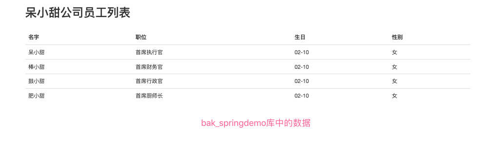
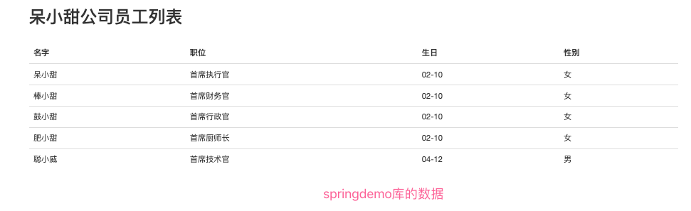

## Mybatis多数据源整合（项目中常用知识点）

### Mybatis回顾

```apl
Mybatis有几个重要的类：SqlSession、SqlSessionFactory、SqlSessionTemplate。

SqlSession 封装了JDBC连接，是数据库连接的客户端和服务端之间的一种会话。直接用来执行sql语句。 我们手动写JDBC的时候，需要创建连接，然后创建事务，然后写执行SQL，然后提交事务，最后执行完毕关闭连接等操作。这一系列的一次会话实际上都是一个SqlSession。

SqlSessionFactory是一个工厂，实际上就是单个数据库映射关系经过编译后的内存镜像。它是用来创建SqlSession的。一般，每一个MyBatis的应用程序都以一个 SqlSessionFactory 对象的实例为核心，作为创建SqlSession的工厂。

Mybatis框架主要是围绕着SqlSessionFactory进行的（核心流程）：
(1) 定义一个 Configuration 对象，其中包含数据源、事务、mapper文件资源以及影响数据库行为属性设置settings。 
(2) 通过配置对象，则可以创建一个 SqlSessionFactoryBuilder对象。
(3) 通过 SqlSessionFactoryBuilder 获得SqlSessionFactory 的实例。 
(4) SqlSessionFactory 的实例可以获得操作数据的 SqlSession 实例，通过这个实例对数据库进行操作。
```

### Mybatis-Spring回顾

```apl
为了将 Mybatis和Spring更好的集成在一起，提供了 mybatis-spring这样的依赖。
SqlSessionTemplate 是 MyBatis-Spring 的核心。
这个类负责管理 MyBatis 的 SqlSession, 调用 MyBatis 的 SQL 方法。 
目的是让 Spring 获取到 SqlSessionTemplate 然后注入给工具类，让工具类操作数据库。 

集成方式形如： 
<bean id="sqlSessionTemplate" class="org.mybatis.spring.SqlSessionTemplate">
	<constructor-arg ref="sqlSessionFactory" />
</bean>
其实是将SqlSessionFactory作为SqlSessionTemplate构造方法的参数的一个集成模板。
```

### 多数据源的使用

多数据源我们使用spring-boot-zhoudbw-04-orm-mybatis中的mybatis版本，因为mybatis-plus虽然生成数据源，但是和当下的springboot版本去集成，集成方案是不太好的。

<div align='center' style='font-weight:bold'>** 该部分的演示案例在spring-boot-zhoudbw-04-orm-mybatis中。**</div>

`1. 如果入口类上有MapperScan()，需要注释掉。因为现在我们有至少两个数据源，这些数据源就不可能有一个固定的文件夹了。`

```java
@SpringBootApplication
//@tk.mybatis.spring.annotation.MapperScan(basePackages = "cn.zhoudbw.tk.mapper")
public class SpringBootZhoudbw04OrmMybatisApplication {
    public static void main(String[] args) {
        SpringApplication.run(SpringBootZhoudbw04OrmMybatisApplication.class, args);
    }
}
```


`2. 在application.properties/yml中配置多数据源连接信息，属性值分别为jdbc-url、username、password、driver-class-name`

```yaml
# 数据库连接配置
spring:
  datasource:
    db1:
      jdbc-url: jdbc:mysql://localhost:3306/springdemo?useSSL=false
      username: root
      password: zhoudbw_tian
      # 可以不配置，能够根据url默认识别
      driver-class-name: com.mysql.jdbc.Driver

    db2:
      jdbc-url: jdbc:mysql://localhost:3306/bak_springdemo?useSSL=false
      username: root
      password: zhoudbw_tian
      # 可以不配置，能够根据url默认识别
      driver-class-name: com.mysql.jdbc.Driver
```

补充一下：如何通过将一个库的一个表的数据备份到另一个库的一个表中呢？
① 如果备份的库存在该表，则可以通过insert语句，将数据备份至该库的该表：

```sql
insert bak_databaseName.tableName  (select 字段1, 字段2... from databaseName.tableName　where 条件;
```

② 如果备份的库不存在该表，则可以通过create语句，将数据备份至该库的该表：

```sql
create table bak_databaseName.tableName (select * from databaseName.tableName where 条件);
```

`我们按照上述的配置文件的写法，springboot是不认识的，所以我们需要自己将库读进来，并且此时的url需要变更成为jdbc-url`

`3. 我们需要自己读取配置文件，自定义数据源加载类 cn.zhoudbw.config.DbConfig`

```java
package cn.zhoudbw.cn.zhoudbw.config;

import org.springframework.boot.context.properties.ConfigurationProperties;
import org.springframework.boot.jdbc.DataSourceBuilder;
import org.springframework.context.annotation.Bean;
import org.springframework.context.annotation.Configuration;

import javax.sql.DataSource;

/**
 * @author zhoudbw
 * 将配置文件中的数据读取到该类中
 *  首先> 得是一个一个配置文件类，利用 @Configuration声明
 *  然后> 在类利用@Bean声明一个bean，该bean代表的就是DataSource，通过依赖注入直接赋值了
 *  然后> 利用ConfigurationProperties("prefix")，指定该数据源对应配置文件中的哪个前缀
 *  因为我们返回的DataSource和我们需要的DataSource是完全一致的，配置文件中配置的属性值和DataSource需要的属性值是一致的，
 *  所以我们可以直接返回。
 *  这样就是将prefix下的配置传递进来，然后去创建一个DataSource。
 */
@Configuration // 声明该类是对应一个配置文件
public class DbConfig {
    
    @Bean(name = "db1") // 将该方法创建的对象交给Spring管理，为了好识别给定名字
    @ConfigurationProperties("spring.datasource.db1") // 该对象对应的是该配置文件下，以该前缀开头的配置
    public DataSource dataSource1() {
        return DataSourceBuilder.create().build();
    }
    
    @Bean(name = "db2")
    @ConfigurationProperties("spring.datasource.db2") 
    public DataSource dataSource2() {
        return DataSourceBuilder.create().build();
    }
}
```

`4. 获取到DataSource之后，开始设置SqlSessionFactory和SqlSessionTamplate，再创建两个类`

`DbOneConfig.java 处理第一个数据库的配置`

```java
package cn.zhoudbw.cn.zhoudbw.config;

import org.apache.ibatis.session.SqlSessionFactory;
import org.mybatis.spring.SqlSessionFactoryBean;
import org.mybatis.spring.SqlSessionTemplate;
import org.mybatis.spring.annotation.MapperScan;
import org.springframework.beans.factory.annotation.Autowired;
import org.springframework.beans.factory.annotation.Qualifier;
import org.springframework.context.annotation.Bean;
import org.springframework.context.annotation.Configuration;

import javax.sql.DataSource;

/**
 * @author zhoudbw
 * 处理db1的配置
 */

@Configuration // 声明该类是配置，如果未添加该注解，会导致@Bean之间相互调用出错
@MapperScan(basePackages = "cn.zhoudbw.mapper", sqlSessionFactoryRef = "sqlSessionFactory1")
// 该类需要声明对应的mapper文件的位置(配置后可以找到真正需要使用的mapper文件的位置了)，
// 和关联的SqlSessionFactory是谁(在这里就是我们底下的"sqlSessionFactory1")
public class DbOneConfig {
    /**
     * 由于我们在DBConfig.java中已经声明了 name="db1"的DataSource，
     * db1通过将spring.dataSource.db1下的配置注入其属性获得了DataSource
     * 所以我们可以直接通过名字来获取对象=> 通过name获取bean，使用 @Autowire 和 @Qualifier("name")
     */
    private final DataSource dataSource;

    @Autowired
    public DbOneConfig(@Qualifier("db1") DataSource dataSource) {
        this.dataSource = dataSource;
    }

    /**
     * 通过SqlSessionFactory的创建需要DataSource。
     * 通过注入DataSource，我们可以创建SqlSessionFactory。
     * 使用@Bean 将SqlSessionFactory的创建交给Spring。
     */
    @Bean
    public SqlSessionFactory sqlSessionFactory1() throws Exception {
        // 创建SqlSessionFactoryBean
        SqlSessionFactoryBean sqlSessionFactoryBean = new SqlSessionFactoryBean();
        // 为SqlSessionFactoryBean设置配置数据源
        sqlSessionFactoryBean.setDataSource(dataSource);
        // getObject()返回的就是SqlSessionFactory
        return sqlSessionFactoryBean.getObject();
    }

    /**
     * 再声明一个Bean，用来解决SqlSessionTemplate的创建
     */
    @Bean
    public SqlSessionTemplate sessionTemplate1() throws Exception {
        // 创建SqlSessionTemplate需要SqlSessionFactory
        SqlSessionFactory sqlSessionFactory = sqlSessionFactory1();
        SqlSessionTemplate sqlSessionTemplate = new SqlSessionTemplate(sqlSessionFactory);
        // 直接返回SqlSessionTemplate
        return sqlSessionTemplate;
    }

    /*
    先把DBConfig中配置的DataSource，通过name注入到当前的类的DataSource中；
    在把DataSource注入到SqlSessionFactory中，创建SqlSessionFactory中；
    在把SqlSessionFactory注入SqlSessionTemplate中，创建SqlSessionTemplate中。
    这样就可以通过Spring更好的使用Mybatis了。
     */
}
```

`5. 创建mapper，来演示不同数据源的不同效果，mapper和mapper2`

```java
package cn.zhoudbw.mapper;

import cn.zhoudbw.model.Employee;
import org.apache.ibatis.annotations.Mapper;
import org.apache.ibatis.annotations.Select;

import java.util.List;


@Mapper
public interface EmployeeMapper {

    /**
     * 查询全部
     * @Select 该注解是为了取代EmployeeMapper.xml中的<select></>标签的
     *   通过 @Mapper @Select 就可以不用写EmployeeMapper.xml了。
     * @return 返回存有所有Employee的列表
     */
    @Select("SELECT id, name, job, birthday, sex FROM employee")
    List<Employee> employeeList();
}


package cn.zhoudbw.mapper2;

import cn.zhoudbw.model.Employee;
import org.apache.ibatis.annotations.Select;

import java.util.List;

/**
 * @author zhoudbw
 * 演示多数据源配置的Mapper
 * 声明了@MapperScan() , 所以不写@Mapper也没关系
 */
public interface EmployeeMapper2 {
    /**
     * 查询全部
     * @return
     */
    @Select("SELECT id, name, job, birthday, sex FROM employee")
    List<Employee> employeeList();
}
```

`6.在service中使用测试一下`

```java
package cn.zhoudbw.service;


import cn.zhoudbw.mapper.EmployeeMapper;
import cn.zhoudbw.mapper2.EmployeeMapper2;
import cn.zhoudbw.model.Employee;
import org.springframework.beans.factory.annotation.Autowired;
import org.springframework.stereotype.Service;

import java.util.List;

/**
 * @author zhoudbw
 */
@Service
public class EmployeeServiceImpl implements EmployeeService {

    /**
     * 测试多数据源的使用
     */
    @Autowired // springdemo库
    private EmployeeMapper mapper;
    @Autowired // bak_springdemo库
    private EmployeeMapper2 mapper2;

    @Override
    public List<Employee> employList() {
        return mapper.employeeList();
    }
}
```

`7. 效果图`





至此，我们就实现了多数据源的配置方式，这样我们就可以通过操作不同的mapper，去操作不同的数据源了。