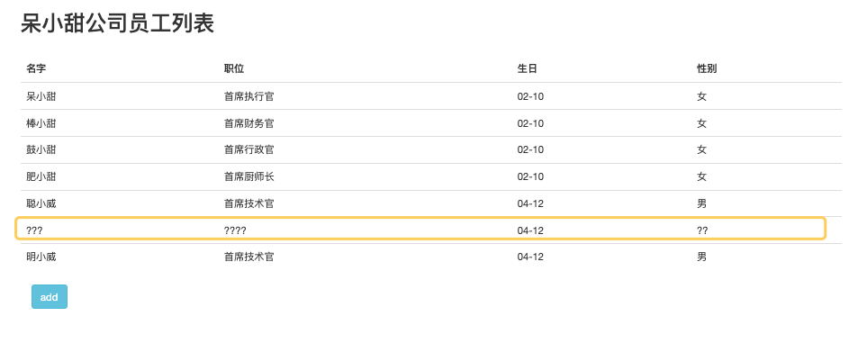

## 事务

提到数据访问，其实离不开的重要内容—— "事务"。

### 事务回顾

```java
事务（Transaction）是并发控制的基本单位。所谓的事务，它是一个操作序列，这些操作要么都执行，要么都不执行，它是一个不可分割的工作单位。它保证了用户操作的原子性 ( Atomicity )、一致性 ( Consistency )、隔离性 ( Isolation ) 和持久性 ( Durabilily )。 

使用事务的方式：
Connection con = DriverManager.getConnection(); //创建连接 
try{
		con.setAutoCommit(false); //开启事务
    ...... //CURD具体逻辑
    con.commit(); //try的最后提交事务 
} catch（） { 
		con.rollback(); //其中任何一个操作出错都将回滚，所有操作都不成功 
} finally{ 
		con.close(); //关闭连接 
}
* 从上述代码可以看出，我们平时的开发生活中，具体的逻辑只在CURD中间这部分，其他的都是固定的样板代码。
* 程序员其实就是不喜欢写样板式的东西，不喜欢写重复的东西。要解决样板式代码的问题，我们有Lombok、Mybatis插件。
* 那么事务呢？Spring也帮助我们做了解决这部分代码的封装。
  用一种AOP的环绕式的切面方式，让我们在事务执行前开启事务，在事务执行之后可以关闭事务，在出现异常的时候可以回滚。
  将我们的具体逻辑作为参数暴露出来，其他部分都封装起来，利用一个注解就直接可以使用了。这个注解是@Transactional
```

### Spring事务

```
声明式的事务管理是基于AOP的，本质上还是数据库对事务的支持。 
在 Spring 中可以通过 @Transactional 注解的方式使用。
优点是：非侵入式，业务逻辑不受事务管理代码的污染。做到方法级别的事务回滚。使用前配置事务管理器。  

第一步：
<bean id="transactionManager" class="org.springframework.jdbc.datasource.DataSourceTransactionManager"> 				<property name="dataSource" ref="dataSource" /> 
</bean> 

第二步： 
<tx:annotation-driven transaction-manager="transactionManager"/> 
```

**@Transactional 支持的参数**

| 属性        | 类型                         | 描述                     |
| :---------- | :--------------------------- | :----------------------- |
| propagation | enum: Propagation            | 可选的事务传播行为设置   |
| isolation   | enum: Isolation              | 可选的事务隔离级别设置   |
| readOnly    | boolean                      | 读写或只读事务，默认读写 |
| timeout     | int (in seconds granularity) | 事务超时时间设置         |

<div align='center' style='font-weight:bold'>** 该部分的演示代码写在spring-boot-zhoudbw-04-orm-mybatis-plus中 **</div>

#### 问题1：id超出

`controller内的代码`

```java
/**
 * @author zhoudbw
 * 业务控制类 返回视图
 * @RequestMapping("/xxx") 放在类上，代表类里面的方法都是以此开头的。
 */

@Controller
@RequestMapping("/employee") // 将RequestMapping提前到类上，表示该类下的所有请求方法都是以employee开头的
public class EmployeeController {

    private final EmployeeService employeeService;

    @Autowired
    public EmployeeController(EmployeeService employeeService) {
        this.employeeService = employeeService;
    }

    @RequestMapping(method = RequestMethod.GET) // 指明该请求的HTTP方法，用于确定该请求的作用，不指定默认也是GET <=> @GetMapping
    public String employeeList(Model model) {
        // 可以直接调用ServiceImpl提供给我们的通用方法
        List<Employee> employeeList = employeeService.list();
        model.addAttribute("employeeList", employeeList);
        // 返回员工列表页
        return "employee-list";
    }

    /**
     * get请求，直接返回一个add视图
     * @return
     */
    @GetMapping("/toadd") // 实际请求："/employee/toadd"
    public String toAdd() {
        return "/add";
    }
    /**
     * 测试事务
     * 添加对象是一个POST请求，发送该请求，
     * 根据输入框的name，自动装配Employee，传入该方法
     */
    @PostMapping("")
    public String add(Employee employee) {
        // 将employee保存
        employeeService.save(employee);
        // 重定向，以get方式发送请求，表示查询，返回的是employee-list视图
        return "redirect:/employee";
    }
}
```

上述代码未使用事务，但是测试该方法是，出现如下错误：

```error
Cause: com.mysql.jdbc.MysqlDataTruncation: Data truncation: Out of range value for column 'id' at row 1; Data truncation: Out of range value for column 'id' at row 1; nested exception is com.mysql.jdbc.MysqlDataTruncation: Data truncation: Out of range value for column 'id' at row 1
```

排查发现：

```java
数据库中表信息如下：
mysql> desc springdemo.employee;
+----------+-------------+------+-----+---------+----------------+
| Field    | Type        | Null | Key | Default | Extra          |
+----------+-------------+------+-----+---------+----------------+
| id       | int(10)     | NO   | PRI | NULL    | auto_increment |
| name     | varchar(10) | YES  |     | NULL    |                |
| job      | varchar(20) | YES  |     | NULL    |                |
| birthday | varchar(20) | YES  |     | NULL    |                |
| sex      | varchar(10) | YES  |     | NULL    |                |
+----------+-------------+------+-----+---------+----------------+
java代码对应的实体类声明如下：

@Getter
@Setter
@AllArgsConstructor
@ToString
public class Employee implements Serializable {
    private Long id;
    private String name;
    private String job;
    private String birthday;
    private String sex;
}

显然 java代码的id与数据库中的id类型不一致。
解决方案：将数据库中的id类型改为bigint()类型：
  ALTER TABLE springdemo.employee MODIFY id BIGINT(20) AUTO_INCREMENT; 

mysql> desc springdemo.employee;
+----------+-------------+------+-----+---------+----------------+
| Field    | Type        | Null | Key | Default | Extra          |
+----------+-------------+------+-----+---------+----------------+
| id       | bigint(20)  | NO   | PRI | NULL    | auto_increment |
| name     | varchar(10) | YES  |     | NULL    |                |
| job      | varchar(20) | YES  |     | NULL    |                |
| birthday | varchar(20) | YES  |     | NULL    |                |
| sex      | varchar(10) | YES  |     | NULL    |                |
+----------+-------------+------+-----+---------+----------------+
```

#### 问题2：数据显示乱码



```yaml
出现乱码，无外乎，读和写的编码不一致导致的。
解决方案1：
1.将配置文件中的url修改成如下形式，增加 useUnicode=true&characterEncoding=UTF-8
url: jdbc:mysql://localhost:3306/springdemo?useSSL=false&useUnicode=true&characterEncoding=UTF-8

解决方案2：
2.配置模板引擎字符集：为utf-8
# 数据库连接配置
spring:
  thymeleaf:
    encoding: utf-8
```

乱码解决。

### 添加事务演示

```java
/**
* 测试事务
* 添加对象是一个POST请求，发送该请求，
* 根据输入框的name，自动装配Employee，传入该方法
*/
@Transactional
@PostMapping("")
public String add(Employee employee) {
  // 将employee保存
  employeeService.save(employee);
  // 算数异常，如果不添加@Transactional，上面save()语句生效
  // 添加了@Transactional后，上面save()语句回滚回最初状态，不生效
  int res = 1/0;
  // 重定向，以get方式发送请求，表示查询，返回的是employee-list视图
  return "redirect:/employee";
}
```

上述代码，由于1/0异常，所以，employeeService.save(employee);也不会执行。这是因为添加了@Transactional注解，保证了事务。如果不添加@Transactional是可以正常执行的。 