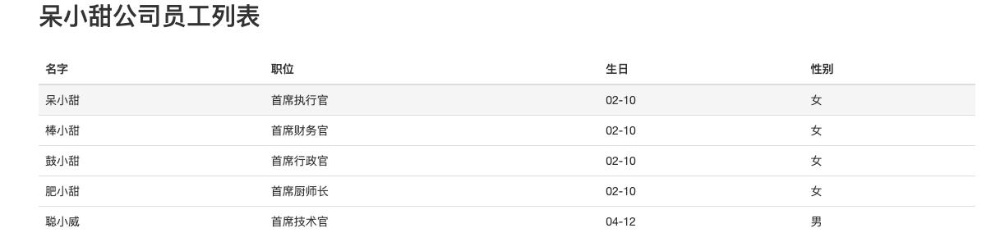

#### 注解方式

使用该方式想要实现的效果是这样的，不需要xml文件，用注解来代替项目来文件。该部分的说明我们按照演变的趋势来说明。我们先看看前面我们实现的方式。

首先将总的`application.yaml`文件内容配置如下：

```yaml
# 数据库连接配置
spring:
  datasource:
    url: jdbc:mysql://localhost:3306/springdemo?useSSL=false
    username: root
    password: zhoudbw_tian
    # 可以不配置，能够根据url默认识别
    driver-class-name: com.mysql.jdbc.Driver

  # 选择使用哪种配置环境进行mybatis和springboot的整合
  profiles:
    active: 0xml


## * 使用mybatis集成springboot是需要的配置

---
# ** 方式一：mybatis-cn.zhoudbw.config.xml 和 EmployeeMapper.xml 都配置
spring:
  profiles: 2xml

server:
  port: 8020

mybatis:
  # 配置mybatis的xml配置文件的位置
  # mybatis.cn.zhoudbw.config-location=classpath:mybatis-cn.zhoudbw.config.xml
  cn.zhoudbw.config-location: classpath:mybatis-cn.zhoudbw.config.xml # 这么写，需要将配置文件放在src/resources目录下

---
# ** 方式二：将mybatis-cn.zhoudbw.config.xml内的配置放在application.yaml中配置
spring:
  profiles: 1xml

server:
  port: 8010

mybatis:
  # mybatis.mapper-locations=classpath*:/mappers/*.xml 声明实体类对应的mapper的xml文件所在位置
  mapper-locations: classpath*:/mybatis/mapper/*.xml
  # mybatis.type-aliases-package=sample.mybatis.domain 声明实体类所在的位置
  type-aliases-package: cn.zhoudbw.model

---

# ** 方式三：完全注解的方式，没有xml文件
spring:
  profiles: 0xml
server:
  port: 8000

# mybatis-cn.zhoudbw.config.xml里面的配置我们也不想要在application.yaml中配置了，

# 但是我们需要找到mapper层，且得有对应的映射文件处理，怎么办呢？
# 这个的实现可以通过@Mapper指定接口，那么这个接口就可以被找到了，
# 通过注解@Select("sql"),放置在方法上方，这样就能够对应相应的mapper层方法对应的sql语句了。

---
```

对该文件内容进行简要的说明。该文件提供了三种配置环境：0xml、1xml、2xml，分别表示0个xml文件、1个xml文件、2个xml文件。演变过程也是从xml文件从多到少进行的。

**使用xml文件的方式**

`1. mybatis-cn.zhoudbw.config.xml`

```xml
<?xml version="1.0" encoding="UTF-8" ?>

<!DOCTYPE configuration
        PUBLIC "-//mybatis.org//DTD Config 3.0//EN"
        "http://mybatis.org/dtd/mybatis-3-cn.zhoudbw.config.dtd">

<configuration>

    <!--实体类的位置-->
    <typeAliases>
        <package name="cn.zhoudbw.model"/>
    </typeAliases>

    <!--实体类对应的mapper的位置-->
    <mappers>
        <!--这种路径写法需要在src/resource目录下创建相应的文件-->
        <mapper resource="mybatis/mapper/EmployeeMapper.xml" />
    </mappers>
</configuration>
```

`2. EmployeeMapper.xml`

```xml
<?xml version="1.0" encoding="UTF-8" ?>

<!DOCTYPE mapper
        PUBLIC "-//mybatis.org//DTD Mapper 3.0//EN"
        "http://mybatis.org/dtd/mybatis-3-mapper.dtd">

<!--该文件本质就是ＳＱＬ的执行文件-->

<!--namespace指定哪个实体类找到这个xml文件-->
<mapper namespace="cn.zhoudbw.mapper.EmployeeMapper">

    <!--id对应SQL语句对应的mapper中的方法-->
    <!--resultType指定该方法执行之后的返回结果类型-->
    <!--当调用mapper中的方法是，会根据这个mapper文件，映射方法，从而执行得到最终的结果-->
    <!--也就是这个mapper文件会映射到cn.zhoudbw.mapper.EmployeeMapper类-->
    <select id="employeeList" resultType="cn.zhoudbw.model.Employee">
        <!--该方法需要的SQL-->
        SELECT id, name, job, birthday, sex FROM employee
    </select>
</mapper>
```

`3. EmployeeMapper.java`

```java
package cn.zhoudbw.mapper;

import cn.zhoudbw.model.Employee;
import org.apache.ibatis.annotations.Mapper;
import org.apache.ibatis.annotations.Select;

import java.util.List;

/**
 * @author zhoudbw
 * 使用mybatis整合，就需要dao层的支持了
 * @Repository 声明该类是DAO层
 * <p>
 * 由于是mybatis的整合，所以dao层命名为mapper。实际上是一样的。
 */

//@Repository
//public class EmployeeMapper {
//
//    /**
//     * 查询全部
//     * @return 返回存有所有Employee的列表
//     */
//    public List<Employee> employeeList() {
//        return null;
//    }
//}

/**
 * @author zhoudbw
 * 现在这个方法整个就变化了，利用 @Mapper声明，变成接口，没有具体的方法实现
 *
 * @Mapper
 *  1. 在启动类中使用@MapperScan("mapper接口所在包全名")即可，不用一个一个的在Mapper接口中加@Mapper注解。
 *  2. @Mapper注解声明该接口是mybatis的mapper接口，能够自动的把加@Mapper注解的接口生成动态代理类。
 *  3. 让springboot认识你的mapper层，也可以在启动类上面加MapperScan("mapper层所在包的全名")
 *  4. 不用写Mapper映射文件（XML）
 */

@Mapper
public interface EmployeeMapper {

    /**
     * 查询全部
     * @Select 该注解是为了取代EmployeeMapper.xml中的<select></>标签的
     *   通过 @Mapper @Select 就可以不用写EmployeeMapper.xml了。
     * @return 返回存有所有Employee的列表
     */
    @Select("SELECT id, name, job, birthday, sex FROM employee")
    List<Employee> employeeList();
}
```

- 使用两个xml文件的时候，需要在application.yaml中配置mybatis-cn.zhoudbw.config.xml的位置

  在mybatis-cn.zhoudbw.config.xml中配置两项

  - ```xml
    <!--实体类的位置-->
    <typeAliases>
      <package name="cn.zhoudbw.model"/>
    </typeAliases>
    ```

  - ```xml
    <!--实体类对应的mapper的位置-->
    <mappers>
      <!--这种路径写法需要在src/resource目录下创建相应的文件-->
      <mapper resource="mybatis/mapper/EmployeeMapper.xml" />
    </mappers>
    ```

    根据该配置文件，我们又要补充mapper层对应的mapper.xml文件

    在该文件中配置如下两项：

    - ```xml
      <!--namespace指定哪个实体类找到这个xml文件-->
      <mapper namespace="cn.zhoudbw.mapper.EmployeeMapper">
          <!--id对应SQL语句对应的mapper中的方法-->
          <!--resultType指定该方法执行之后的返回结果类型-->
          <!--当调用mapper中的方法是，会根据这个mapper文件，映射方法，从而执行得到最终的结果-->
          <!--也就是这个mapper文件会映射到cn.zhoudbw.mapper.EmployeeMapper类-->
          <select id="employeeList" resultType="cn.zhoudbw.model.Employee">
              <!--该方法需要的SQL-->
              SELECT id, name, job, birthday, sex FROM employee
          </select>
      </mapper>
      ```

    - ```
      指定该xml映射的mapper类
      根据mapper中的方法，对应不同的操作方法。
      ```

- 使用一个xml文件的时候，我们将mybatis-cn.zhoudbw.config.xml的配置移动到application.xml中，省去了mybatis-cn.zhoudbw.config.xml文件

  - ```yaml
    # ** 方式二：将mybatis-cn.zhoudbw.config.xml内的配置放在application.yaml中配置
    spring:
      profiles: 1xml
    
    server:
      port: 8010
    
    mybatis:
      # mybatis.mapper-locations=classpath*:/mappers/*.xml 声明实体类对应的mapper的xml文件所在位置
      mapper-locations: classpath*:/mybatis/mapper/*.xml
      # mybatis.type-aliases-package=sample.mybatis.domain 声明实体类所在的位置
      type-aliases-package: cn.zhoudbw.model
    ```

- 不使用xml文件的时候，我们用注解来全部代替xml文件

  - ```
    使用@Mapper来定位声明是mapper类
    使用@Select("sql")来对应mapper类中查询操作方法
    基于上述两个注解，我们就相当于是取代了EmployeeMapper.xml, mybatis-cn.zhoudbw.config.xml
    ```

  - ```java
    @Mapper
    public interface EmployeeMapper {
    
        /**
         * 查询全部
         * @Select 该注解是为了取代EmployeeMapper.xml中的<select></>标签的
         *   通过 @Mapper @Select 就可以不用写EmployeeMapper.xml了。
         * @return 返回存有所有Employee的列表
         */
        @Select("SELECT id, name, job, birthday, sex FROM employee")
        List<Employee> employeeList();
    }
    ```

运行结果：


