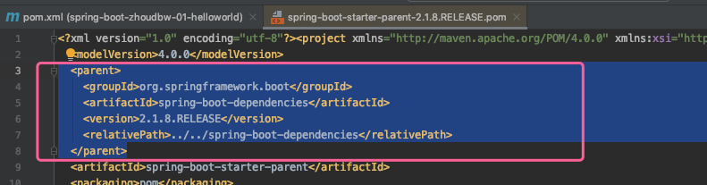
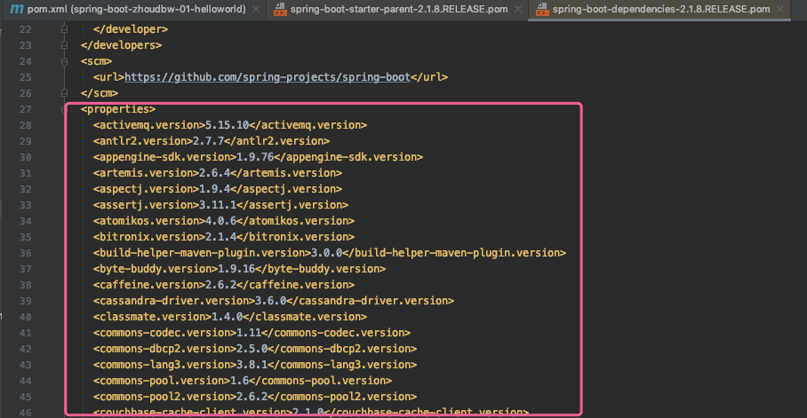
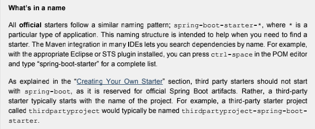

## SpringBoot启动配置原理

学习SpringBoot底层原理，不可避免的需要知道，Java注解的原理。

### Java注解

#### 注解基础

```apl
定义：注解（Annotation），也叫元数据。一种代码级别的说明。
它是JDK1.5及以后版本引入的 一个特性，与类、接口、枚举是在同一个层次。
它可以声明在包、类、字段、方法、局部变量、方法参数等的前面，用来对这些元素进行说明，注释。 
作用：本来可能需要很多配置文件，需要很多逻辑才能实现的内容，就可以使用一个或者多个注解来替代，这样就使得编程更加简洁，代码更加清晰。 
原理：本质上就是一个继承自`java.lang.annotation.Annotation`的接口。 
接口如何设置属性呢？简单来说，就是Java通过动态代理的方式生成了一个实现了注解的实例（ 对于当前的实体来说，例如类、方法、属性域等，这个代理对象是单例的 ），然后对该代理实例的属性赋值之后，这样就可以在程序运行时（如果将注解设置为运行时可见的话）通过反射获取到注解的配置信息，从而达到使用的目的。
注解实际上就是通过 "动态代理+反射" 实现的。
```

#### 注解分类

```
1）按照运行机制划分： 
【源码注解 → 编译时注解 → 运行时注解】 
源码注解：只在源码中存在，编译成 .class 文件就不存在了。 
编译时注解：在源码和 .class 文件中都存在。像前面的 @Override、 @Deprecated、 @SuppressWarnings，他们都属于编译时注解。 
运行时注解：在运行阶段还起作用，甚至会影响运行逻辑的注解。像 @Autowired 自动注入的这样一种注解就属于运行时注解，它会在程序运行的时候把你的成员变量自动的注入进来。 

2）按照来源划分：【来自JDK的注解、来自第三方的注解、自定义注解】 
 
3）元注解：元注解是给注解进行注解，可以理解为注解的注解就是元注解。自定义注解的时候都需要使用元注解。
```

#### 注解详解

```java
@Target({ElementType.METHOD, ElementType.TYPE})
@Retention(RetentionPolicy.RUNTIME)
@Inherited
@Documented
public @interface Description {
  String desc();
  String author();
  int age() default 18;
}
/*
上述为一个普通注解的形态。`@Target()、@Retention()、@Inherited、@Documented`四大元注解。

首先我们要明确这不是一个接口，它是使用 @interface 关键字定义的一个注解。

然后我们看下面的几个方法，String desc(); 虽然它很类似于接口里面的方法，其实它在注解里面只是一个成员变量（成员以无参无异常的方式声明），int age() default 18;（成员变量可以用 default 指定一个默认值的）。

最后我们知道：
①.成员类型是受限制的，合法的类型包括基本的数据类型以及String，Class，Annotation，Enumeration等。
②.如果注解只有一个成员，则成员名必须取名为 value()，在使用时可以忽略成员名和赋值号（=）。
③.注解类可以没有成员，没有成员的注解称为标识注解。
*/
```

#### 元注解（负责注解其他注解）

```
1）@Target 是这个注解的作用域，ElementType.METHOD是这个注解的作用域的列表， METHOD是方法声明，除此之外，还有：CONSTRUCTOR（构造方法声明）, FIELD（字段声明）, LOCAL VARIABLE（局部变量声明）, PACKAGE（包声明）, PARAMETER（参数声明）,TYPE（类接口）

2）@Retention 是它的生命周期，前面不是说注解按照运行机制有一个分类嘛，RUNTIME就是在运行时存在，可以通过反射读取。除此之外，还有：SOURCE（只在源码显示，编译时丢弃）,CLASS（编译时记录到class中，运行时忽略）,RUNTIME（运行时存在，可以通过反射读取）

3）@Inherited是一个标识性的元注解，它允许子注解继承它。

4）@Documented，生成javadoc时会包含注解。
```

### Spring注解

#### Spring常用注入注解

```apl
注入注解：顾名思义就是通过注解来实现注入。
Spring和注入相关的常见注解有@Autowired、@Resource、@Qualifier、@Service、@Controller、@Repository、@Component。

1）@Autowired 是自动注入，默认按类型匹配的方式，在容器查找匹配的Bean，当有且仅有一个匹配的Bean时，Spring将其注入@Autowired标注的变量中；
2）@Resource 用来指定名称注入
3）@Qualifier 和 @Autowired 配合使用，指定 bean 的名称。如果容器中有一个以上匹配的Bean，则可以通过 @Qualifier注解限定Bean的名称；
4）@Service，@Controller，@Repository分别标记类是Service层类，Controller层类，数据访问层的类， Spring扫描注解配置时，会标记这些类要生成bean；
5）@Component是一种泛指，标记类是组件，Spring扫描注解配置时，会标记这些类要生成bean。（不建议使用）

注：上面的@Autowired和@Resource是用来修饰字段，构造函数，或者设置方法，并做注入的。 
而@Service，@Controller，@Repository，@Component 则是所有受Spring 管理组件的通用形式，在组件不明确具体类别时使用。
```

#### Spring常用配置注解回顾

```apl
从Spring3.0，@Configuration用于定义配置类，可替换xml配置文件，被注解的类内部包含有一个或多个被@Bean注解的方法，@Bean就相当于原先xml里面的<bean />

1) @EnableXXX 注解: 配合@Configuration使用，包括 @EnableAsync(自动的异步), @EnableScheduling(自动的定时), @EnableTransactionManagement(事务管理), @EnableAspectJAutoProxy(切面), @EnableWebMvc(WebMVC)。
2）@PropertySources 注解，配合@Configuration加载外部配置文件，使用@Value加载配置项。
3）@Import 注解，可以组合多个配置类。
4）@Lazy 懒加载注解，与@Configuration和@Bean配合使用。Spring默认不是懒加载。
5）@Profile逻辑组配置，用于指定配置类加载的逻辑组(开发/生产环境)，只有在组内的配置类才会被加载。
```

### HelloWorld 探秘

我们在创建HelloWorld的时候，第一步是引入依赖。我们首先来看看我们首先引入的超级父pom都做了什么：

```xml
<!--超级父pom，是springboot的父依赖
    帮我们集成了很多子依赖，而且声明了版本号
    引入这个父pom，也标志着我们要创建一个SpringBoot的项目-->
<parent>
    <groupId>org.springframework.boot</groupId>
    <artifactId>spring-boot-starter-parent</artifactId>
    <version>2.1.8.RELEASE</version>
    <relativePath/> <!-- lookup parent from repository -->
</parent>
```



```xml
<parent>
    <groupId>org.springframework.boot</groupId>
    <artifactId>spring-boot-dependencies</artifactId>
    <version>2.1.8.RELEASE</version>
    <relativePath>../../spring-boot-dependencies</relativePath>
</parent>
```

我们看到`spring-boot-starter-parent` 又继承了一个依赖`spring-boot-dependencies`

接着深入，查看`spring-boot-dependencies`下面都有什么：



该文件中定义了一个`<properties>...</properties>` 标签，改标签定义了很多的版本号。比如：`activemq、aspectj、commons-codec、commons-lang3、jackson、javax、themeleaf、webjars等等`。该标签相当于是帮我们集成了当前springboot最匹配的其他包相应的版本号。

所以在实际使用的时候时候，我们引入`spring-boot-start-web`、引入`spring-boot-devtools`，我们都没有去声明其版本号，因为版本号使用的是`spring-boot-starter-parent` 父级`spring-boot-dependencies` 里面的版本号。当`spring-boot-dependencies`没有这个版本号才需要我们去声明。

```xml
<!--创建SpringBoot的web项目所需的依赖
明显，缺少version这项，是因为版本号已经在parent里面声明过了-->
<dependency>
    <groupId>org.springframework.boot</groupId>
    <artifactId>spring-boot-starter-web</artifactId>
</dependency>

<!--SpringBoot热部署工具的依赖-->
<dependency>
    <groupId>org.springframework.boot</groupId>
    <artifactId>spring-boot-devtools</artifactId>
    <optional>true</optional>
</dependency>
```

接下来我们来看看springboot的依赖的命名规范。就拿上面的`spring-boot-starter-web`和`spring-boot-devtools`来说，似乎遵循着某种规范，都叫 <i>spring-boot-starter-xxx</i>。这其实就是springboot的依赖的命名规范。

**starter启动器**

```
SpringBoot的一大优势就是starter，由于SpringBoot有很多开箱即用的Starter依赖，使得我们开发变得简单，我们不需要过多的关注框架的配置。
可以认为starter是一种服务(更方便的使用第三方依赖)——使得使用某个功能的开发者不需要关注各种依赖库的处理，不需要具体的配置信息，由SpringBoot自动通过classpath路径下的类发现需要的Bean，并织入bean。
starter列表见官方文档PartIII 13.5 官方命名规则spring-boot- starter-模块名，快速整合第三方依赖。（截取部分，见下表）
```

```abap
* 截取自官方文档：spring-booot-reference-v2.1.8
```

**13.5 Starters**

Starters are a set of convenient dependency descriptors that you can include in your application.  You get a one-stop shop for all the Spring and related technologies that you need without having to hunt through sample code and copy-paste loads of dependency descriptors. For example, if you want to get started using Spring and JPA for database access, include the spring-boot-starter-data-jpa dependency in your project.

The starters contain a lot of the dependencies that you need to get a project up and running quickly and with a consistent, supported set of managed transitive dependencies.



The following application starters are provided by Spring Boot under the org.springframework.boot group:

**Table Spring Boot application starters** (示例截取两个)

| Name                            | Description                                                  | Pom                                                          |
| ------------------------------- | ------------------------------------------------------------ | ------------------------------------------------------------ |
| spring-boot-starter-data-jpa    | Starter for using Spring Data JPA with Hibernate             | {github-code}/spring-bootproject/spring-boot-starters/spring-boot-starter-data-jpa/pom.xml[Pom] |
| spring-boot-starterdata-mongodb | Starter for using MongoDB document-oriented database and Spring Data MongoDB | {github-code}/spring-bootproject/spring-boot-starters/spring-boot-starter-datamongodb/pom.xml[Pom] |

提供了一系列的starter，实际上就是抽象了一系列的场景，用starter帮助我们封装好了，作为一种服务提供给我们使用，是一种依赖的服务，这样我们对于依赖的使用就更加简便了。

---

依赖之后，我们来看看Springboot的入口类做了什么事情：

```java
import org.springframework.boot.SpringApplication;
import org.springframework.boot.autoconfigure.SpringBootApplication;

@SpringBootApplication
public class DemoApplication {
    public static void main(String[] args) {
        SpringApplication.run(DemoApplication.class, args);
    }
}
```

调用SpringApplication的run()方法，并且添加注解 @SpringBootApplication

* **@SpringBootApplication做了哪些事？**

  * @SpringApplication源码：

    ```java
    /**
     * Indicates a {@link Configuration configuration} class that declares one or more
     * {@link Bean @Bean} methods and also triggers {@link EnableAutoConfiguration
     * auto-configuration} and {@link ComponentScan component scanning}. This is a convenience
     * annotation that is equivalent to declaring {@code @Configuration},
     * {@code @EnableAutoConfiguration} and {@code @ComponentScan}.
     *
     * @author Phillip Webb
     * @author Stephane Nicoll
     * @since 1.2.0
     */
    @Target(ElementType.TYPE)
    @Retention(RetentionPolicy.RUNTIME)
    @Documented
    @Inherited
    @SpringBootConfiguration
    @EnableAutoConfiguration
    @ComponentScan(excludeFilters = { @Filter(type = FilterType.CUSTOM, classes = TypeExcludeFilter.class),
    		@Filter(type = FilterType.CUSTOM, classes = AutoConfigurationExcludeFilter.class) })
    public @interface SpringBootApplication {
    
    	/**
    	 * Exclude specific auto-configuration classes such that they will never be applied.
    	 * @return the classes to exclude
    	 */
    	@AliasFor(annotation = EnableAutoConfiguration.class)
    	Class<?>[] exclude() default {};
    
    	/**
    	 * Exclude specific auto-configuration class names such that they will never be
    	 * applied.
    	 * @return the class names to exclude
    	 * @since 1.3.0
    	 */
    	@AliasFor(annotation = EnableAutoConfiguration.class)
    	String[] excludeName() default {};
    
    	/**
    	 * Base packages to scan for annotated components. Use {@link #scanBasePackageClasses}
    	 * for a type-safe alternative to String-based package names.
    	 * <p>
    	 * <strong>Note:</strong> this setting is an alias for
    	 * {@link ComponentScan @ComponentScan} only. It has no effect on {@code @Entity}
    	 * scanning or Spring Data {@link Repository} scanning. For those you should add
    	 * {@link org.springframework.boot.autoconfigure.domain.EntityScan @EntityScan} and
    	 * {@code @Enable...Repositories} annotations.
    	 * @return base packages to scan
    	 * @since 1.3.0
    	 */
    	@AliasFor(annotation = ComponentScan.class, attribute = "basePackages")
    	String[] scanBasePackages() default {};
    
    	/**
    	 * Type-safe alternative to {@link #scanBasePackages} for specifying the packages to
    	 * scan for annotated components. The package of each class specified will be scanned.
    	 * <p>
    	 * Consider creating a special no-op marker class or interface in each package that
    	 * serves no purpose other than being referenced by this attribute.
    	 * <p>
    	 * <strong>Note:</strong> this setting is an alias for
    	 * {@link ComponentScan @ComponentScan} only. It has no effect on {@code @Entity}
    	 * scanning or Spring Data {@link Repository} scanning. For those you should add
    	 * {@link org.springframework.boot.autoconfigure.domain.EntityScan @EntityScan} and
    	 * {@code @Enable...Repositories} annotations.
    	 * @return base packages to scan
    	 * @since 1.3.0
    	 */
    	@AliasFor(annotation = ComponentScan.class, attribute = "basePackageClasses")
    	Class<?>[] scanBasePackageClasses() default {};
    }
    ```
    * 四大元注解：@Target(ElementType.TYPE)   @Retention(RetentionPolicy.RUNTIME)   @Documented   @Inherited 

    * 主要使用三个注解：@SpringBootConfiguration   @ComponentScan

      * ```
        1. @SpringBootConfiguration 是对配置的声明注解，封装了注解@Configuration，该注解对应一个配置文件，可以调用Spring容器去注入bean。配置该注解的类能够以 JavaConfig的方式完成配置，不再使用XML配置
        2. @SpringBootConfiguration 是自动注入配置的注解，是基于已经添加的依赖项，猜测你要如何使用Spring的相关配置。
        该注解由四大元注解和@AutoConfigurationPackage和@AutoConfigurationImportSelector注解构成。
                @Target(ElementType.TYPE)
                @Retention(RetentionPolicy.RUNTIME)
                @Documented
                @Inherited
                @AutoConfigurationPackage
                @Import(AutoConfigurationImportSelector.class)
        3. @ComponentScan 是扫描注解的注解，功能是自动扫描，默认扫描所在类的入口类和同级目录下的所有类，扫描地址可以更改。相当于Spring XML配置文件中的<context: component-scan >
        4. @Target、@Retention、@Documented、@Inherited是java元注解(注解其他注解) 表明注解的使用位置、保留时间(编译策略)、文档化使用和允许子类继承父类等
        ```

  * 总结：@SpringApplication做了三件事：声明配置类、自动注入配置、自动扫描包

* **run()启动过程做了哪些事**

  * 首先我们用SpringApplication这个类，然后运行它的run方法，传的参数是当前类类型即Xxxx.class，以及main方法的参数。

  * 本质上run方法是创建一个SpringApplication实例，然后再执行该实例的run()方法，然后通过这个实例返回一个 ConfigurableApplicationContext对象。

    ```java
    /**
     * Static helper that can be used to run a {@link SpringApplication} from the
     * specified sources using default settings and user supplied arguments.
     * @param primarySources the primary sources to load
     * @param args the application arguments (usually passed from a Java main method)
     * @return the running {@link ApplicationContext}
     */
    public static ConfigurableApplicationContext run(Class<?>[] primarySources, String[] args) {
    	return new SpringApplication(primarySources).run(args);
    }
    ```

    * 创建SpringApplication实例的过程

      ```java
      /**
       * Create a new {@link SpringApplication} instance. The application context will load
       * beans from the specified primary sources (see {@link SpringApplication class-level}
       * documentation for details. The instance can be customized before calling
       * {@link #run(String...)}.
       * @param resourceLoader the resource loader to use
       * @param primarySources the primary bean sources
       * @see #run(Class, String[])
       * @see #setSources(Set)
       */
      @SuppressWarnings({ "unchecked", "rawtypes" })
      public SpringApplication(ResourceLoader resourceLoader, Class<?>... primarySources) {
        /* 加载资源*/
      	this.resourceLoader = resourceLoader;
        /* 判断 PrimarySources 是否为空 */ 
      	Assert.notNull(primarySources, "PrimarySources must not be null");
        /* 加载主配置 */
      	this.primarySources = new LinkedHashSet<>(Arrays.asList(primarySources));
        /* 确定web应用的类型 */
      	this.webApplicationType = WebApplicationType.deduceFromClasspath();
        //================================上述三项为配置项=============================
        /* 查看初始化器和监听器并设置进来 -> 通过getSpringFactoriesInstances找到 */
        /* public static final String FACTORIES_RESOURCE_LOCATION = "META-INF/spring.factories";
        	 在该文件下加载Spring初始化器和监听器	*/
        /* 查找方式：SpringFactoriesLoader类的loadFactories()方法。加载"META-INF/spring.factories"文件 */
      	setInitializers((Collection) getSpringFactoriesInstances(ApplicationContextInitializer.class));
      	setListeners((Collection) getSpringFactoriesInstances(ApplicationListener.class));
        /* 主方法类的查找。通过传递的primarySources去查找主程序在哪里，也就是main() */
      	this.mainApplicationClass = deduceMainApplicationClass();
      }
      ```

    * SpringApplication创建之后开始执行run()，run()的执行过程

      ```java
      /**
       * Run the Spring application, creating and refreshing a new
       * {@link ApplicationContext}.
       * @param args the application arguments (usually passed from a Java main method)
       * @return a running {@link ApplicationContext}
       */
      public ConfigurableApplicationContext run(String... args) {
         /* 计时器 */
      	StopWatch stopWatch = new StopWatch();
         /* 计时开始 */
      	stopWatch.start();
         /* 开始创建应用上下文(容器) */
      	ConfigurableApplicationContext context = null;
      	Collection<SpringBootExceptionReporter> exceptionReporters = new ArrayList<>();
         /* 加载配置 */
      	configureHeadlessProperty();
         /* 获取监听器 */
      	SpringApplicationRunListeners listeners = getRunListeners(args);
      	listeners.starting(); // 监听器启动
      	try {
           /* 在Application的参数中创建一个默认的参数 */
      		ApplicationArguments applicationArguments = new DefaultApplicationArguments(args);
           /* 在配置的环境中准备配置的环境 */
      		ConfigurableEnvironment environment = prepareEnvironment(listeners, applicationArguments);
      		configureIgnoreBeanInfo(environment);
           /* 打印banner */
      		Banner printedBanner = printBanner(environment);
           /* 创建容器 */
      		context = createApplicationContext();
           /* 获取Spring里面的实例中，这里是异常报告以及配置的应用容器 */
      		exceptionReporters = getSpringFactoriesInstances(SpringBootExceptionReporter.class,
      				new Class[] { ConfigurableApplicationContext.class }, context);
           /* 准备上下文 */
      		prepareContext(context, environment, listeners, applicationArguments, printedBanner);
           /* 刷新上下文 */
      		refreshContext(context);
           /* 结束刷新 */
      		afterRefresh(context, applicationArguments);
           /* 计时结束 ， 代表创建成功*/
      		stopWatch.stop();
           /* 打印一部分日志 */
      		if (this.logStartupInfo) {
      			new StartupInfoLogger(this.mainApplicationClass).logStarted(getApplicationLog(), topWatch);
      		}
           /* 启动监听器 */
      		listeners.started(context);
           /* 进行回调 */
      		callRunners(context, applicationArguments);
      	}
      	catch (Throwable ex) {
      		handleRunFailure(context, ex, exceptionReporters, listeners);
      		throw new IllegalStateException(ex);
      	}
      	
        try {
           /* 启动监听器 */
      		listeners.running(context);
      	}
      	catch (Throwable ex) {
      		handleRunFailure(context, ex, exceptionReporters, null);
      		throw new IllegalStateException(ex);
      	}
         /* 返回上下文(返回容器) */
      	return context;
      }
      ```

    * 上述代码实际再做的事情就是：加载一系列配置、准备一系列日志、开始创建容器启动监听

      * run()方法，打印banner的执行过程

        ```java
        private Banner printBanner(ConfigurableEnvironment environment) {
          // 判断banner打印的模式是否为关闭，如果关闭什么都打印不了
        	if (this.bannerMode == Banner.Mode.OFF) {
        		return null;
        	}
          // banner打开，要去加载资源，获取banner对象，打印这个对象。
        	ResourceLoader resourceLoader = (this.resourceLoader != null) ? this.resourceLoader
        			: new DefaultResourceLoader(getClassLoader());
        	SpringApplicationBannerPrinter bannerPrinter = new SpringApplicationBannerPrinter(resourceLoader, this.banner);
        	if (this.bannerMode == Mode.LOG) {
        		return bannerPrinter.print(environment, this.mainApplicationClass, logger);
        	}
        	return bannerPrinter.print(environment, this.mainApplicationClass, System.out);
        }
        ```

        ```java
        private Banner getBanner(Environment environment) {
        		Banners banners = new Banners();
        		banners.addIfNotNull(getImageBanner(environment)); // 获取图片banner
        		banners.addIfNotNull(getTextBanner(environment)); // 获取文本banner
        		if (banners.hasAtLeastOneBanner()) {
        			return banners;
        		}
        		if (this.fallbackBanner != null) {
        			return this.fallbackBanner;
        		}
        		return DEFAULT_BANNER;
        	}
        ```

        ```java
        private Banner getTextBanner(Environment environment) {
        		String location = environment.getProperty(BANNER_LOCATION_PROPERTY, DEFAULT_BANNER_LOCATION); // 文本banner的地址 	static final String DEFAULT_BANNER_LOCATION = "banner.txt"; 也就是默认在src/main/resource下。
        		Resource resource = this.resourceLoader.getResource(location);
        		if (resource.exists()) {
        			return new ResourceBanner(resource);
        		}
        		return null;
        	}
        ```

      * run()方法创建容器的逻辑

        ```java
        /**
         * Strategy method used to create the {@link ApplicationContext}. By default this
         * method will respect any explicitly set application context or application context
         * class before falling back to a suitable default.
         * @return the application context (not yet refreshed)
         * @see #setApplicationContextClass(Class)
         */
        protected ConfigurableApplicationContext createApplicationContext() {
        	Class<?> contextClass = this.applicationContextClass;
        	if (contextClass == null) {
        		try {
        			switch (this.webApplicationType) {
        			case SERVLET:
        				contextClass = Class.forName(DEFAULT_SERVLET_WEB_CONTEXT_CLASS);
        				break;
        			case REACTIVE:
        				contextClass = Class.forName(DEFAULT_REACTIVE_WEB_CONTEXT_CLASS);
        				break;
        			default:
        				contextClass = Class.forName(DEFAULT_CONTEXT_CLASS);
        			}
        		}
        		catch (ClassNotFoundException ex) {
        			throw new IllegalStateException(
        					"Unable create a default ApplicationContext, " + "please specify an ApplicationContextClass",
        					ex);
        		}
        	}
          // 拿到类名，通过反射创建容器。
        	return (ConfigurableApplicationContext) BeanUtils.instantiateClass(contextClass);
        }
        ```

      * 调用执行callRunner()的逻辑

        ```java
        private void callRunners(ApplicationContext context, ApplicationArguments args) {
        	List<Object> runners = new ArrayList<>();
          /* 两种runner  ApplicationRunner CommandLineRunner 都是接口， 调用这种接口去执行。*/
        	runners.addAll(context.getBeansOfType(ApplicationRunner.class).values());
        	runners.addAll(context.getBeansOfType(CommandLineRunner.class).values());
        	AnnotationAwareOrderComparator.sort(runners);
        	for (Object runner : new LinkedHashSet<>(runners)) {
        		if (runner instanceof ApplicationRunner) {
        			callRunner((ApplicationRunner) runner, args);
        		}
        		if (runner instanceof CommandLineRunner) {
        			callRunner((CommandLineRunner) runner, args);
        		}
        	}
        }
        ```

        

**源码凭着一些并不能结束，更不能掌握。所以，一定要沉下心来，一点一点的看。哪怕，一天只是看了几百行，亦或几十行的代码。** 

