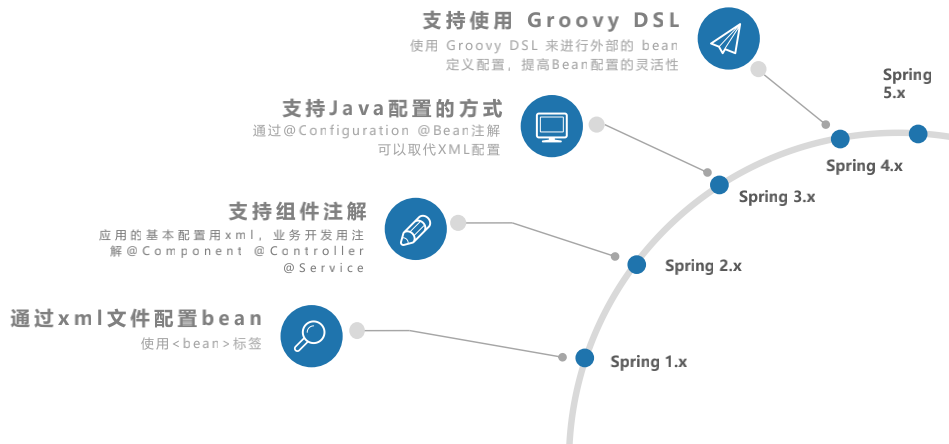
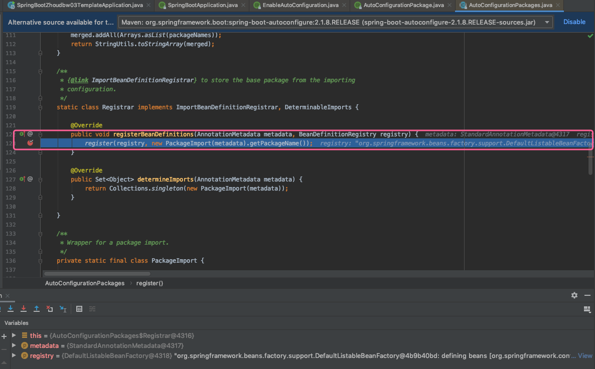
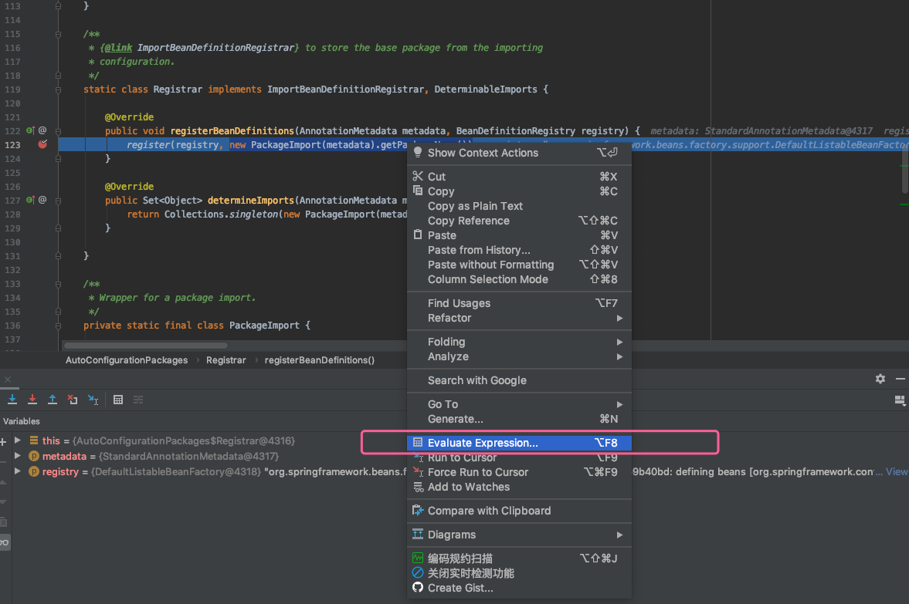
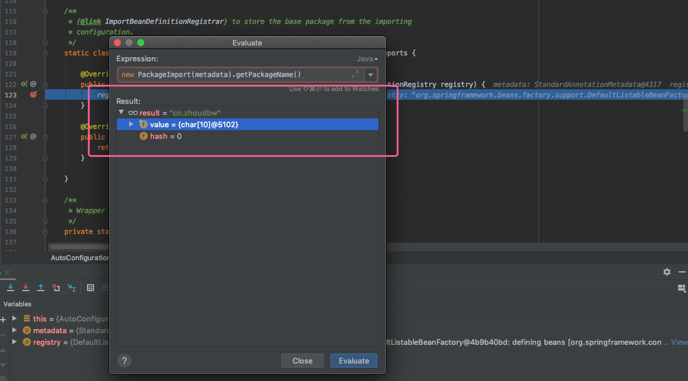
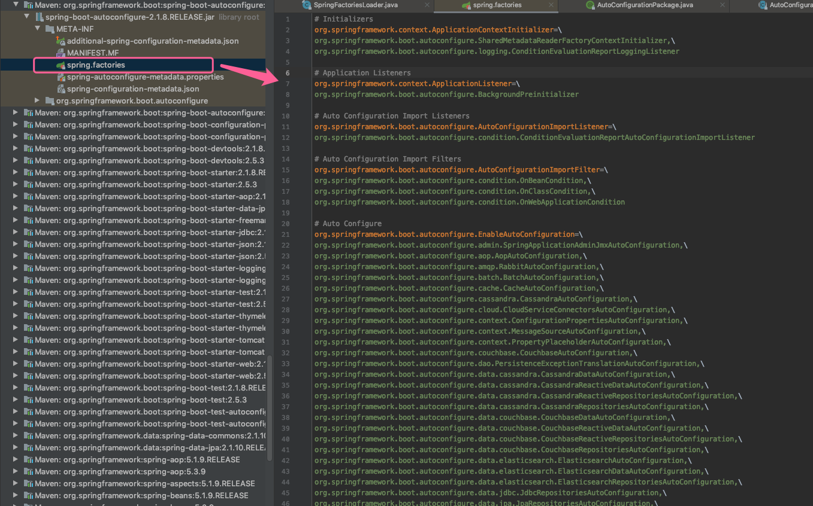
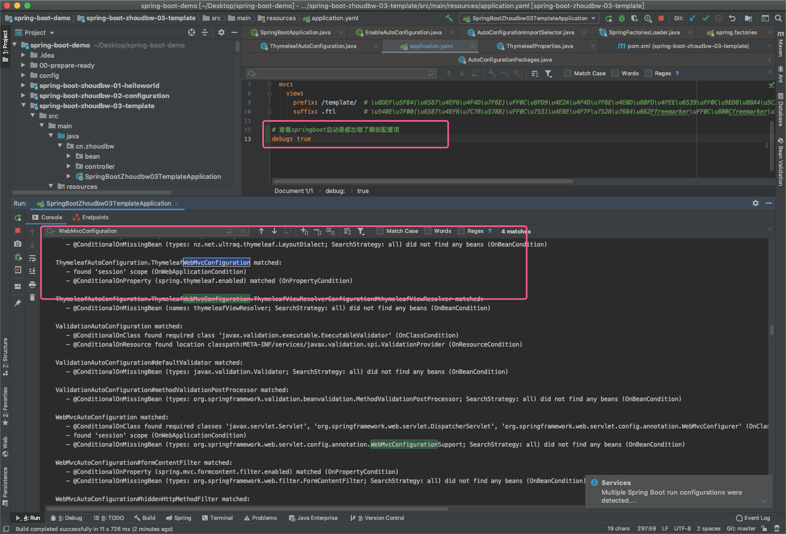

## 自动配置原理

### @Conditional注解

自动配置（Auto-configuration）是非侵入性的，任何时候你都可以定义自己 的配置类来替换自动配置的特定部分。了解这部分的原理，首先要知道一个注解，这个注解为SpringBoot提供了强大的支持，让SpringBoot在自动注入配置的时候非常的便捷，@Conditionlal。

```sql
SpringBoot的强大之处在于使用了Spring4框架的新特性：@Conditional注解，是一种判断条件的注解，该注解使得只有在特定条件满足是才启动一些配置。也就是说，当满足某种添加的时候才会使用这个注解标识的类或者方法。

除此以外，拓展的注解还有：
@ConditionalOnBean（仅仅在当前上下文中存在某个对象时，才会实例化一个Bean）
@ConditionalOnClass（某个class位于类路径上，才会实例化一个Bean）
@ConditionalOnExpression（当表达式为true的时候，才会实例化一个Bean）
@ConditionalOnMissingBean（仅仅在当前上下文中不存在某个对象时，才会实例化一个Bean）
@ConditionalOnMissingClass（某个class不存在的时候，才会实例化一个Bean）
@ConditionalOnWebApplication（是web应用时，才会调用这个注解标识的类或方法）
@ConditionalOnNotWebApplication（不是web应用时，才会调用这个注解标识的类或方法）

* 上述是条件注解，我们说springboot会猜测我们使用哪些配置？springboot猜测的方式就是，通过条件判断。这是一种条件判断的策略。
```

### Spring配置功能发展进程



注：Spring5的关键特性是响应式编程。

```
Spring1.x 的时候通过xml文件去配置bean。也就是我们使用spring时熟知的spring.xml，利用<bean />标签配置bean。

Spring2.x 的时候通过组件式注解的方式去配置。应用配置使用xml、业务开发用注解，如@Component，@Controller，@Service等。有了这些注解，在业务开发的时候，这些bean就不需要配置在xml中了。通过扫描的方式和注解本身去结合就可以代替xml。当时xml和注解是混用的，因为不能完全替代。

Spring3.x 的时候增加了@Configuration和@Bean这种注解，可以取代xml配置。可以完全不使用xml就可以使用Spring了。这也是SpringBoot的基础，是有了3.0以上版本的支持，SpringBoot才能做到完全弃用xml的。

Spring4.x 的时候更多的是推行一种Groovy DSL的方式，进行外部的bean定义配置，让bean的配置更加的灵活了。包括@Conditional这个条件注解也是在Spring4.0期间推出的。这也是springboot的一个基石。 * 有了弃用xml的方式，有了条件判断的方式，才能让springboot灵活的，自动化的猜测我们要使用哪些配置，让springboot变得智能起来。其实SpringBoot是Spring的一种智能方案。

Spring5.x 的时候，关键特性是响应式编程。 readme3.md 和 readme4.md详细介绍。
```

* 从xml文件 到 xml文件+注解组合使用 到 注解主要来使用，甚至到可以不用注解利用GroovyDSL这种动态语言的形式来定义外部bean，趋于越来越灵活的发展方向。

### SpringBoot自动注入配置注解做了哪些事

#### @EnableAutoConfiguration Javadoc

```java
/**
 * @link 表示这是一个链接，可以理解为一个对象、方法等在使用的链接
 * @code 表示是一段代码，即使纯粹的代码块
 *
 * Enable auto-configuration of the Spring Application Context, attempting to guess and
 * configure beans that you are likely to need. 
启动Spring应用上下文的自动配置，尝试猜测和配置你所需要的bean。
 * Auto-configuration classes are usually
 * applied based on your classpath and what beans you have defined. 
自动配置类通常是基于你定义的类路径和bean。
 * For example, if you
 * have {@code tomcat-embedded.jar} on your classpath you are likely to want a
 * {@link TomcatServletWebServerFactory} (unless you have defined your own
 * {@link ServletWebServerFactory} bean). 
例如，如果你有{@code tomcat-embedded.jar}在你的类路径上，你可能想要一个{@link TomcatServletWebServerFactory}(除非你已经定义了自己的{@link ServletWebServerFactory} bean)。
 * <p>
 * When using {@link SpringBootApplication}, the auto-configuration of the context is
 * automatically enabled and adding this annotation has therefore no additional effect.
当使用{@link SpringBootApplication}时，上下文的自动配置是自动启用和添加注解因此没有额外的影响。
 * <p>
 * Auto-configuration tries to be as intelligent as possible and will back-away as you
 * define more of your own configuration. 
自动配置会尽可能地智能化，并会后退让出更多的空间，所以你能定义更多您自己的配置。
 * You can always manually {@link #exclude()} any
 * configuration that you never want to apply (use {@link #excludeName()} if you don't
 * have access to them). 
你总是可以手动使用{@link #exclude()}排除任何你再也不想应用的配置(可以使用{@link # exudename ()} 根据名字，排除这些不想要被允许的配置。
 * You can also exclude them via the
 * {@code spring.autoconfigure.exclude} property. 
你也可以通过排除他们，凭借 {@code spring.autoconfigure.exclude}属性。
 * Auto-configuration is always applied
 * after user-defined beans have been registered.
自动配置是应用注册用户定义的bean之后。
 * <p>
 * The package of the class that is annotated with {@code @EnableAutoConfiguration},
 * usually via {@code @SpringBootApplication}, has specific significance and is often used
 * as a 'default'. 
用{@code @EnableAutoConfiguration}注释的类包，通常通过{@code @SpringBootApplication}，具有特定的意义，经常使用作为默认值。
 * For example, it will be used when scanning for {@code @Entity} classes.
例如，它将用于扫描{@code @Entity}类。
 * It is generally recommended that you place {@code @EnableAutoConfiguration} (if you're
 * not using {@code @SpringBootApplication}) in a root package so that all sub-packages
 * and classes can be searched.
一般建议您放置{@code @EnableAutoConfiguration}在根包中，以便所有子包和类可以被搜索。(如果你不使用{@code @SpringBootApplication}) 
 * <p>
 * Auto-configuration classes are regular Spring {@link Configuration} beans.
自动配置类是常规的Spring {@link Configuration} bean。
 * They are located using the {@link SpringFactoriesLoader} mechanism (keyed against this class).
它们是通过{@link springfactoresloader}机制定位的 (keyed against this class)。
 * Generally auto-configuration beans are {@link Conditional @Conditional} beans (most
 * often using {@link ConditionalOnClass @ConditionalOnClass} and
 * {@link ConditionalOnMissingBean @ConditionalOnMissingBean} annotations).
通常自动配置bean是{@link Conditional @Conditional} bean(大多数通常使用{@link ConditionalOnClass @ConditionalOnClass}和 {@link ConditionalOnMissingBean @ConditionalOnMissingBean}注解)。
 *
 * @author Phillip Webb
 * @author Stephane Nicoll
 * @since 1.0.0
 * @see ConditionalOnBean
 * @see ConditionalOnMissingBean
 * @see ConditionalOnClass
 * @see AutoConfigureAfter
 * @see SpringBootApplication
 */
```

#### @EnableAutoConfiguration Resource

```java
@Target(ElementType.TYPE)
@Retention(RetentionPolicy.RUNTIME)
@Documented
@Inherited
@AutoConfigurationPackage
@Import(AutoConfigurationImportSelector.class)
public @interface EnableAutoConfiguration {

	String ENABLED_OVERRIDE_PROPERTY = "spring.boot.enableautoconfiguration";

	/**
	 * Exclude specific auto-configuration classes such that they will never be applied.
	 * @return the classes to exclude
	 */
	Class<?>[] exclude() default {};

	/**
	 * Exclude specific auto-configuration class names such that they will never be
	 * applied.
	 * @return the class names to exclude
	 * @since 1.3.0
	 */
	String[] excludeName() default {};
}
```

* 主要由两大注解组成`@AutoConfigurationPackage`查找并注册自动配置包 和 `@Import`引入资源，自动配置的包选择器。

* 相关的逻辑都在spring-boot-autoconfigure.jar里。

* 实际是@AutoConfigurationPac kage和@Import的组合。将所有符合自动配置条件的bean定义加载到IoC容器。 

  @AutoConfigurationPackage：自动配置包，返回主程序类的同级以及子级的包组件。加载外部文件META-INF/ spring.factories。 

  @Import: 导入自动配置的组件。EnableAutoConfigurationImportSelector类抓取全部配置文件传输给加载器。 

  加载器SpringFactoriesLoader，提供一种配置查找的功能支持从classpath中搜寻所有的META- INF/ spring.factories配置文件，并将其中EnableutoConfiguration对应的配置项通过反射实例化为配置类，此配置类对应标注@Configuration注解，然后汇总为一个IoC容器。

  ---

* `@AutoConfigurationPackage`

  ```java
  /**
   * Indicates that the package containing the annotated class should be registered with
   * {@link AutoConfigurationPackages}.
   *
   * @author Phillip Webb
   * @since 1.3.0
   * @see AutoConfigurationPackages
   */
  @Target(ElementType.TYPE)
  @Retention(RetentionPolicy.RUNTIME)
  @Documented
  @Inherited
  @Import(AutoConfigurationPackages.Registrar.class)
  public @interface AutoConfigurationPackage {
  
  }
  ```

  * 引入自动配置的包注册器`@Import(AutoConfigurationPackages.Registrar.class)`

  * `Registrar.class`

    ```java
    /**
    	* {@link ImportBeanDefinitionRegistrar} to store the base package from the importing
    	* configuration.
    	*/
    static class Registrar implements ImportBeanDefinitionRegistrar, DeterminableImports {
    	@Override
      // 注册bean定义器，包名是主程序入口所在目录（默认只扫描入口类的当前目录和子目录）
    	public void registerBeanDefinitions(AnnotationMetadata metadata, BeanDefinitionRegistry registry) {
    		// 将new PackageImport(metadata).getPackageName()放到了注册器中
        // registry 是registerBeanDefinitions，是Bean初始化的注册器
        // debug该packagename -> 流程如下
        // new PackageImport(metadata).getPackageName()的值是cn.zhoudbw,是我们入口类的父级目录。
        // 所以这就像我们说的， 默认是扫描入口类所在同级目录及同级目录的子目录的。
        // 所以如果脱离了这个目录，这个类的注解是扫描不到的。
        register(registry, new PackageImport(metadata).getPackageName());
    	}
      
    	@Override
    	public Set<Object> determineImports(AnnotationMetadata metadata) {
    		return Collections.singleton(new PackageImport(metadata));
    	}
    }
    ```

    - 1. 打断点，debug运行
         
      2. 选中`new PackageImport(metadata).getPackageName())`右键，选择Evaluate Expression...
         
      3. 回车就可以看到执行的结果，是`cn.zhoudbw`
         

  * 将`new PackageImport(metadata).getPackageName()`放到了注册器中`register()`方法又做了什么

    ```java
    /**
     * Programmatically registers the auto-configuration package names. Subsequent
     * invocations will add the given package names to those that have already been
     * registered. You can use this method to manually define the base packages that will
     * be used for a given {@link BeanDefinitionRegistry}. Generally it's recommended that
     * you don't call this method directly, but instead rely on the default convention
     * where the package name is set from your {@code @EnableAutoConfiguration}
     * configuration class or classes.
     * @param registry the bean definition registry
     * @param packageNames the package names to set
     */
    // 注册这些bean的信息，定义器
    public static void register(BeanDefinitionRegistry registry, String... packageNames) {
    	if (registry.containsBeanDefinition(BEAN)) {
    		BeanDefinition beanDefinition = registry.getBeanDefinition(BEAN);
    		ConstructorArgumentValues constructorArguments = beanDefinition.getConstructorArgumentValues();
    		constructorArguments.addIndexedArgumentValue(0, addBasePackages(constructorArguments, packageNames));
    	}
    	else {
    		GenericBeanDefinition beanDefinition = new GenericBeanDefinition();
    		beanDefinition.setBeanClass(BasePackages.class);
    		beanDefinition.getConstructorArgumentValues().addIndexedArgumentValue(0, packageNames);
    		beanDefinition.setRole(BeanDefinition.ROLE_INFRASTRUCTURE);
    		registry.registerBeanDefinition(BEAN, beanDefinition);
    	}
    }
    ```

    ---

* `@Import(AutoConfigurationImportSelector.class)`中`AutoConfigurationImportSelector.class`做了哪些事

* `AutoConfigurationImportSelector.class`有个方法`selectImports`

  ```java
  @Override
  // 选择引入包，选择引入哪些包。
  // 这个方法自动配置两部分：
  //  1. 自动配置元数据
  //  2. 自动配置条目 —— 接下来看这部分
  public String[] selectImports(AnnotationMetadata annotationMetadata) {
  	if (!isEnabled(annotationMetadata)) {
  		return NO_IMPORTS;
  	}
  	AutoConfigurationMetadata autoConfigurationMetadata = AutoConfigurationMetadataLoader
  			.loadMetadata(this.beanClassLoader);
  	AutoConfigurationEntry autoConfigurationEntry = getAutoConfigurationEntry(autoConfigurationMetadata,
  			annotationMetadata);
  	return StringUtils.toStringArray(autoConfigurationEntry.getConfigurations());
  }
  ```

* `getAutoConfigurationEntry()，获取配置实例`

  ```java
  /**
  	* Return the {@link AutoConfigurationEntry} based on the {@link AnnotationMetadata}
  	* of the importing {@link Configuration @Configuration} class.
  	* @param autoConfigurationMetadata the auto-configuration metadata
  	* @param annotationMetadata the annotation metadata of the configuration class
  	* @return the auto-configurations that should be imported
  	*/
  protected AutoConfigurationEntry getAutoConfigurationEntry(AutoConfigurationMetadata autoConfigurationMetadata,	AnnotationMetadata annotationMetadata) {
  	if (!isEnabled(annotationMetadata)) {
  		return EMPTY_ENTRY;
  	}
    // 注解的参数
  	AnnotationAttributes attributes = getAttributes(annotationMetadata);
    // 获取条件配置,就是利用@Conditional注解实现的 —— 仔细看看
  	List<String> configurations = getCandidateConfigurations(annotationMetadata, attributes);
  	configurations = removeDuplicates(configurations);
  	Set<String> exclusions = getExclusions(annotationMetadata, attributes);
  	checkExcludedClasses(configurations, exclusions);
  	configurations.removeAll(exclusions);
  	configurations = filter(configurations, autoConfigurationMetadata);
  	fireAutoConfigurationImportEvents(configurations, exclusions);
  	return new AutoConfigurationEntry(configurations, exclusions);
  }
  ```

* `getCandidateConfigurations()` , 获取条件配置

  ```java
  /**
   * Return the auto-configuration class names that should be considered. By default
   * this method will load candidates using {@link SpringFactoriesLoader} with
   * {@link #getSpringFactoriesLoaderFactoryClass()}.
   * @param metadata the source metadata
   * @param attributes the {@link #getAttributes(AnnotationMetadata) annotation
   * attributes}
   * @return a list of candidate configurations
   */
  // 通过Spring的工厂加载器，获取名称。
  protected List<String> getCandidateConfigurations(AnnotationMetadata metadata, AnnotationAttributes attributes) {
    // 首先找SpringFactoriesLoader加载相关的FactoryName
    // 在 public static final String FACTORIES_RESOURCE_LOCATION = "META-INF/spring.factories"; 这个路径下加载资源
    // loadFactoryNames(),加载上述文件中的内容。
  	List<String> configurations = SpringFactoriesLoader.loadFactoryNames(getSpringFactoriesLoaderFactoryClass(), getBeanClassLoader());
  	Assert.notEmpty(configurations, "No auto configuration classes found in META-INF/spring.factories. If you " + "are using a custom packaging, make sure that file is correct.");
  	return configurations;
  }
  ```

* `META-INF/spring.factories`的内容，这些都是在自动配置的时候需要加载的。是会条件选择去加载的，只是先将这些条目注册进来，看这个类可能要加载，具体加不加载是要有个条件判断的。
  

* 从上图我们可以看出，这些类是以XxxAutoConfiguration命名的一系列配置类。

  ---

* **以ThymeleafAutoConfiguration为了，查看选择注解的机制**

  * `ThymeleafAutoConfiguration`有如下四大注解：

  ```java
  @Configuration // 声明这是一个配置类（也就是说明这是一个类似xml类）
  @EnableConfigurationProperties(ThymeleafProperties.class) // 加载ThymeleafProperties这个配置文件类
  @ConditionalOnClass({ TemplateMode.class, SpringTemplateEngine.class }) // 当存在TemplateMode和SpringTemplateEngine才会执行这个类的逻辑，控制条件注解
  @AutoConfigureAfter({ WebMvcAutoConfiguration.class, WebFluxAutoConfiguration.class }) // 在执行了WebMvcAutoConfiguration和WebFluxAutoConfiguration之后才会执行这个类，控制执行顺序
  ```

  **ThymeleafAutoConfiguration执行逻辑**

  1. 先执行AutoConfigureAfter里面的属性类

  2. 判断是否存在ConditionalOnClass里面的class文件（是否存在取决于pom是否引入依赖）

     ```xml
     首先引入starter（封装的启动器）
     <!--thymeleaf模板的依赖-->
     <!--启动器形式的Thymeleaf的依赖-->
     <dependency>
         <groupId>org.springframework.boot</groupId>
         <artifactId>spring-boot-starter-thymeleaf</artifactId>
     </dependency>
     
     启动器引入具体的依赖：spring-boot-starter、thymeleaf-spring5以及thymeleaf-extras-java8time
     <dependency>
         <groupId>org.springframework.boot</groupId>
         <artifactId>spring-boot-starter</artifactId>
         <version>2.1.8.RELEASE</version>
         <scope>compile</scope>
     </dependency>
     <dependency>
         <groupId>org.thymeleaf</groupId>
         <artifactId>thymeleaf-spring5</artifactId>
         <version>3.0.11.RELEASE</version>
         <scope>compile</scope>
     </dependency>
     <dependency>
         <groupId>org.thymeleaf.extras</groupId>
         <artifactId>thymeleaf-extras-java8time</artifactId>
         <version>3.0.4.RELEASE</version>
         <scope>compile</scope>
     </dependency>
     
     具体依赖就存在我们需要要的class
     如：thymeleaf-spring5.jar中存在SpringTemplateEngine.class
     ```

  3. 判断需要执行后，开始加载ThymeleafProperties这个配置文件类。

     ```java
     @ConfigurationProperties(prefix = "spring.thymeleaf") // 声明这是一个配置文件类，并且寻找前缀为spring.thymeleaf的配置。
     然后就可以根据这个文件中的属性去对应，比如：
     /**
     	* Prefix that gets prepended to view names when building a URL.
     	*/
       private String prefix = DEFAULT_PREFIX;
     
     /**
     	* Suffix that gets appended to view names when building a URL.
     	*/
     private String suffix = DEFAULT_SUFFIX;
     
     /**
     	* Template mode to be applied to templates. See also Thymeleaf's TemplateMode enum.
     	*/
     private String mode = "HTML";
     
     /**
     	* Template files encoding.
     	*/
     private Charset encoding = DEFAULT_ENCODING;
     
     对应的就是：
       spring.thymeleaf.prefix   默认值 classpath:/templates/
       spring.thymeleaf.suffix   默认值 .html
       spring.thymeleaf.mode     默认值 HTML
       spring.thymeleaf.encoding 默认值 UTF-8
     
     所以如果想要配置这些值的时候在application.properties或者yaml中配置即可，当然也可以不配置，使用默认值即可。
     ```

  4. 注解执行完毕之后，开始执行类里面的逻辑

     ```java
     @Bean // 注入bean，是spring资源模板解析器
     public SpringResourceTemplateResolver defaultTemplateResolver() {
       //通过spring-thymeleaf这个粘合剂，调用thymeleaf里面的核心逻辑  
       SpringResourceTemplateResolver resolver = new SpringResourceTemplateResolver(); // 创建模板解析器
       //赋值配置文件中的重要属性
       resolver.setApplicationContext(this.applicationContext);
       resolver.setPrefix(this.properties.getPrefix()); // 放置prefix
       resolver.setSuffix(this.properties.getSuffix()); // 放置suffix
       resolver.setTemplateMode(this.properties.getMode());// 放置mode
       if (this.properties.getEncoding() != null) {
         resolver.setCharacterEncoding(this.properties.getEncoding().name());
       }
       resolver.setCacheable(this.properties.isCache());
       Integer order = this.properties.getTemplateResolverOrder();
       if (order != null) {
         resolver.setOrder(order);
       }
       resolver.setCheckExistence(this.properties.isCheckTemplate());
       return resolver;// 返回解析器，在模板使用的时候和SpringMVC集成的解析器
     }
     ```

  5. 接下来会判断WebApplication的类型，我们以Servlet来说

     ```java
     @Configuration
     @ConditionalOnWebApplication(type = Type.SERVLET) // 判断WebApplication的类型，是Servlet执行这部分
     @ConditionalOnProperty(name = "spring.thymeleaf.enabled", matchIfMissing = true) // 看spring.thymeleaf.enabled是否可用，如果不可用，会默认为其匹配可用
     static class ThymeleafWebMvcConfiguration {
     
       @Bean // 注入bean
       @ConditionalOnEnabledResourceChain// - 看是否有资源内的链表
       @ConditionalOnMissingFilterBean(ResourceUrlEncodingFilter.class)// 看是否是丢失了Filter的bean
       public FilterRegistrationBean<ResourceUrlEncodingFilter> resourceUrlEncodingFilter() {
       ...解析逻辑。
     ```

**结束**

---

### 查看自动配置结果 

我们知道了自动配置配置的原理了，那么我们能不能查看每次启动都配置了哪些项呢？



```java
- spring-boot:run运行的在对话框Enviroment中加入debug=true变量;
- java -jar xxx.jar --debug;
- main方法运行，在VM Argumanets加入-Ddebug;
- 直接在application文件中加入debug=true;
- 如果集成了spring-boot-starter-actuator监控，通过autoconfig端点也可以查看。
```