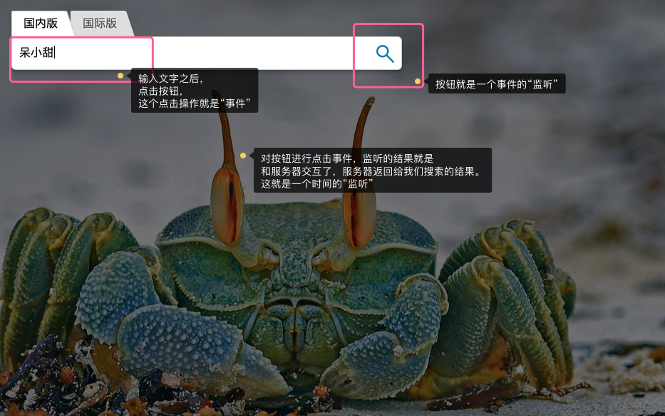
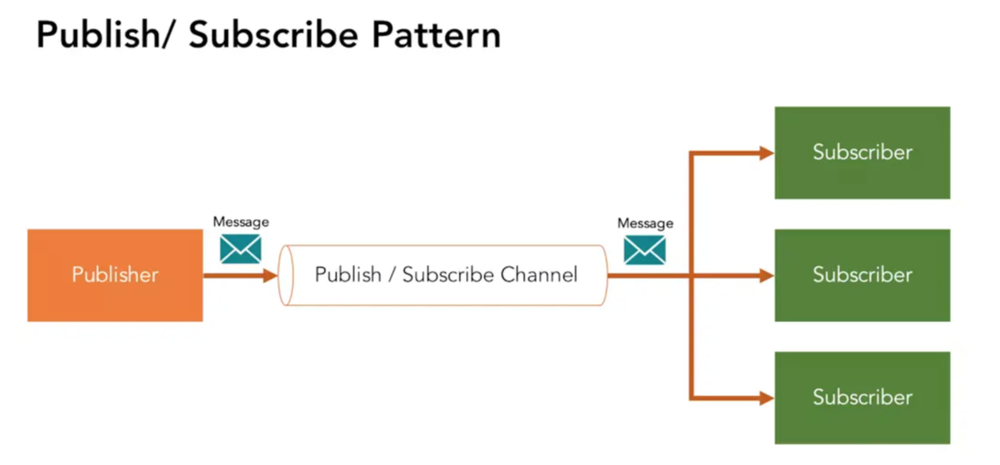
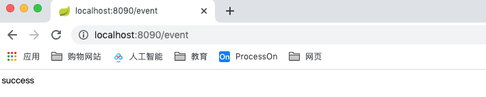
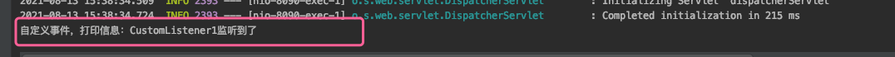
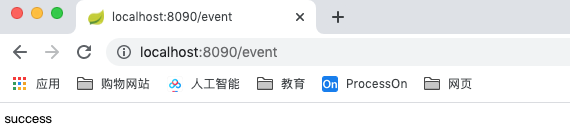
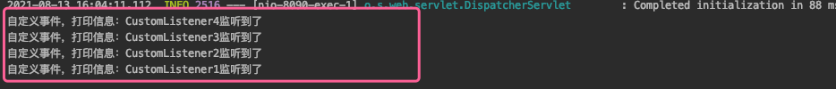
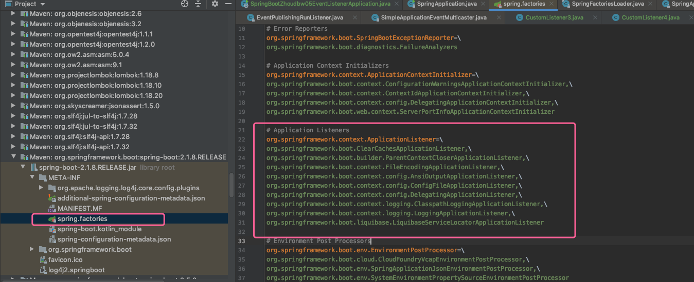

## **事件监听机制** 

### Java事件监听

事件监听的概念：事件监听就是让电脑通过你的操作得到一些数据并对这些数据做出反应，反馈相应的行为或者指令的操作。

Java中的事件机制的参与者有3种角色：

1. event objec t：事件状态对象，继承自java.util.EventObject。作为参数用于listener的相应的方法之中。伴随着事件的发生，相应的状态通常都封装在事件状态对象中。
2.  event source：具体的事件源，比如说，你点击一个button，那么button就是event source，要想使button对某些事件进行响应，你就需要注册特定的listener。
3. event listener：对每个明确的事件的发生，都相应地定义一个明确的Java方法。这些方法都集中定义在事件监听者（EventListener）接口中，这个接口要继承 java.util.EventListener。 实现了事件监听者接口中一些或全部方法的类就是事件监听者。

我们已经搜索浏览器为案例来说明事件监听：



从上述案例中，我们至少知道一件事：事件监听是有主语的，需要对谁进行事件监听。

* 具体的事件源，对应上述案例中的"按钮"，这个按钮对应的就对谁。
* 事件状态对象，指的是事件本身，对应上述案例中的"点击操作"。
* event listener，点击操作的结果就是做了一个监听，同时需要给个响应。这个响应就在listener方法中。
* * 对event object 进行 event source操作，通过event listener监听执行给出响应结果。

### Spring事件监听

Spring的事件监听是基于观察者模式。遵循发布-订阅模型。 
意思就是：发布者发布信息，订阅者获取信息，订阅了就能收到信息，没订阅就收不到信息。

**该模型主要由四个角色组成：**

1. 事件（ApplicationEvent）：继承了jdk的EventObjec t；spring在容器中定义了四大事件，分别对应容器启动、刷新、停止、关闭四个时刻；在spring项目中可以继承ApplicationEvent，来自定义自己的事件。
2. 发布者（Appl icationEventPubl isher）：事件发布类，声明了一个用于发布事件的publishEvent()方法。ApplicationContext实现了该接口。 
3. 事件订阅者（Appl icationListener）：用于接收事件，并触发事件的操作。一旦事件触发，就会执行其中的onApplicationEvent() 方法。 
4. 事件广播器（Appl icationEventMulticaster）：用于查找事件监听器。

比如，你打开你的微信订阅号，你订阅的作者发布的文章，会广播给每个订阅者。在这个场景里，微信公众号就是一个Pulisher，而你就是一个Subscriber，你收到的文章就是一个Message。



**功能划分：** 

在Spring中通常是Appl icationContext本身担任监听器注册表的角色，在其子类AbstractApplicationContext中就聚合了事件广播器ApplicationEventMulticaster和事件监听器ApplicationListnener，并且提供注册监听器的addApplicationListnener方法。

**执行流程：** 

当一个事件源产生事件时，它通过事件发布器Appl icationEventPublisher发布事件，然后事件广播器ApplicationEventMulticaster会去事件注册表ApplicationContex t中找到事件监听器ApplicationListnener，并且逐个执行监听器的onApplicationEvent方法，从而完成事件监听器的逻辑。

用公众号的例子就是，当一个消息需要从公众号推送给用户，发布者会先发布到一个后台管理系统，后台管理系统有一个广播机制，回去查找哪些用户订阅了这个公众号，找到之后，会执行每个订阅者加载这个文章的方法，这样我们就能在微信公众号中看到文章了。

### SpringBoot自定义事件

Spring框架早已提供了完善的事件监听机制，在Spring框架中实现事件监听的流程如下： 

1. 自定义事件，继承org. springframework.context.ApplicationEvent抽象类 

2. 定义事件监听器，实现org. springframework.context.ApplicationListener接口

3. 在Spring容器中发布事件 

**提供了四种实现监听的方式：** 

1. 自定义类实现ApplicationListener接口，并且在入口主函数中使用ConfigurableApplicationContext容器装载监听
2. 自定义类实现ApplicationListener接口，在接口上注解@Component
3. 自定义类不需要实现接口，在方法上标明@EventListener注解 （主要通过EventListenerMethodProcessor扫描出所有带有此注解的方法，然后动态构造事件监听器，并将监听器托管到Spring应用上文中）
4. 在application.properties中配置context.listener.classes（DelegatingApplicationListener，该类的作用是从application.properties中读取配置context.listener.classes，并将事件广播给这些配置的监听器）

---

###### **1. 自定义类实现ApplicationListener接口，并且在入口主函数中使用ConfigurableApplicationContext容器装载监听**

`自定义事件`

```java
package cn.zhoudbw.event;

import org.springframework.context.ApplicationEvent;

/**
 * @author zhoudbw
 * 自定义事件
 * 1. 继承ApplicationEvent这个抽象类
 * 2. 需要给定默认的构造方法
 */
public class CustomEvent extends ApplicationEvent {

    /**
     * Create a new ApplicationEvent.
     *
     * @param source the object on which the event initially occurred (never {@code null})
     */
    public CustomEvent(Object source) {
        super(source);
    }

    /**
     * 事件 ——　打印
     */
    public void printMessage(String msg) {
        System.out.println("自定义事件，打印信息：" + msg);
    }
}
```

`自定义监听`

```java
package cn.zhoudbw.listener;

import cn.zhoudbw.event.CustomEvent;
import org.springframework.context.ApplicationListener;

/**
 * @author zhoudbw
 * 自定义监听器
 * 1. 实现ApplicationListener接口，传递 事件 的类型
 * 2. 实现onApplicationEvent()方法
 */
public class CustomListener1 implements ApplicationListener<CustomEvent> {
    @Override
    public void onApplicationEvent(CustomEvent event) {
        event.printMessage("CustomListener1监听到了");
    }
}
```

`使用ConfigurationApplicationContext装在监听`

```java
package cn.zhoudbw;

import cn.zhoudbw.listener.CustomListener1;
import org.springframework.boot.SpringApplication;
import org.springframework.boot.autoconfigure.SpringBootApplication;
import org.springframework.context.ConfigurableApplicationContext;

/**
 * @author zhoudw
 */
@SpringBootApplication
public class SpringBootZhoudbw05EventListenerApplication {

    public static void main(String[] args) {
        /**
         * 加载监听。
         * 首先我们需要清楚一件事情：run方法返回给我们的是ConfigurableApplicationContext容器的。
         * 我们可以直接在这个容器中加载，所以我们需要接收这个容器，然后操作这个容器加载。
         */
        ConfigurableApplicationContext context = SpringApplication.run(SpringBootZhoudbw05EventListenerApplication.class, args);
        // 添加监听器 => 这样就通过获取启动后的容器，加载了自定义监听器。
        context.addApplicationListener(new CustomListener1());
        /**
         * 怎么触发这个监听呢？ => controller
         * 在controller中注入ApplicationEventPublisher
         */
    }

}
```

`controller中注入ApplicationEventPublisher发布事件`

```java
package cn.zhoudbw.controller;

import cn.zhoudbw.event.CustomEvent;
import org.springframework.beans.factory.annotation.Autowired;
import org.springframework.context.ApplicationEventPublisher;
import org.springframework.web.bind.annotation.RequestMapping;
import org.springframework.web.bind.annotation.RestController;

/**
 * @author zhoudbw
 * 通过controller触发监听器
 * @RestController 直接返回JSON
 */
@RestController
public class EventController {

    /**
     * 注入发布者，用来发布事件
     */
    @Autowired
    private ApplicationEventPublisher publisher;

    @RequestMapping("/event")
    public String event() {
        // 通过发布者发布事件
        publisher.publishEvent(new CustomEvent(this));
        return "success";
    }
}
```

`localhost:8090/event 访问结果`





---

###### **2. 自定义类实现ApplicationListener接口，在接口上注解@Component**

`实现监听`

```java
package cn.zhoudbw.listener;

import cn.zhoudbw.event.CustomEvent;
import org.springframework.context.ApplicationListener;
import org.springframework.stereotype.Component;

/**
 * @author zhoudbw
 * 实现ApplicationListener接口，泛型指定自定义事件的类型
 * 使用@Component声明这是一个需要加载的监听器
 */
@Component
public class CustomListener2 implements ApplicationListener<CustomEvent> {
    @Override
    public void onApplicationEvent(CustomEvent event) {
        event.printMessage("CustomListener2监听到了");
    }
}
```

---

###### 3. 自定义类不需要实现接口，在方法上标明@EventListener注解 （主要通过EventListenerMethodProcessor扫描出所有带有此注解的方法，然后动态构造事件监听器，并将监听器托管到Spring应用上文中）

```java
package cn.zhoudbw.listener;

import cn.zhoudbw.event.CustomEvent;
import org.springframework.context.event.EventListener;
import org.springframework.stereotype.Component;

/**
 * @author zhoudbw
 * 
 * 自定义类不需要实现ApplicationListener接口，但是需要声明当前类是@Component组件，需要被加载
 * 在方法上标明@EventListener注解 声明这是一个监听组件，监听的事件是方法的参数。
 * 
 * （主要通过EventListenerMethodProcessor扫描出所有带有此注解的方法,
 *  然后动态构造事件监听器，并将监听器托管到Spring应用上文中）
 */
@Component
public class CustomListener3 {
    
    @EventListener
    public void eventListener(CustomEvent event) {
        event.printMessage("CustomListener3监听到了");
    }
}
```

---

###### `4. 在application.properties中配置context.listener.classes（DelegatingApplicationListener，该类的作用是从application.properties中读取配置context.listener.classes，并将事件广播给这些配置的监听器）`

```java
package cn.zhoudbw.listener;

import cn.zhoudbw.event.CustomEvent;
import org.springframework.context.ApplicationListener;

/**
 * @author zhoudbw
 * 需要实现ApplicationListener接口，实现其中的方法
 * 
 * 但是监听器加载方式不同，这里使用配置的方式进行加载：
 *      在application.properties中配置context.listener.classes（DelegatingApplicationListener，
 *      该类的作用是从application.properties中读取配置context.listener.classes，并将事件广播给这些配置的监听器）
 */
public class CustomListener4  implements ApplicationListener<CustomEvent> {
    @Override
    public void onApplicationEvent(CustomEvent event) {
        event.printMessage("CustomListener4监听到了");
    }
}
```

`配置`

```yml
# 配置需要加载的监听器
context:
  listener:
    classes: cn.zhoudbw.listener.CustomListener4
```

##### 执行，观察执行顺序





首先扫描 application.yml配置文件，发现配置了监听器加载进来；
其次通过扫描注解里面的@EventListener，看这个方法监听了哪个事件，然后去监听这个事件；
再次@Component+实现ApplicationListener<>接口的监听
最后是加载完监听然后将其放入ConfigurationApplicationContext中的监听。

---

##### **实际上在程序运行中，也运行了一个很大监听器 —— SpringApplicationRunListener**

```abap
SpringApplicationRunListener用于监听SpringApplication的run方法的执行。 

定义了几个步骤：
* starting()：run方法执行的时候立马执行；对应事件的类型是ApplicationStartedEvent
* environmentPrepared()：容器创建之前并且环境信息准备好的时候调用；对应事件的类型是ApplicationEnvironmentPreparedEvent
* contextPrepared()：容器创建好并且初始化器加载之后调用一次；对应事件的类型是ApplicationContextInitializedEvent
* contextLoaded()：容器创建并加载之后并在refresh之前调用；对应事件的类型是ApplicationPreparedEvent
* started()：在启动完成，回调runner之前调用，对应事件的类型是ApplicationStartedEvent
* running()：应用成功启动时调用，对应事件的类型是ApplicationReadyEvent
* failed()：应用启动失败时调用，对应事件的类型时ApplicationFailedEvent

目前只有一个实现类EventPublishingRunListener，它把监听的过程封装成了SpringApplicationEvent事件并通过 内部属性广播出去，属性名为initialMulticaster，是ApplicationEventMulticaster接口的实现类SimpleApplicationEventMulticaster，广播出去的事件对象会被SpringApplication中的listeners属性进行处理。
```

```java
public ConfigurableApplicationContext run(String... args) {
   /* 计时器 */
	StopWatch stopWatch = new StopWatch();
   /* 计时开始 */
	stopWatch.start();
   /* 开始创建应用上下文(容器) */
	ConfigurableApplicationContext context = null;
	Collection<SpringBootExceptionReporter> exceptionReporters = new ArrayList<>();
   /* 加载配置 */
	configureHeadlessProperty();
   /* 获取监听器 
   SpringApplicationRunListeners实际上是List<SpringApplicationRunListener>监听器的管理器
   class SpringApplicationRunListeners {
			private final List<SpringApplicationRunListener> listeners;
	 ...
	 }
	 当我们执行SpringApplicationRunListeners中的方法时，实际上是遍历了这个列表，让该列表中的每个监听器都执行了该方法
	 比如starting()方法，遍历列表中的所有监听器，然后让监听器去执行对应的方法：
     public void starting() {
        for (SpringApplicationRunListener listener : this.listeners) {
          listener.starting();
        }
     }
   ** SpringApplicationRunListeners就相当于是一个管理器，它有一系列监听器的列表，每次执行相应方法的时候，就是执行这个类表中每个监听器对应的方法。
   ---
   那么监听器从哪里获取的呢？
     private SpringApplicationRunListeners getRunListeners(String[] args) {
        Class<?>[] types = new Class<?>[] { SpringApplication.class, String[].class };
        return new SpringApplicationRunListeners(logger,
            getSpringFactoriesInstances(SpringApplicationRunListener.class, types, this, args));
     }
   通过getSpringFactoriesInstances()方法获取的监听器，而getSpringFactoriesInstances()方法调用的是loadFactoryNames(), 该方法由调用loadSpringFactories()方法，然后loadSpringFactories()方法加载的是META-INF/spring.factories文件，监听器便是从该文件获取的 
   ---
   SpringApplicationRunListeners什么时候加载的呢？
   在我们创建SpringApplication的时候就加载到了。
   */
	SpringApplicationRunListeners listeners = getRunListeners(args);
  /*
  // 监听器启动，按照上面的分析，我们知道这个starting()方法，做的就是遍历SpringApplicationRunListener列表，然后挨个执行这些listener的starting()方法.
  我们跟进starting()方法
    public interface SpringApplicationRunListener {
      void starting();
      ...
    }
  发现找到的是一个接口类，但是接口是无法执行的，但是该接口目前只有一个实现类，所以starting()方法的逻辑就是这个实现类中的逻辑。
    public class EventPublishingRunListener implements SpringApplicationRunListener, Ordered {...}
    @Override
    public void starting() {
      this.initialMulticaster.multicastEvent(new ApplicationStartingEvent(this.application, this.args));
    }
    starting()对应ApplicationStartingEvent这个事件。
    其实这个方法是一个事件发布器，当执行到该节点的时候，发布说这个事件可以被广播了。
    这么说的依据是：
    	private final SimpleApplicationEventMulticaster initialMulticaster; 广播器
    执行这个方法的逻辑，就是通过这个广播器去广播事件。
    所以说，这个方法的逻辑是广播事件的逻辑。具体的监听逻辑是在ApplicationStartingEvent对应的事件监听器中。
    也就是我们上文listener中获得到的监听器。
  */
	listeners.starting(); 
	try {
     /* 传递命令行参数，创建应用参数类 */
		ApplicationArguments applicationArguments = new DefaultApplicationArguments(args);
     /* 在配置的环境中准备配置的环境 */
		ConfigurableEnvironment environment = prepareEnvironment(listeners, applicationArguments);
		configureIgnoreBeanInfo(environment);
     /* 打印banner */
		Banner printedBanner = printBanner(environment);
     /* 创建容器
     创建容器会根据WebApplication的类型看是SERVLET or REACTIVE or default，然后通过反射获取容器类
         protected ConfigurableApplicationContext createApplicationContext() {
            Class<?> contextClass = this.applicationContextClass;
            if (contextClass == null) {
              try {
                switch (this.webApplicationType) {
                case SERVLET:
                  contextClass = Class.forName(DEFAULT_SERVLET_WEB_CONTEXT_CLASS);
                  break;
                case REACTIVE:
                  contextClass = Class.forName(DEFAULT_REACTIVE_WEB_CONTEXT_CLASS);
                  break;
                default:
                  contextClass = Class.forName(DEFAULT_CONTEXT_CLASS);
                }
              }
              catch (ClassNotFoundException ex) {
                throw new IllegalStateException(
                    "Unable create a default ApplicationContext, " + "please specify an ApplicationContextClass",
                    ex);
              }
            }
            return (ConfigurableApplicationContext) BeanUtils.instantiateClass(contextClass);
         }
     */
		context = createApplicationContext();
     /* 获取Spring里面的实例中，这里是异常报告以及配置的应用容器 */
		exceptionReporters = getSpringFactoriesInstances(SpringBootExceptionReporter.class,
				new Class[] { ConfigurableApplicationContext.class }, context);
     /* 准备上下文 */
    /*准备容器做了什么事情呢？ 见 《《《准备容器》》》*/
		prepareContext(context, environment, listeners, applicationArguments, printedBanner);
     /* 刷新容器 
     刷新容器做了哪些操作呢？做了一系列的bean工厂的操作。
     
     */
		refreshContext(context);
     /* 结束刷新 */
		afterRefresh(context, applicationArguments);
     /* 计时结束 ， 代表创建成功*/
		stopWatch.stop();
     /* 打印一部分日志 */
		if (this.logStartupInfo) {
			new StartupInfoLogger(this.mainApplicationClass).logStarted(getApplicationLog(), topWatch);
		}
     /* 启动监听器 广播started()方法对应的事件*/
		listeners.started(context);
     /* 回调runner的方法 分别是ApplicationRunner 和 CommandLineRunner*/
		callRunners(context, applicationArguments);
	}
	catch (Throwable ex) {
    /* 出现异常将会进入到该部分,该部分会广播failed对应的异常
        private void handleRunFailure(ConfigurableApplicationContext context, Throwable exception,
          Collection<SpringBootExceptionReporter> exceptionReporters, SpringApplicationRunListeners listeners) {
        try {
          try {
            handleExitCode(context, exception);
            if (listeners != null) {
              // 广播failed()方法对应的事件
              listeners.failed(context, exception);
            }
          }
          ...
    */
		handleRunFailure(context, ex, exceptionReporters, listeners);
		throw new IllegalStateException(ex);
	}
	
  try {
     /* 启动监听器 */
		listeners.running(context);
	}
	catch (Throwable ex) {
		handleRunFailure(context, ex, exceptionReporters, null);
		throw new IllegalStateException(ex);
	}
   /* 返回上下文(返回容器) */
	return context;
}
```

`《《《准备容器》》》`

```java
// 准备容器的工作
private void prepareContext(ConfigurableApplicationContext context, ConfigurableEnvironment environment,
			SpringApplicationRunListeners listeners, ApplicationArguments applicationArguments, Banner printedBanner) {
  // 设置环境参数
  context.setEnvironment(environment);
  postProcessApplicationContext(context);
  // 应用初始化器，初始化器也是在创建SpringApplication的时候创建的，也是通过META-INF/spring.factories文件加载的
  applyInitializers(context);
  // 广播容器准备方法对应的事件
  listeners.contextPrepared(context);
  // 打印一些日志
  if (this.logStartupInfo) {
    logStartupInfo(context.getParent() == null);
    logStartupProfileInfo(context);
  }
  // 增加特殊的单例bean
  ConfigurableListableBeanFactory beanFactory = context.getBeanFactory();
  beanFactory.registerSingleton("springApplicationArguments", applicationArguments);
  if (printedBanner != null) {
    beanFactory.registerSingleton("springBootBanner", printedBanner);
  }
  if (beanFactory instanceof DefaultListableBeanFactory) {
    ((DefaultListableBeanFactory) beanFactory)
    .setAllowBeanDefinitionOverriding(this.allowBeanDefinitionOverriding);
  }
  // 加载sources
  Set<Object> sources = getAllSources();
  Assert.notEmpty(sources, "Sources must not be empty");
  // 容器真正的加载容器，比如扫描注解、创建bean、关联bean的关系等等
  load(context, sources.toArray(new Object[0]));
  // 广播容器加载对应的事件
  listeners.contextLoaded(context);
}
```

* listener贯穿了容器创建的始终。并且还有容器创建的结果通知，也就是说在不同的节点上进行了一些埋点，然后这个埋点会去广播一个事件。事件可以去listeners内寻找listener(订阅者)，如果订阅者订阅了，那么就执行对应的方法。

* 创建SpringApplication需要加载的监听器：
  

* 以org.springframework.boot.context.logging.LoggingApplicationListener为例：

  ```java
  继承关系：
    public class LoggingApplicationListener implements GenericApplicationListener {...}
    public interface GenericApplicationListener extends ApplicationListener<ApplicationEvent>, Ordered {...}
  继承ApplicationListener，所以可以说LoggingApplicationListener是springboot帮我们定义的一个listener。
    
    	// 定义事件的类型。这个监听器需要订阅的事件有哪些，都是容器启动的时候需要广播的事件
    	private static final Class<?>[] EVENT_TYPES = { ApplicationStartingEvent.class,
  			ApplicationEnvironmentPreparedEvent.class, ApplicationPreparedEvent.class, ContextClosedEvent.class,
  			ApplicationFailedEvent.class };
      // 当上述事件触发的时候，执行onApplicationEvent()方法
  		@Override
      public void onApplicationEvent(ApplicationEvent event) {
          // 根据不同的事件类型，执行不同的触发方法。
          if (event instanceof ApplicationStartingEvent) {
            onApplicationStartingEvent((ApplicationStartingEvent) event);
          }
          else if (event instanceof ApplicationEnvironmentPreparedEvent) {
            onApplicationEnvironmentPreparedEvent((ApplicationEnvironmentPreparedEvent) event);
          }
          else if (event instanceof ApplicationPreparedEvent) {
            onApplicationPreparedEvent((ApplicationPreparedEvent) event);
          }
          else if (event instanceof ContextClosedEvent
              && ((ContextClosedEvent) event).getApplicationContext().getParent() == null) {
            onContextClosedEvent();
          }
          else if (event instanceof ApplicationFailedEvent) {
            onApplicationFailedEvent();
          }
      }
  ```

  