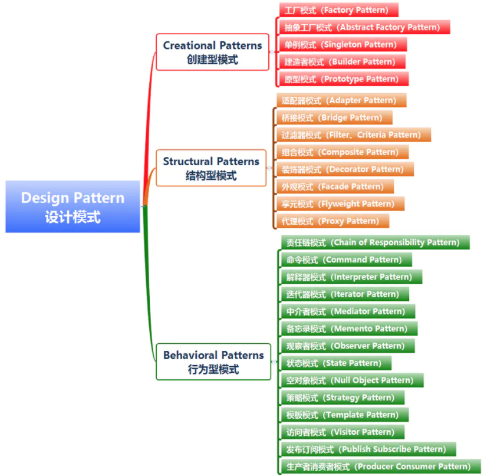
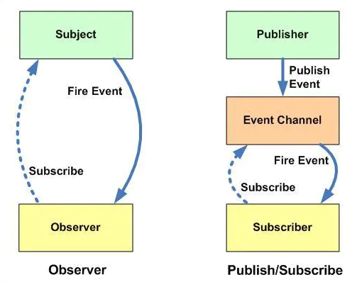

## 设计模式汇总：



## 发布订阅模式

#### 1. 定义

发布-订阅模式其实是一种对象间一对多的依赖关系，当一个对象的状态发送改变时，所有依赖于它的对象都将得到状态改变的通知。
 订阅者（Subscriber）把自己想订阅的事件注册（Subscribe）到调度中心（Event Channel），当发布者（Publisher）发布该事件（Publish Event）到调度中心，也就是该事件触发时，由调度中心统一调度（Fire Event）订阅者注册到调度中心的处理代码。

#### 2. 例子

比如我们很喜欢看某个公众号号的文章，但是我们不知道什么时候发布新文章，要不定时的去翻阅；这时候，我们可以关注该公众号，当有文章推送时，会有消息及时通知我们文章更新了。
 上面一个看似简单的操作，其实是一个典型的发布订阅模式，公众号属于发布者，用户属于订阅者；用户将订阅公众号的事件注册到调度中心，公众号作为发布者，当有新文章发布时，公众号发布该事件到调度中心，调度中心会及时发消息告知用户。

## 实现发布-订阅模式

#### 实现思路

>  1、创建一个对象
>  2、在该对象上创建一个缓存列表（调度中心）
>  3、on 方法用来把函数 fn 都加到缓存列表中（订阅者注册事件到调度中心）
>  4、emit 方法取到 arguments 里第一个当做 event，根据 event 值去执行对应缓存列表中的函数（发布者发布事件到调度中心，调度中心处理代码）
>  5、off 方法可以根据 event 值取消订阅（取消订阅）
>  6、once 方法只监听一次，调用完毕后删除缓存函数（订阅一次）

#### Jquery中的发布订阅

需求：**我（订阅者）后天结婚，规划了3件事情，需要（发布者）后天点击提交按钮后执行这三件事**。
分析：**提前写好三个方法，未来某段时间触发三个方法**
 我们会这么实现：

```jsx
let fn1 = function(){console.log(1)};
let fn2 = function(){console.log(2)};
let fn3 = function(){console.log(3)};

$('.submit').click(function(){
    fn1();
    fn2();
    fn3();
});
```

看似达到了需求，然而，当我想多加一件事时，或者想删掉一件事时，每次都要在事件函数内去增删，这样下去，不仅增加的工作成本，而且，我作为订阅者，每次添加事情，发布者都要修改他自身的方法，耦合太紧，不方便，这个时候，需要引入一个**事件池**。

```jsx
let $pond1 = $.Callbacks();//创建一个事件池

//给提交按钮注册
$('.submit').click(function(){
    $pond1.fire();//触发事件池中的方法
});
let fn1 = function(){console.log(1)};
let fn2 = function(){console.log(2)};
let fn3 = function(){console.log(3)};
$pond1.add(fn1);//将事件添加进事件池
$pond1.add(fn2);
$pond1.add(fn3);
let fn4 = function(){console.log(4)};
$pond1.add(fn4);

$pond1.remove(fn3);//移除事件
```

这样，就实现了个简单的发布订阅。
 Jquery.Callbacks中的API和源码可参考[https://segmentfault.com/a/1190000004331027](https://links.jianshu.com/go?to=https%3A%2F%2Fsegmentfault.com%2Fa%2F1190000004331027)

#### 自己实现发布订阅

直接上源码：

```jsx
var _Event=(function(){
    var clienlist={},
    addlisten,trigger,remove;
    /**
     * 增加订阅者
     * @key {String} 类型
     * @fn {Function} 回掉函数
     * */
    addlisten=function(key,fn){
        if(!clienlist[key]){
            clienlist[key]=[];
        }
        clienlist[key].push(fn);
    };
    /**
     * 发布消息
     * */
    trigger=function(){
        var key=[].shift.call(arguments),//取出消息类型
            fns=clienlist[key];//取出该类型的对应的消息集合
        if(!fns || fns.length===0){
            return false;
        }
        for(var i=0,fn;fn=fns[i++];){
            fn.apply(this,arguments);
        }
    };
    /**
     * 删除订阅
     * @key {String} 类型
     * @fn {Function} 回掉函数
     * */
    remove=function(key,fn){
        var fns=clienlist[key];//取出该类型的对应的消息集合
        if(!fns){//如果对应的key没有订阅直接返回
            return false;
        }
        if(!fn){//如果没有传入具体的回掉，则表示需要取消所有订阅
            fns && (fns.length=0);
        }else{
            for(var l=fns.length-1;l>=0;l--){//遍历回掉函数列表
                if(fn===fns[l]){
                    fns.splice(l,1);//删除订阅者的回掉
                }
            }
        }
    };
    return{
        addlisten:addlisten,
        trigger:trigger,
        remove:remove
    }
})();


_Event.addlisten("jianbing",function(d,all){
    console.log("发布的消息来自："+d+"，具体信息："+all);
});
_Event.addlisten("jianbing",function(d,all){
    console.log("发布的消息来自："+d+"，具体信息："+all);
})
_Event.trigger("jianbing","小小坤","前端工程师，擅长JavaScript，喜欢结交更多的前端技术人员，欢迎喜欢技术的你加QQ群：198303871")
```

## 发布/订阅者模式的优点

`发布/订阅者模式`的优点可以归纳为:

1. 松耦合/Independence

`发布/订阅者模式`可以将众多需要通信的子系统(Subsystem)解耦，每个子系统都可以独立管理。而且即使部分子系统下线了，也不会影响系统消息的整体管理。

`发布/订阅者模式`为应用程序提供了关注点分离。每个应用程序都可以专注于其核心功能，而消息传递基础结构负责将消息路由到每个消费者手里。

2. 高伸缩性/Scalability

`发布/订阅者模式`增加了系统的可伸缩性，并提高了发送者的响应能力。原因是发送方(Publisher)可以快速地向输入通道发送一条消息，然后返回到其核心处理职责，而不必等待子系统处理完成。然后消息传递的基础结构负责确保把消息传递到每个订阅者(Subscriber)手里。

3. 高可靠性/Reliability

`发布/订阅者模式`提高了可靠性。异步的消息传递有助于应用程序在增加的负载下继续平稳运行，并且可以更有效地处理间歇性故障。

4. 灵活性/Flexibility

你不需要关心不同的组件是如何组合在一起的，只要他们共同遵守一份协议即可。

`发布/订阅者模式`允许延迟处理或者按计划的处理。例如当系统负载大的时候，订阅者可以等到非高峰时间才接收消息，或者根据特定的计划处理消息。

5. 可测试性/Testability

`发布/订阅者模式`提高了可测试性。通道可以被监视，消息可以作为整体集成测试策略的一部分而被检查或记录。

## 实现发布/订阅者模式需要考虑的点

1. 订阅处理

订阅者可以在消息通道中订阅或者取消订阅某个话题。

2. 安全

连接到任何消息通道必须受到安全策略的限制，以防止未经授权的用户或应用程序窃听。

3. 内容筛选

根据每条消息的内容检查和分发消息。每个订户都可以指定其感兴趣的内容。

订阅者通常只对发布者分发的消息的子集感兴趣。消息服务通常允许订户缩小以下用户接收到的消息集。

考虑允许订户通过通配符订阅多个主题。每个主题都有一个专用的输出通道，每个使用者都可以订阅所有相关主题。

4. 双向通信

发布订阅系统中的通道被视为单向的。

如果特定订户需要向发布服务器发送确认或通信状态，请考虑使用请求/回复模式。此模式使用一个通道向订阅服务器发送消息，以及一个单独的回复通道向发布服务器进行通信。

5. 消息排序

使用者实例接收消息的顺序不一定得到保证，也不一定反映消息的创建顺序。

设计该系统以确保消息处理是等量的，以帮助消除对消息处理顺序的任何依赖。

6. 消息优先级

有些解决方案可能需要按特定顺序处理消息。优先级队列模式提供了一种确保特定消息先于其他消息传递的机制。

7. 有毒信息

格式错误的消息或需要访问不可用资源的任务可能会导致服务实例失败。系统应防止此类消息返回到队列，否则可能导致系统故障。

8. 消息重复

同一消息可能会发送多次。例如，发送者可能在发布消息后出现了异常，没有记录自己已经成功发送了消息，然后，发送者的新实例可能会启动并重复该消息。

消息基础结构应基于消息ID实现重复消息检测和删除（也称为重复数据消除），以便最多提供一次消息传递。

9. 消息过期

消息的生命周期可能有限。如果在这段时间内没有处理，它可能不再有价值，应该丢弃。发送方可以指定过期时间作为消息中数据的一部分。在决定是否执行与消息关联的业务逻辑之前，接收者可以检查此信息，以确保消息没有过期。

10. 消息调度

例如，消息可能会被暂时禁止，直到特定的日期和时间才被处理。

## 何时应使用发布/订阅者模式

如果你的程序只有很少的订阅者，或者需要与子系统进行实时的交互，那么`发布/订阅者模式`是不适合的。

在以下情况下可以考虑使用此模式：

1. 应用程序需要向大量消费者广播信息。例如微信订阅号就是一个消费者量庞大的广播平台。
2. 应用程序需要与一个或多个独立开发的应用程序或服务通信，这些应用程序或服务可能使用不同的平台、编程语言和通信协议。
3. 应用程序可以向消费者发送信息，而不需要消费者的实时响应。
4. 被集成的系统被设计为支持其数据的最终一致性模型。
5. 应用程序需要将信息传递给多个消费者，这些消费者可能具有与发送者不同的可用性要求或正常运行时间计划。例如你消息在上午发布了出去，消费者计划在下午才去处理这些消息。

## 发布/订阅者模式与观察者模式

`发布/订阅者模式`与`观察者模式`是我们经常混淆的两种设计模式，可以说两种设计模式在行为上有一定的相似性，但却是两种不同的设计模式。或者说`发布/订阅者模式`是`观察者模式`的一种变体。

通过下图可以清晰地看到两种设计模式的不同点。



`发布/订阅者模式`与`观察者模式`主要有以下几个不同点：

1. 在观察者模式中，主体维护观察者列表，因此主体知道当状态发生变化时如何通知观察者。然而，在发布者/订阅者中，发布者和订阅者不需要相互了解。它们只需在中间层消息代理（或消息队列）的帮助下进行通信。
2. 在发布者/订阅者模式中，组件与观察者模式完全分离。在观察者模式中，主题和观察者松散耦合。
3. 观察者模式主要是以同步方式实现的，即当发生某些事件时，主题调用其所有观察者的适当方法。发布服务器/订阅服务器模式主要以异步方式实现（使用消息队列）。
4. 发布者/订阅者模式更像是一种跨应用程序模式。发布服务器和订阅服务器可以驻留在两个不同的应用程序中。它们中的每一个都通过消息代理或消息队列进行通信。 

---

作者：江平路
链接：https://www.jianshu.com/p/d755909b85f8
来源：简书
著作权归作者所有。商业转载请联系作者获得授权，非商业转载请注明出处。