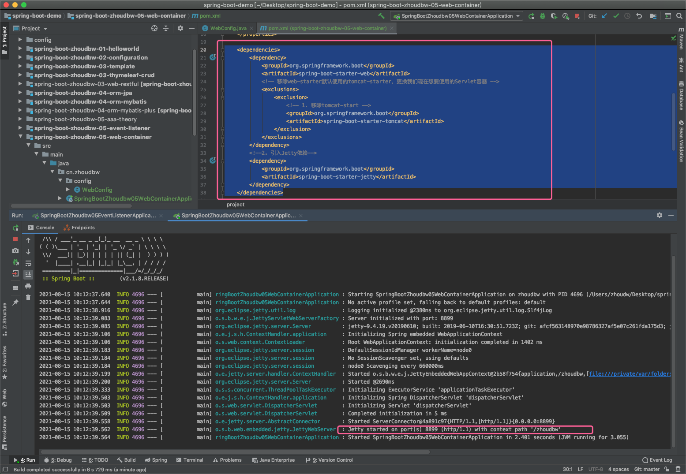

## 嵌入式容器说明（嵌入+外置使用方式）

springboot支持三种容器：tomcat、jetty、undertow。在Spring1.0向2.0升级的过程中，2.0的一个重大的革命就是嵌入式容器，从单一的Servlet Web容器，到支持响应式的Reactive容器，这是一个重大的变革。这也说明响应式编程技术在未来会有一个很好的前景，所以说SpringBoot才支持它。那为什么有这么好的前景呢？ —— 通过Demo来感受响应式编程的便捷性。当然在编码的时候只能感受到它的便捷性，只有在投入生产的时候才能体会到它的高容量和高并发。

### Servlet Web容器对比

该片段截取自谷歌工程师被访问时的片段

Jetty在刚刚被知晓的时候，是因为谷歌的App Engine（我们简称GAE），它放弃使用Tomcat而使用Jetty，这一下便让Jetty被人们所熟知。当时的采访（09年了），为什么谷歌选择Jetty替代了Tomcat。

主要的原因在于，谷歌看中了Jetty的大小和灵活性。省下量级的空间，就可以被应用本身使用而不需要给容器预留了。这是一个很大量的内存空间。Jetty具有可插拔和可拓展的特性，这样谷歌可以最大限度的去定制一些服务，这就是因为Jetty的灵活性。

来源：https://www.infoq.com/news/2009/08/google-chose-jetty/


再有了Tomcat有了Jetty之后，才有了undertow。据不完全统计，80%的机器都在使用Tomcat，15%的机器在使用Jetty，可能之后5%的机器在使用undertow。就现在来说，Tomcat还是当之无愧的容器之王，还是对Tomcat的使用较多。对于看中灵活性和大小的还是使用Jetty。对于undertow大概是springboot推出之后才被人们所知道的。

undertow, ”后起之秀”，是红帽公司开发的一款基于 NIO 的高性能 Web 嵌入式服务器，支持高并发、兼容servlet3.1+规范。最大的特点是“轻量 轻量 轻量”，加载应用可<10M内存。

随着springboot的推广，从springboot的测试数据来看undertow的表现是最好的。支持的吞吐量是最高的，随着springboot的推广，对于这个容器的使用应该也会随之增多。undertow应当是未来，而Tomcat和Jetty是现在。

### Tomcat VS Jetty

1. **架构比较** 
   Jetty的架构比Tomcat的更为简单 
   Jetty的架构是基于Handler来实现的，主要的扩展功能都可以用Handler来实现，扩展简单。
   Tomcat的架构是基于容器设计的，进行扩展是需要了解Tomcat的整体设计结构，不易扩展。 

2. **性能比较** 
   Jetty和Tomcat性能方面差异不大 
   Jetty可以同时处理大量连接而且可以长时间保持连接，适合于web聊天应用等等。 
   Jetty的架构简单，因此作为服务器，Jetty可以按需加载组件，减少不需要的组件，减少了服务器内存开销，从而提高服务器性能。 
   Jetty默认采用NIO结束在处理I/O请求上更占优势，在处理静态资源时，性能较高。
   Tomcat适合处理少数非常繁忙的链接，也就是说链接生命周期短的话，Tomcat的总体性能更高。 
   Tomcat默认采用BIO处理I/O请求，在处理静态资源时，性能较差。 

3. **其它比较** 
   Jetty的应用更加快速，修改简单，对新的Servlet规范的支持较好。 
   Tomcat目前应用比较广泛，对JavaEE和Servlet的支持更加全面，很多特性会直接集成进来。

### 嵌入容器方式

springboot为我们默认嵌入的容器是Tomcat。我们引入spring-boot-starter-web查看其依赖树


#### 一、由上图可知，依赖路径： 

```xml
spring-boot-starter-tomcat => tomcat-embed-websocket => tomcat-embed-core 
													 => tomcat-embed-el
```

#### 二、修改相关配置的方法：

我们在使用外置tomcat的时候，如果需要修改一些配置我们会在conf这个文件夹下进行修改。比如我们想要修改端口，那么修改conf/server.xml的port选项即可

```xml
<Connector port="8080" protocol="HTTP/1.1"
           connectionTimeout="20000"
           redirectPort="8443" />
```

如果想要改变访问目录，那么通常需要在webapps内增加一些路径，然后改变其访问路径。

那么内置的tomcat如何更改其配置呢？

##### **方式一：通过application.properties这个配置文件**。比如：

```properties
#修改内置容器访问端口
server.port=8090
#修改内置容器访问路径：localhost:8090/zhoudbw
server.servlet.context-path=/zhoudbw
```

其实，和server相关的配置都在ServerProperties.java中。

```java
@ConfigurationProperties(prefix = "server", ignoreUnknownFields = true)
public class ServerProperties {...}

* 其中有个属性
private final Tomcat tomcat = new Tomcat();

* 通过Ctrl查看源码，可以查看tomcat可以配置哪些,比如：Tomcat中的一个配置：
private int maxConnections = 10000;

* 这样我们就可以在配置文件中配置最大连接数：
# 配置tomcat最大连接数
server.tomcat.max-connections=5000

// 上述举例也告诉我们，我们不需要特别的去记忆，只要在需要的时候通过源码查看的方式查找即可。
```

除了上述的配置方法还有吗？

##### **方式二：通过java类的方式配置，创建自定义器。实现了WebServerFactoryCustomizer的customize方法**。

```java
package cn.zhoudbw.cn.zhoudbw.config;

import org.springframework.boot.web.server.ConfigurableWebServerFactory;
import org.springframework.boot.web.server.WebServerFactory;
import org.springframework.boot.web.server.WebServerFactoryCustomizer;
import org.springframework.context.annotation.Bean;
import org.springframework.context.annotation.Configuration;

/**
 * @author zhoudbw
 * @Configuration 声明该类是一个配置类
 */
@Configuration
public class WebConfig {

    /**
     * @Bean 声明bean放入spring容器，让我们可以使用
     * WebServerFactoryCustomer允许我们自己定制配置
     * 传递泛型和配置有关ConfigurableWebServerFactory
     */
    @Bean
    public WebServerFactoryCustomizer<ConfigurableWebServerFactory> customizer() {
        /**
          @FunctionalInterface 函数型接口，只有一个方法，只是为了声明这个方法的。
          public interface WebServerFactoryCustomizer<T extends WebServerFactory> {
              // Customize the specified {@link WebServerFactory}.
              // @param factory the web server factory to customize
              void customize(T factory);
          }
         本质是一个接口，泛型需要去实现WebServerFactory，其实就是WebServer的一个工厂
         其中只有唯一一个定制的方法，定制方法所操作的方法也就是它的泛型
         */
        // 因为我们需要创建一个WebServerFactoryCustomizer<ConfigurableWebServerFactory>的bean
        // 所以我们new，但由于是一个接口，所以需要我们实现这个接口的方法
        // 我们通过customize就可以操作这个factory了。
        return new WebServerFactoryCustomizer<ConfigurableWebServerFactory>() {
            @Override
            public void customize(ConfigurableWebServerFactory factory) {
                // 设置端口
                factory.setPort(8899);
            }
        };
    }
}
```

##### **那么上述两种配置方式，执行那个会生效呢？**


从上图可以看出，同时配置了启动端口，生效的是配置类中内容。配置类中没有配置的，那么配置文件中生效。这也说明，在配置文件中配置的端口，优先级没有我们在定制器中配置的端口号优先级高。


我们访问出现上述页面，注意，该页面表示我们确实访问成功了。只是没有找到页面，所以返回了一个空白的错误页面。

访问失败的页面如下图所示：


#### 三、切换其他Servlet容器：(支持Tomcat，Jetty，和Undertow)

我们刚刚看到，spring-boot-starter-web在使用tomcat的时候，是将tomcat-starter放在了web-starter里面。

按照上面的想法，我们如果想要切换其他的Servlet容器，那么只需要将tomcat移除掉，替换成我们想要使用的Servlet容器，就可以了。

移除的方式：

```xml
<dependencies>
  <dependency>
    <groupId>org.springframework.boot</groupId>
    <artifactId>spring-boot-starter-web</artifactId>
    <!-- 移除web-starter默认使用的tomcat-starter，更换我们现在想要使用的Servlet容器 -->
    <exclusions>
      <exclusion>
        <!-- 1. 移除tomcat-start -->
        <groupId>org.springframework.boot</groupId>
        <artifactId>spring-boot-starter-tomcat</artifactId>
      </exclusion>
    </exclusions>
  </dependency>
  <!--2. 引入Jetty依赖-->
  <dependency>
    <groupId>org.springframework.boot</groupId>
    <artifactId>spring-boot-starter-jetty</artifactId>
  </dependency>
</dependencies>
```



改用undertow也是同理：

```xml
<dependencies>
  <dependency>
    <groupId>org.springframework.boot</groupId>
    <artifactId>spring-boot-starter-web</artifactId>
    <!-- 移除web-starter默认使用的tomcat-starter，更换我们现在想要使用的Servlet容器 -->
    <exclusions>
      <exclusion>
        <!-- 1. 移除tomcat-start -->
        <groupId>org.springframework.boot</groupId>
        <artifactId>spring-boot-starter-tomcat</artifactId>
      </exclusion>
    </exclusions>
  </dependency>
  <!-- 改用undertow -->
  <dependency>
    <groupId>org.springframework.boot</groupId>
    <artifactId>spring-boot-starter-undertow</artifactId>
  </dependency>
</dependencies>
```

---

### **Reactive Web容器**

响应式（Reactive）编程技术针对的就是经典的大数据4V问题（ Volume大容量，Variety多样性，Velocity高并发，Value价值） 中的Velocity，即高并发问题，可以极高的提高系统的吞吐量。这四个V，每一个都是一个难点，是由IBM提出的。提出之后业内也较为认可，确实有这样四个难点问题。

实现方式及特点是异步、并发、事件驱动、推送PUSH机制以及观察者模式的衍生。
因此，响应式有这样的宣言

```
We want systems that are Responsive, Resilient, Elastic and Message Driven. We call these Reactive Systems. 
- The Reactive Manifesto 可响应的、可恢复的、可伸缩的、消息驱动的。
```

响应式在springboot中是基于两个类型使用的：Mono 和 Flux。

```
Mono 和 Flux 是由 Reactor 提供的两个 Reactor的类型。 

Flux ，“流”。它可以触发零个或者多个事件，并根据实际情况结束处理或触发错误。 

Mono，“单子”。最多只触发一个事件，Mono<Void>用于在异步任务完成时发出通知。
```

我们在知道了响应式和响应式的模型之后，在springboot中，Reactive Web容器，默认实现为Netty Web Server，本质上使用了Netty的nio来实现。 
Spring Webflux基于Reactor框架实现，所以说，在springboot中，netty web server属于netty和reactor的整合实现。
具体的使用方式就是，通过spring-boot-starter-webflux这个启动器使用这个响应式的web容器了。

#### **嵌入容器方式**

##### 一、更改使用容器

首先，Web容器我们还是使用undertow。如果需要使用响应式web容器，那么我们不能引入starter-web这个依赖，因为两者不能共存，两者共存的话，默认还是使用Servlet。然后我们引入对start-webflux的引用。

```xml
<!-- 使用undertow -->
<dependency>
  <groupId>org.springframework.boot</groupId>
  <artifactId>spring-boot-starter-undertow</artifactId>
</dependency>
<!--使用响应式web容器，不能同时存在starter-web-->
<!--引入响应式容器starter-webflux依赖-->
<dependency>
  <groupId>org.springframework.boot</groupId>
  <artifactId>spring-boot-starter-webflux</artifactId>
</dependency>
```

使用响应式容器时，对应的使用情况及创建的WebServer类

| 容器     | mvn依赖                      | WebServer实现类   |
| -------- | ---------------------------- | ----------------- |
| Tomcat   | spring-boot-starter-tomcat   | TomcatWebServer   |
| Jetty    | spring-boot-starter-jetty    | JettyWebServer    |
| Undertow | spring-boot-starter-undertow | UndertowWebServer |


##### 二、使用响应式web容器

示例，编写HelloWorld

```java
package cn.zhoudbw;

import org.springframework.boot.SpringApplication;
import org.springframework.boot.autoconfigure.SpringBootApplication;
import org.springframework.context.annotation.Bean;
import org.springframework.web.reactive.function.server.RouterFunction;
import org.springframework.web.reactive.function.server.ServerResponse;
import reactor.core.publisher.Mono;

import static org.springframework.web.reactive.function.server.ServerResponse.ok;
import static org.springframework.web.reactive.function.server.RequestPredicates.GET;
import static org.springframework.web.reactive.function.server.RouterFunctions.route;


/**
 * @author zhoudw
 */
@SpringBootApplication
public class SpringBootZhoudbw05WebContainerApplication {

    public static void main(String[] args) {
        SpringApplication.run(SpringBootZhoudbw05WebContainerApplication.class, args);
    }

    /**
     * 响应式的DEMO
     * 为什么可以直接在入口类中声明一个bean呢？
     *
     * @SpringBootApplication 是一个组合注解，其中的注解之一是@SpringBootConfiguration，
     * 该注解封装的是@Configuration,所以可以不声明@Configuration直接在入口类中声明@Bean
     * 给定一个方法返回路由的方法，指定泛型ServerResponse
     */
    @Bean
    public RouterFunction<ServerResponse> hello() {
        // 可以直接使用route()返回
        // 引入来自org.springframework.web.reactive.function.server.RouterFunctions的静态方法
        // 导入方式：import static org.springframework.web.reactive.function.server.RouterFunctions.route
        /**
         * 可以声明HTTP方法和请求的路径
         *   import static org.springframework.web.reactive.function.server.RequestPredicates.GET
         * 给定处理方法，指定响应的内容类型
         *   import static org.springframework.web.reactive.function.server.ServerResponse.ok
         *   import reactor.core.publisher.Mono
         *   Mono的just()方法，可以返回一个字符串类型的值。
         *   return 什么东西，完全取决于，ok()方法的处理方式
         */
        return route(
                // HTTP请求为GET，请求名为/hello
                GET("/hello"),
                serverRequest -> ok().body(
                   // 返回 Hello World，再声明返回的是字符串类型
                   Mono.just("Hello World"), String.class
                ));
        /**
         * 通过上述几行代码我们就能够写出一个简单的响应式编程的DEMO了。
         * 上述代码代表：
         * @Bean 声明的这个RouterFunction的bean，这个bean可以直接到达一个路由方法route()中，
         * 这个route()方法，可以通过获取请求地址"/hello", 给出一个响应ok()代表200，
         * 内容(.body)是 Mono.just("Hello World"), String.class 给出的内容，也就是Hello World这样的字符串。
         */
    }
}
```

执行效果：


### 查看创建的容器

方式一：在应用启动后，通过WebServerApplicationContext对象获取 （非web应用时失败）通过ApplicationRunner回调，这个ApplicationRunner是容器启动时会回调的Runner，并且我们知道除了这个ApplicationRunner会被回调外，CommandRunner也会被回调。这两个Runner会被回调一起使用。

我们通过创建bean来回调这个ApplicationRunner来回调这个Runner，并且通过WebServerApplicationContext这个容器来获取web server的类名。

```java
/**
 * @author zhoudbw
 * 在应用启动后，通过WebServerApplicationContext对象获取 （非web应用时失败）
 */
@Configuration
public class WebServerName {
    @Bean
    public ApplicationRunner runner(WebServerApplicationContext context) {
        return args -> {
            System.out.println("当前web容器的实现类是: " +
                    context.getWebServer().getClass().getName());
        };
    }
}
```


上述使用方法有个弊端，当这个项目不是web应用的时候使用是会出现问题的，因为获取是通过webserver的应用容器。如果不是web应用时候，我们怎么获取webserver的实现类呢？

方式二：通过监听WebServerInitializedEvent获取，只要启动就会被监听，就会拿到具体的容器实现类。

```java
/**
 * @author zhoudbw
 * 通过监听WebServerInitializedEvent获取
 */
@Component
public class ListenerWebServerName {
    @EventListener(WebServerInitializedEvent.class)
    public void onWebServerReady(WebServerInitializedEvent event) {
        System.out.println("listener -- 当前容器的实现类是: " +
                event.getWebServer().getClass().getName());
    }
}
```


---

### 外置容器

如果现在我们不需要内置一个容器，现在还是外置一个容器，还需要打成一个war包，如何设置？

一、必须创建一个war项目，需要建立好web项目的目录结构，特别是`webapp/WEB-INF/web.xml； `

二、嵌入式的Tomcat依赖的scope指定为provided； 

```xml
<dependency>
  <groupId>org.springframework.boot</groupId>
  <artifactId>spring-boot-starter-web</artifactId>
</dependency>

<dependency>
  <groupId>org.springframework.boot</groupId>
  <artifactId>spring-boot-starter-tomcat</artifactId>
  <!--设置scope==provide，表示此依赖只在运行和编译时使用，不会打包（这也就说明，不会使用内嵌的tomcat了。）-->
  <scope>provided</scope>
</dependency>
```

三、必须编写一个SpringBootServletInitializer类的子类，并重写configure方法； 

```java
package cn.zhoudbw;

import org.springframework.boot.builder.SpringApplicationBuilder;
import org.springframework.boot.web.servlet.support.SpringBootServletInitializer;

/**
 * @author zhoudw
 * Servlet初始化器，继承了SpringBoot的Servlet初始化器
 * 重写了返回SpringApplicationBuilder的configure()方法
 * 这是一个配置方法，这个配置方法的参数也是SpringApplicationBuilder
 * 这个SpringApplicationBuilder可以将我们主程序类放入到sources里面，这也说明启动方式会有变化，也就是说不在使用内置的容器了。
 * 有了这些修改，我们打包，打成的就是wa包而不是jar包了
 */
public class ServletInitializer extends SpringBootServletInitializer {

    @Override
    protected SpringApplicationBuilder configure(SpringApplicationBuilder application) {
        return application.sources(SpringBootZhoudbw05WebWarApplication.class);
    }
} 
```

四、部署war包启动。使用maven的package打包。然后在target目录下就可以看到生成的war，然后就可以将这个war包部署到tomcat上，这样就可以通过外置的容器来使用了。（在写项目的时候，我们依旧使用内置的容器进行验证，只是在打包的时候做出变化，不将tomcat打包进去，并且编写SpringBootServletInitializer类的子类）


