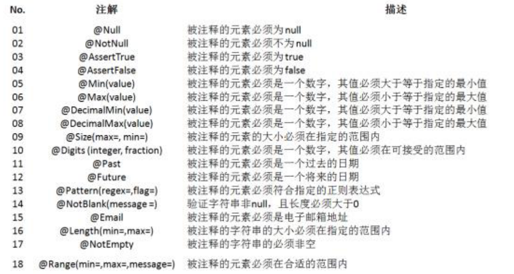
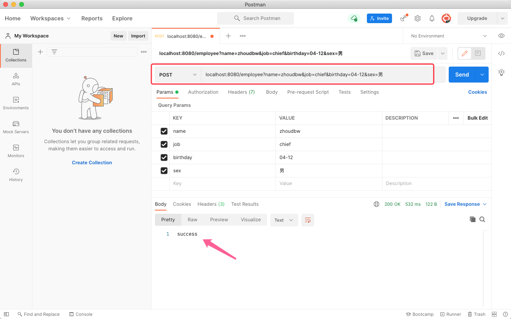
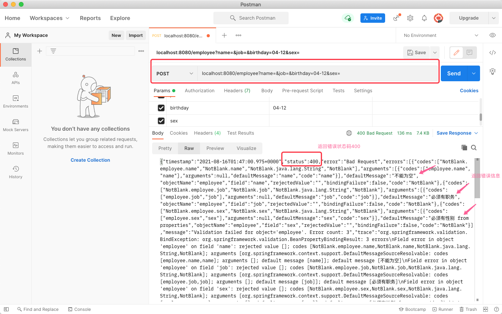
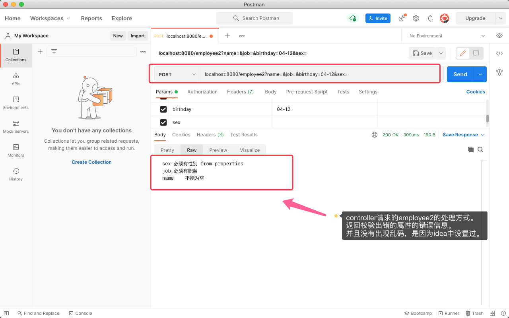
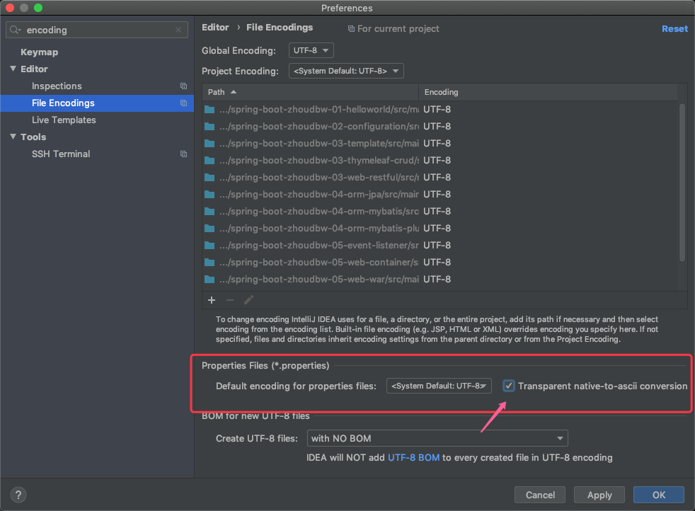

## 错误和异常处理机制

### 错误和异常

错误Error：经常是程序无法处理的（分为用户引发的错误和系统引发的错误）
异常Exception：程序员引发的，能够在程序中处理，try catch throws

虽然我们期望很少出现错误和异常，我们都希望这个程序是健壮的，但是这是一个不可避免、一定会出现的问题。即使再完善的程序，也会出现错误、也会出现异常，所以一个好的、优秀的错误处理机制就很重要了。

问题：怎么处理？如何做到优秀？

当用户引发的一些数据验证的错误，我们统称为"数据验证错误"、当访问页识别不到，系统出现异常抛出错误页，我们统称为"错误页指派"、当程序运行过程中出现异常，我们用"全局异常处理"。

综上，分为三种处理方式：数据验证错误、错误页指派、全局异常处理

#### 一、数据验证错误

数据验证错误本质上是实现了一个规范的框架 —— JSR 303。

##### **数据验证JSR 303**

JSR-303 是 JAVA EE 6 中的一项子规范，叫做 Bean Validation，官方参考实现是Hibernate Validator。 此实现与 Hibernate ORM 没有任何关系。 JSR 303 用于对 Java Bean 中的字段的值进行验证，是一个运行期的数据验证框架。 

在应用程序中，通过使用 Bean Validation 或是你自己定义的 constraint，就可以确保数据模型（JavaBean）的正确性。

##### 验证注解



##### Hibernate Validator 使用

@NotNull           @NotEmpty           @NotBlank

```
@NotNull 不为空  广泛用于基础类型的判断。
	- 比如int a = null; 

@NotBlank 不为空串  广泛引用于String类型的判断。 
	- 比如 String str = "";
	
@NotEmpty 内容不为空  广泛用于集合等的判断。
	- 比如 Map<String, String> map = new HashMap<>();
```

###### 案例：使用校验框架的"普通模式"（遍历所有属性，不符合校验规则都返回）

`需要校验的bean`

```java
public class Employee {
    /**
     * @NotBlank 不为空串
     * 可以指定校验失败时给出的信息通过message给出
     */
    @NotBlank
    private String name;
    @NotBlank(message = "必须有职务")
    private String job;
    private String birthday;
    private String sex;
}
```

`检验测试类的书写`

```java
import javax.validation.ConstraintViolation;
import javax.validation.Path;
import javax.validation.Validation;
import javax.validation.Validator;
import java.util.Set;

public class EmployeeValidTest {

    public static void main(String[] args) {
        // 通过创建默认的Validator工厂获取一个Validator
        Validator validator = Validation.buildDefaultValidatorFactory().getValidator();
        // 创建需要验证的bean, 故意将name给空串, 故意将job给空串
        Employee employee = new Employee("", "", "xxxx", "xxxxx");
        // 通过validate()方法验证bean，看是否符合注解
        // 方法声明：<T> Set<ConstraintViolation<T>> validate(T object, Class<?>... groups)
        // 所以返回值是 Set<ConstraintViolation<T>> ，泛型是验证的bean
        Set<ConstraintViolation<Employee>> violationSet =  validator.validate(employee);
        // 遍历验证结果
        for (ConstraintViolation violation : violationSet) {
            // 获取出问题的属性
            Path property = violation.getPropertyPath();
            // 获取问题信息
            String message = violation.getMessage();
            // 打印出错属性和出错信息
            System.out.println(property + ", " + message);
        }
    }
}
```

`校验结果`


---

###### 案例："快速失败模式" （遍历属性时，有一个不符合校验规则，即返回）

```java
/**
 * 快速失败
 */
public static void main(String[] args) {
  // 通过validation获取默认的Provider从而获取配置，添加快速失败配置，通过该配置获取默认的Validator工厂，从而获取Validator
  Validator validatorFastFail = Validation.byDefaultProvider().configure()
    .addProperty("hibernate.validator.fail_fast", "true")
    .buildValidatorFactory().getValidator();
  Employee employee = new Employee("", "", "xxxx", "xxxxx");
  Set<ConstraintViolation<Employee>> violationFastFailSet =  validatorFastFail.validate(employee);
  for (ConstraintViolation violation : violationFastFailSet) {
    System.out.println(violation.getPropertyPath() + ", " + violation.getMessage());
  }
}
```

`校验结果`


#### SpringBoot如何集成Hibernate Validator框架

spring-boot-starter-web依赖中，引入了spring-boot-starter-validator。所以我们不要引入，直接就可以使用了。

```xml
<dependency>
  <groupId>org.hibernate.validator</groupId>
  <artifactId>hibernate-validator</artifactId>
  <version>6.0.17.Final</version>
  <scope>compile</scope>
</dependency>
```

那么，如何在controller中使用呢？往往在接收到请求的时候，controller是第一层的处理层，当然要最快捷的验证数据格式啦。

`创建controller`

```java
import javax.validation.Valid;

/**
 * @author zhoudbw
 */
@RestController
public class EmployeeController {

    /**
     * 通过add一个新的员工的方式来验证数据格式
     * 使用RESTful风格，利用POST请求代表增加
     * 需要在controller中验证传递过来的Employee，那么怎么验证呢？
     *   提供给我们一个注解 @Valid ： 直接放在bean前面，校验其是否符合注解规则
     *  校验不通过时，返回400和错误信息。 
     *  处理方式是，遍历全部属性，失败结果全部返回。
     */
    @PostMapping("/employee")
    public String add(@Valid Employee employee) {
        return "success";
    }
}
```

`使用PostMan测试`

正确数据的测试结果：



错误数据的测试结果：



---

上述是默认处理的，如果我们想要自定义一种处理方式怎么办？使用BindingResult。BindingResult需要紧跟在@Valid Employee employee之后，这样我们就能拿到校验之后的结果了。

```java
/**
 * 自定义处理方式，通过 BindingResult实现
 */
@PostMapping("/employee2")
public String add2(@Valid Employee employee, BindingResult result) {
  // 通过result.getErrorCount()方法可以得到检验错误的数目
  if (result.getErrorCount() > 0) {
    // >0 表示有校验错误的条目
    // 拿到所有属性失败的失败结果
    List<FieldError> errorList = result.getFieldErrors();
    // 返回值
    StringBuffer stringBuffer = new StringBuffer();
    // 遍历
    for (FieldError fieldError : errorList) {
      // 获取出错属性本身
      String fieldString = fieldError.getField();
      // 获取错误信息
      String errorString = fieldError.getDefaultMessage();
      stringBuffer.append(fieldString);
      stringBuffer.append("\t");
      stringBuffer.append(errorString);
      stringBuffer.append("\n");
    }
    return  stringBuffer.toString();
  }
  return "success";
}
```

`使用PostMan测试`




---

补充：我们看，我们想要返回自定义的错误信息时我们是这样写的：

```java
@NotBlank(message = "必须有职务")
private String job;
```

在代码中，一般不推荐将这样的信息放在代码中，这样不方便更改，而且不是统一处理的，这样不够优雅。那么怎么优雅的处理呢？

SpringBoot提供给我们一个配置文件 ValidationMessages.properties

` ValidationMessages.properties` 固定的，位置在/src/resources下。

```properties
employee.sex.notblank=必须有性别 from properties
```

`应用在sex属性上`，通过 {key} 获取value。

```java
public class Employee {

    /**
     * @NotBlank 不为空串
     * 可以指定校验失败时给出的信息通过message给出
     */
    @NotBlank
    private String name;
    @NotBlank(message = "必须有职务")
    private String job;
    private String birthday;
    /**
     * 如何使用配置文件中的信息，作为错误校验的提示信息呢，使用 {key}获取value
     */
    @NotBlank(message = "{employee.sex.notblank}")
    private String sex;
}
```

如果出现乱码，在idea中做如下设置



