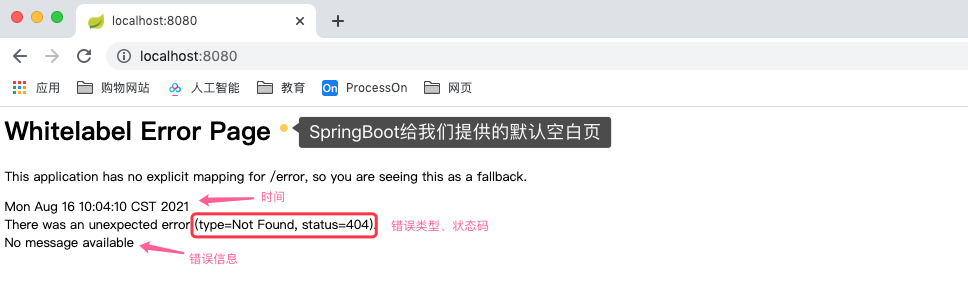

## 错误和异常处理机制

### 二、错误页指派

#### **什么是错误页呢？**

> 比如我们访问 `github.com/400.html`，这个页面不存在，就会返回一个页面，告诉我们该页面是找不到的。这就是错误页。

> 

> 一般http返回码都是400或500，我们再来看看500的错误页 `github.com/500.html`。

> 

像这样的错误信息的提示就是很友好的，告诉什么地方出错了。如果我们http状态码响应回一堆代码，用户也可能不知所措。他可能以为系统出现了什么大问题，当给这样一个友好的页面，至少他知道出现了什么问题，然后也知道这个是我们处理过的返回结果，用户体验也能变得好了，所以这是任何一个网站都离不开的错误页的处理。

#### SpringBoot提供的错误页处理

对于一个没有错误页处理的项目，SpringBoot给我们提供了一个空白的错误页处理。



我们通过Postman来访问看看，返回JSON，包含和浏览器访问相同的提示信息。


##### **为什么使用浏览器访问是一个页面？而用Postman访问就是一个JSON数据了呢？**

> 主要原因在与HTTP请求头中（Request Header）的Accept属性。

> 浏览器访问时：

> 

> Postman访问时：

> 

> 项目的源码中，也是通过这个值来区分不同的返回结果的。

---

### **如何自定义指定状态码的错误页？**

以下内容截取官方文档【spring-boot-reference-v2.1.8.pdf】-> 【Part IV. Spring Boot features】.【29. Developing Web Applications】.【29.1 The “Spring Web MVC Framework”】.【Error Handling】.【Custom Error Pages】。

>**Custom Error Pages**
>
>If you want to display a custom HTML error page for a given status code, you can add a file to an /error folder. 
>#说明：如果想要定义HTML页面给指定的状态码，那么HTML页面的名字需要和状态码一致，并且将其放置在error文件夹下。 
>
>Error pages can either be static HTML (that is, added under any of the static resource folders)
>#说明：如果是一个静态的HTML页面，放置在/src/resources/public/error文件夹下
>
>or be built by using templates. The name of the file should be the exact status code or a series mask.
>#说明：如果是使用模板的页面，那么放置在/src/resources/template/error文件夹下
>
>For example, to map 404 to a static HTML file, your folder structure would be as follows:
>
>
>
>To map all 5xx errors by using a FreeMarker template, your folder structure would be as follows:
>
>

#### 方式一 静态页面示例

**`编写静态HTML页面，注意只支持静态页面。`**

`以404.html为例`

```html
<!DOCTYPE html>
<html lang="en">
<head>
    <meta charset="UTF-8">
    <!-- 自定义404静态页面 -->
    <!-- 静态的不能出现任何模板使用的标签 -->
    <title>404</title>
</head>
<body>
<div align="center">
    这里是 src/resources/public/error/404.html
</div>
<br>
<div align="center">
    现在找不到页面了
</div>
</body>
</html>
```

`测试截图`


#### 方式二 模板页面示例

**`编写模板HTML页面，支持动态页面，并且优先级比/public/error目录高。`**

`以404.html为例`

```html
<!DOCTYPE html>
<html lang="en" xmlns:th="http://www.thymeleaf.org">
<head>
    <meta charset="UTF-8">
    <!-- 自定义404模板页面 -->
    <title>404</title>
</head>
<body>
<div align="center">
    这里是 src/resources/templates/error/404.html
</div>
<br>
<div align="center">
    <!-- 拿到错误页的时间戳 -->
    <p th:text="${timestamp}">timestamp</p>
    <!-- 状态码 -->
    <p th:text="${status}">status</p>
    <!-- 错误信息 -->
    <p th:text="${message}">message</p>
</div>
<br>
<div align="center">
    现在找不到页面了
</div>
</body>
</html>
```

`测试截图`


问题：我们知道，错误码经常有400、401、402、403、404等等，即400开头的错误码有一堆，难道都要对应error目录下的一堆文件吗？如果这样的话，那么页面是不是太多了。我们能不能用一种` 多（多个状态码）对一（一个错误页）`的方式来处理所有以400开头的状态码呢？

我们先将原先的404.html更名为 404_bak.html，这样404这个状态码就找不到这个错误页了。因为是错误码对应文件名，现在对应关系没有了。

新建页面4xx.html 或 5xx.html，这样的页面可以代表状态码4开头对应的文件或状态码5开头对应的文件。
即可以通过4xx.html页面，代表所有4开头错误码(400, 401, 402...)要查找的页面，5xx同理。

如果4xx.html和404.html同时存在时，若错误码为404，则优先查找的是404.html，即存在精确匹配的页面时，以匹配的页面为准。若错误码为403，由于没有403.html，那么会以4xx.html为准显示。

#### 方式三 ErrorViewResolver

> For more complex mappings, you can also add beans that implement the ErrorViewResolver interface, as shown in the following example:
>
> ```java
> public class MyErrorViewResolver implements ErrorViewResolver {
> 		@Override
>     public ModelAndView resolveErrorView(HttpServletRequest request,
>        HttpStatus status, Map<String, Object> model) {
>           // Use the request or status to optionally return a ModelAndView
>           return ...
>     }
> }
> ```
>
> You can also use regular Spring MVC features such as @ExceptionHandler methods and @ControllerAdvice. The ErrorController then picks up any unhandled exceptions.
>
> #说明：通过自定义错误视图解析器的方式，来自定义我们的返回结果。

创建自定义的错误视图解析器，实现ErrorViewResolver接口

```java
package cn.zhoudbw.resolver;

import org.springframework.boot.autoconfigure.web.servlet.error.ErrorViewResolver;
import org.springframework.http.HttpStatus;
import org.springframework.stereotype.Component;
import org.springframework.web.servlet.ModelAndView;

import javax.servlet.http.HttpServletRequest;
import java.util.Map;

/**
 * @author zhoudbw
 * 自定义错误视图解析器
 * 实现 ErrorViewResolver接口， 重写resolverErrorView，解析错误视图
 *
 * 重要：必须声明@Component 才能说明这是一个组件，才能够被Spring识别（是一个bean），这样定义才会生效。
 */
@Component
public class MyErrorViewResolver implements ErrorViewResolver {
    /**
     * 该方法我们只处理404
     * @param request
     * @param status 状态码
     * @param model
     * @return 返回ModelAndView，是MVC的返回结果，用来显示视图
     */
    @Override
    public ModelAndView resolveErrorView(HttpServletRequest request, HttpStatus status, Map<String, Object> model) {
        // 处理404  	NOT_FOUND(404, "Not Found")
        if (status.equals(HttpStatus.NOT_FOUND)) {
            // 创建ModelAndView
            ModelAndView modelAndView = new ModelAndView();
            // 通过setViewName("xxx")方法，设置返回页面
            // 我们将自定义的文件放在了templates下，因此直接传递路径下的文件名可以找到对饮名字的视图
            modelAndView.setViewName("/resolver404");
            return modelAndView;
        }
        return null;
    }
}
```

`验证结果`


从验证结果我们也知道，

```
实现ErrorViewResolver的错误页的优先级 > src/resources/templates/error的错误页优先级 > src/resources/public/error的错误页优先级
```

#### 方式四 WebServerFactoryCustomizer

前面连接，我们知道WebServerFactoryCustomizer可以在容器创建的时候增加一些配置，比如设置接口，并且优先级高于配置文件。同样，我们可以在这里设置错误页面。

使用WebServerFactoryCustomizer来注册bean，通过更改错误码的处理路径，来指定不同的页面。

`编写WebServerFactoryCustomizer的实现类`

```java
package cn.zhoudbw.customizer;

import org.springframework.boot.web.server.ConfigurableWebServerFactory;
import org.springframework.boot.web.server.ErrorPage;
import org.springframework.boot.web.server.WebServerFactoryCustomizer;
import org.springframework.context.annotation.Bean;
import org.springframework.context.annotation.Configuration;
import org.springframework.http.HttpStatus;

/**
 * @author zhoudbw
 * 使用WebServerFactoryCustomizer设置错误页面
 * @COnfiguration 声明这是一个配置文件，需要使用这个类声明bean，代替xml文件的
 */
@Configuration
public class MyCustomizer {
    /**
     * 因为是配置相关的，所以泛型自然要传递配置相关的，要求<T extends WebServerFactory>，传递ConfigurableWebServerFactory
     */
    @Bean
    public WebServerFactoryCustomizer<ConfigurableWebServerFactory> customizer() {
        return new WebServerFactoryCustomizer<ConfigurableWebServerFactory>() {
            @Override
            public void customize(ConfigurableWebServerFactory factory) {

                /*  // 创建错误页，使用下述构造方法
                	public ErrorPage(HttpStatus status, String path) {
                        this.status = status;
                        this.exception = null;
                        this.path = path;
	                }
	                status表示状态码
	                path表示请求路径
	                当status==404时，转发到/error404请求
                 */
                ErrorPage errorPage = new ErrorPage(HttpStatus.NOT_FOUND, "/error404");
                // 设置错误页
                factory.addErrorPages(errorPage);
            }
        };
    }
}
```

`编写controller处理错误状态码转发的处理请求`

```java
/**
 * @author zhoudbw
 * 处理错误码对应的请求
 *  此处处理MyCustomizer.java中定义的/error404请求
 */
@Controller
public class MyErrorController {
    @RequestMapping("/error404")
    public String error404() {
        return "error404";
    }
}
```

`编写视图层页面`

```html
<!DOCTYPE html>
<html lang="en" xmlns:th="http://www.thymeleaf.org">
<head>
    <meta charset="UTF-8">
    <!-- customizer的404页面 -->
    <title>404</title>
</head>
<body>
<div align="center">
    这里是 src/resources/templates/error404.html
</div>
<br>
<div align="center">
    <!-- 拿到错误页的时间戳 -->
    <p th:text="${timestamp}">timestamp</p>
    <!-- 状态码 -->
    <p th:text="${status}">status</p>
    <!-- 错误信息 -->
    <p th:text="${message}">message</p>
</div>
<br>
<div align="center">
    现在找不到页面了
</div>
</body>
</html>
```

`执行结果`


由此也说明：

```
实现WebServerFactoryCustomizer的错误页的有衔接 > 实现ErrorViewResolver的错误页的优先级 > src/resources/templates/error的错误页优先级 > src/resources/public/error的错误页优先级
```

### 错误页的原理

```apl
原理： 
1）当系统出现错误，有一个系统的ErrorController，就会跳转到/error请求。 
2）处理请求时，查找error.path配置，来确定返回页面的地址。一般，页面名称和状态码对应，如404.html / 4xx.html。 
3）根据请求头（Request Header）中的Accept属性值，判断返回的是页面还是json数据。
```

