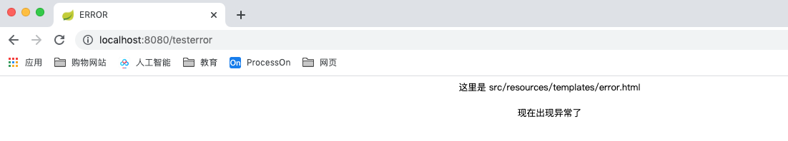
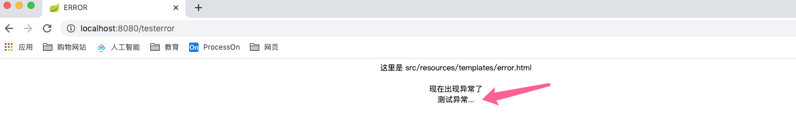

## 错误和异常处理机制

异常处理非常重要。不好的异常处理可能会导致很严重的问题。

### 异常处理的设计

#### **常见的错误示例1：**

１）前端只做了成功的响应，对失败没有任何处理。
２）后台直接捕获了异常，当出错时用户无感知，页面无响应。

```javascript
$.ajax({ 																|							try {
    type: “GET”, 												|									// todo 具体业务逻辑
    url: “/operate”, 										|							} catch(Exception e) {
    dataType: “json”, 									|									e.printStackTrace();
    success: function(data){						|							}
      	alert(“处理成功”);						　　|   　　
    }																		| 
});																			|
```

前端如果处理出错了，并没有做处理，那么页面什么都不会做，就是空白页。
服务端如果出错了，虽然将异常打印出来了，但是当真正上了生产的项目，日志是非常庞大的，而且不会有人每天都盯着日志去看。所以说类似于e.printStackTrace()这样的打印是没有什么意义的。如果看不到日志也就不知道这个异常是怎么出现的，也就不知道如何解决。如果有用户使用的时候突然卡死了，也不知道出现了什么问题，这样的用户体验是非常的差的。

#### **常见的错误示例2：**

1）虽然使用map返回错误信息，但问题在于不够规范化，增加沟通理解成本。(REST中错误码的必要)

```javascript
$.ajax({ 																|									Map map = new HashMap();
    type: “GET”, 												|									try{
    url: “/operate”, 										|											// todo 具体业务逻辑
    dataType: “json”, 									|											map.put(“success“,true);
    success: function(data){ 						|									} catch(Exception e) {
        if (data.success) { 						|											map.put(“success“,false);
        		alert(“处理成功”);               	 								 map.put(“message“,e.getMessage();
        } else { 												|									}
        		alert(“处理失败”);           									 return map;
        } 															|
    } 																	|
});																			|
```

前端这样处理，至少用户知道处理是成功还是失败了。
后端现在不进去做具体的业务逻辑，而且添加了map集合，如果处理成功就将正确存入map；如果失败，将false放入map并且将相应的message放入，有了这样容器的辅助，前端放回信息的时候，就不一定是一定要返回处理失败了，可以将map中的message返回。

这是相对较好的一种处理方式，很多人在使用，但是依旧有其弊端。这里用的是success规定的失败与否。我们也可以定义"isSuccess"或"noSuccess"等等来标识，这是一种自定义的，而不是一种规范，所以说有很多的沟通理解成本。换一个人来修改这个代码需要看明白各个位置代表什么才能进行修改。这种方式远不如RESTful那种通用处理更好（400开头的就是页面找不到，系统错误之类问题、500开头的就代表异常相关的错误，然后还有一些位置异常等等）。

**知道了不好的异常处理机制，自然也就知道一个优秀的异常处理机制的设计了。**

### **定义全局异常**

要想做一种优秀的异常处理机制，首先应该先知道如何定义异常处理机制。

通过@ControllerAdvice注解监听所有在controller中出现的异常，执行@ExceptionHandler注解的方法，跳转错误页。

1.  创建全局异常处理类 

   ```java
   /**
    * @author zhoudbw
    * 自定义的异常处理器
    * Spring3.2 给我们提供了一个注解，让我们可以获取全局任何地方出现的异常。 这个注解就是@ControllerAdvice
    * @ControllerAdvice 控制器通知，也就是我们在处理controller的时候抛出的任何异常都会被这个注解所标识的这个类接收到。
    * @ControllerAdvice 内嵌了 @Component 这个注解，所以这个类可以被Spring容器所接管了。
    * @ControllerAdvice 是切面式的使用方法
    */
   @ControllerAdvice
   public class MyExceptionHandler {
   
       /*
        * 处理什么类型的异常，通过 @ExceptionHandler("异常类型.class")指定
        * 比如处理所有异常的父类：@ExceptionHandler(Exception.class)
        * 该注解下的方法就是用来处理该异常的处理方法。
        */
   
       /**
        * 通过@ExceptionHandler()确定具体需要处理何种异常
        * 通过handler()方法处理该类型的异常
        * @param e 需要处理的异常类型
        * @return 返回MVC的模型和视图，控制返回内容
        */
       @ExceptionHandler(Exception.class)
       public ModelAndView handler(Exception e) {
           ModelAndView mv = new ModelAndView();
           // 返回templates下的名称为error的视图
           mv.setViewName("/error");
           return mv;
       }
   }
   ```

2. 常见controller，模拟异常

   ```java
   /**
    * 该controller存在异常，为了演示出现异常，然后被自定义的全局异常处理器MyExceptionHandler得知，
    * 然后返回处理该异常的页面。
    */
   @RequestMapping("/testerror")
   public String error() throws Exception {
     throw new Exception("测试异常...");
     /**
      * 这里会抛出异常，这个异常会被 MyExceptionHandler监听到。
      * 其实@ControllerAdvice是一个切面的注解，监听到了抛出的异常，然后会执行@ExceptionHandler()注解的方法。
      * 这个方法会创建ModelAndView，跳转到error这个页面来，对应的就是src/resources/templates/error.html
      */
   }
   ```

3. 创建 error.html 页面 

   ```html
   <!DOCTYPE html>
   <html lang="en" xmlns:th="http://www.thymeleaf.org">
   <head>
       <meta charset="UTF-8">
       <!-- 处理特定异常返回的页面 -->
       <title>ERROR</title>
   </head>
   <body>
   <div align="center">
       这里是 src/resources/templates/error.html
   </div>
   <br>
   <div align="center">
       现在出现异常了
   </div>
   </body>
   </html>
   ```

4. 结果截图
   

**拓展1：**如何将`new Exception("测试异常...")`这样的异常信息显示到页面内呢？

```javascript
* 修改MyExceptionHandler中，@ExceptionHandler(Exception.class)的方法为，如下
    @ExceptionHandler(Exception.class)
    public ModelAndView handler(Exception e) {
        ModelAndView mv = new ModelAndView();
        // 返回templates下的名称为error的视图
        mv.setViewName("/error");
        // 将异常信息显示在页面上
        mv.addObject("message", e.getMessage());
        return mv;
    }
* 我们可以在这个类中做很多的事情，可以判断异常类型分别处理，等等操作。
```

```html
* 将异常信息显示在页面上，在error.html中增加内容
<!-- 显示接收到的异常信息 -->
<div align="center" th:text="${message}">异常信息</div>
```



**拓展2：**如果使用rest风格，注解更改为@RestControllerAdvice 返回结果更改为异常信息类。 

