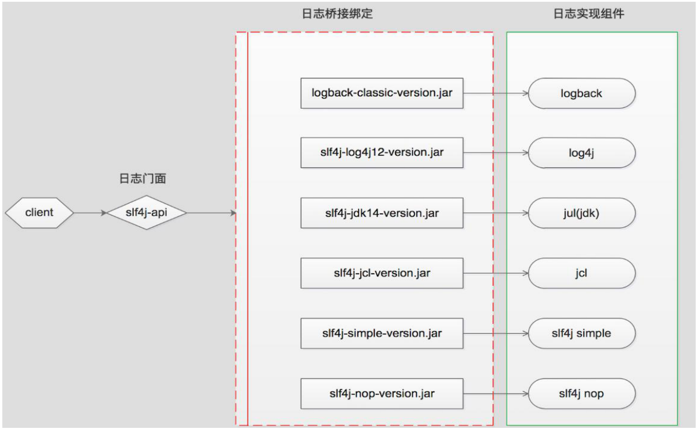
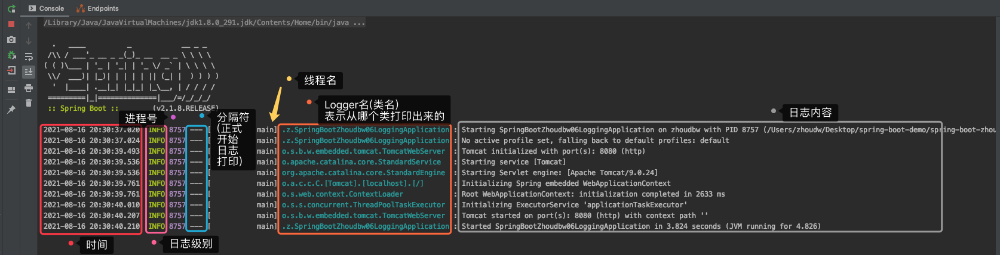
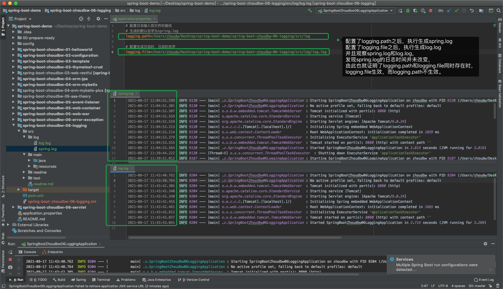
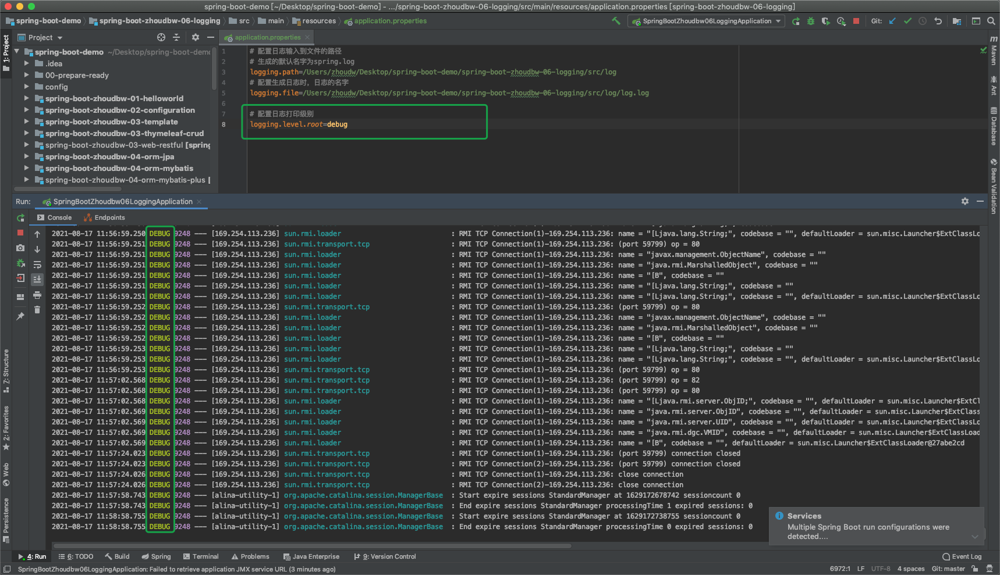
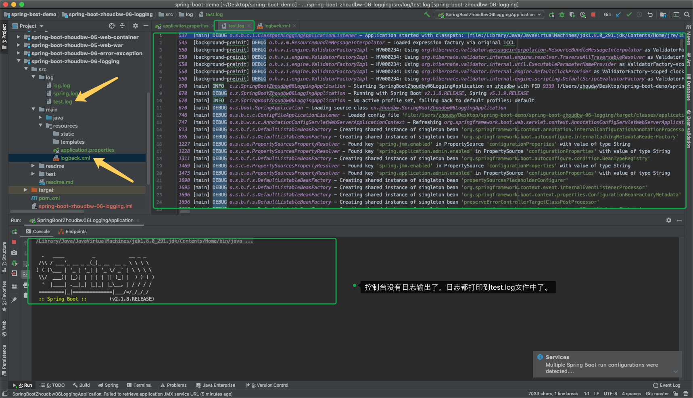
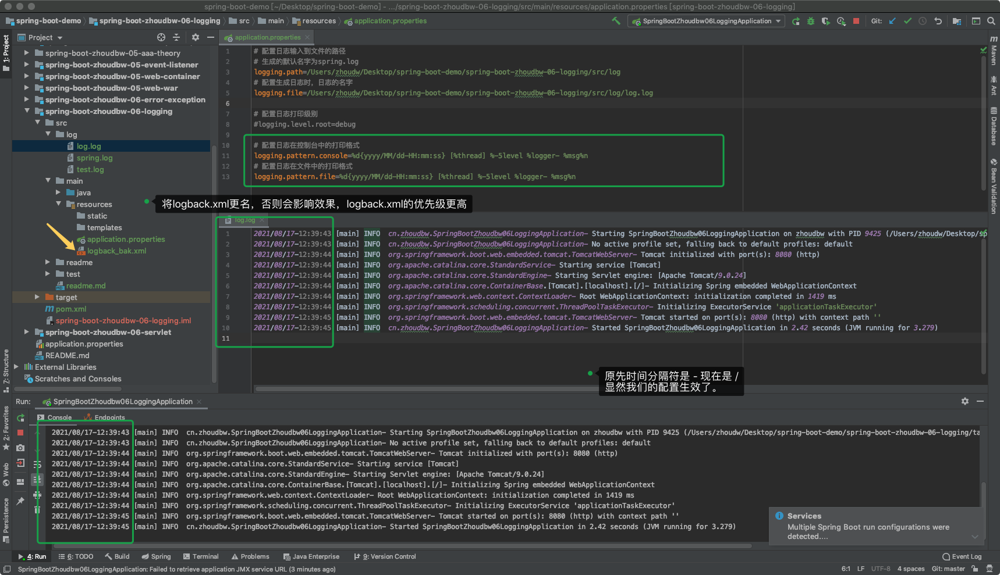

## 日志

日志，通常不会在需求阶段作为一个功能单独提出来，也不会在产品方案中看到它的细节。但是， 这丝毫不影响它在任何一个系统中的重要的地位。日志在我们实际开发中非常的重要，我们通过日志可以排查出一些问题、为监测服务做保障（日志其实是所有监控功能的本源，因为日志出现问题了，所以才会有一系列的动作，比如报警，提示等等。）

那么开发中怎么使用日志呢？

### 日志框架的诞生历史

```apl
1996年，欧洲的安全电子市场的一个项目组，想要编写一个程序跟踪的API，这个API经过完善之后，就成了一个很受欢迎的软件日志包 —— log4j。
log4j = log for java. log4j意义上就是为java诞生的一个日志，出现后也迅速风靡java社区，成为了一种日志标准，后来也被Apache给收购了成为Apache的一部分。

有传言说，Apache想要吧log4j卖给Sun，让Sun把它放到Java的SDK中作为一个工具，但是Sun拒绝了。
2002年，Sun在java1.4中，推出了自己的日志库 —— jul。
jul = java util logging. jul实际上模仿了log4j的实现方式，希望和log4j抢占一席之地。获取了一部分的市场，但是log4j依然处于统治地位。

Apache不甘示弱，随后又推出了 jcl。
jcl = jakarta commons logging. 本质上是一套java日志接口，支持运行动态加载日志的一个组件（也就是想要调用log4j或者jul都是可以支持的）。后更名为Commons Logging。

2006年，编写log4j的大神离开了Apache，本来想要写一个log4j的升级版，因为发现log4j存在一些性能问题。但是发现在原有的要修改这些问题实在是太复杂了，所以就推出了一个新的日志框架logback。（做log4j的和做logback的是同一个大神）

大神发现，如果先要做logback，那么原先log4j的日志都要修改，这也太麻烦了。紧接着他推出了既能支持log4j，又能支持logback的日志门面框架也推出了 —— slf4j.
slf4j = simple logging facade for java 日志门面接口。就是让我们既可以用logback，又可以用log4j，并且在切换的时候不需要修改任何的日志代码。
这样提供了一种通用的接口，通用的API，让我们切换的成本变得非常低了，后面在出现任何日志框架，我们都可以直接切换使用。这就是一种facade设计模式（门面设计模式），并且log4j、logback和slf4j都是一个大神来写的。

原先说logback是想做log4j的升级版，但是原有的升级很困难所以推出了新的。但是这个时候大神已经离开了Apache。
因为推出这个之后呢，整个日志市场就成了一种平分秋色的一种场景了。Commons Logging 和 slf4j。
但是现在slf4j已经成为了主流，原先配合使用的是log4j，现在也是logback。所以现在的主流 slf4j + logback。

补充：在推出logback之后，Apache看着logback要反超log4j了，有了危机意识。
2012年，Apache推出了log4j2，log4j2就是模仿logback，基于loj4j的基础上推出的2.0版本。
```

### 日志框架浅析

SLF4J ，即简单日志门面（Simple Logging Facade for Java），可以和其他框架相集成。集成方式：门面设计模式配合着桥接的绑定。从而将代码和日志的底层隔离，然后我们可以通用slf4j的api，让我们想调用哪个日志就调用哪个日志。集成直观图如下所示。目前来说， Logback 是 SLF4J 的最佳实现。 

从设计模式的角度考虑，它是用来在 log 和代码层之间起到门面的作用。配置 SLF4J 是非常简单的一件事，只要将你打算使用的日志系统对应的 jar 包加入到项目中， SLF4J 就会自动选择使用你加入的日志系统。使用 SLF4J 提供的接口，可隐藏日志的具体实现。这与 JDBC 相似，使用 JDBC 也就避免了不同的具体数据库，想要使用哪种数据库，直接调用其api即可。



### SpringBoot使用日志

首先，我们仔细看一看SpringBoot的启动日志是什么样的？（前提：只引入了spring-boot-starter-web依赖，未做任何业务逻辑的编写，启动入口类）。

Spring Boot默认会用Logback来记录日志



通用日志格式：

```
时间日期+日志级别+进程ID+分隔符(正式开始)+线程名+Logger名(类名)+日志内容
```

日志级别：

```
TRACE < DEBUG < INFO < WARN < ERROR < FATAL
追踪		 调试	   信息    警告		 错误     失败
```

日志地址：

```
默认输出到控制台
```

#### **如何将日志输出到文件？**

```properties
1) 在application中添加logging.path 配置path，默认输出的文件名是spring.log 
2) 在application中添加logging.file 配置file, 默认输出路径是项目当前路径，[可配置绝对路径] 
```

注：**二者不能同时使用**，如若同时使用，则只有logging.file生效 。

默认情况下，日志文件的大小达到10MB时会切分一次，产生新的日志文件。

```properties
# 配置日志输入到文件的路径
# 生成的默认名字为spring.log
logging.path=/Users/zhoudw/Desktop/spring-boot-demo/spring-boot-zhoudbw-06-logging/src/log
# 配置生成日志时，日志的名字
logging.file=/Users/zhoudw/Desktop/spring-boot-demo/spring-boot-zhoudbw-06-logging/src/log/log.log
```



#### 如何控制日志级别？

`logging.level.*`

```properties
logging.level  日志级别控制前缀
*              为包名或Logger名 

LEVEL：选项TRACE, DEBUG, INFO, WARN, ERROR, FATAL, OFF 
如： logging.level.root=debug 含义：设置root包下的日志打印级别为debug。
从这我们也能够有这样的启示，如果将root换成我们自己的包名，那么所打印的debug日志就能够帮助我们快速的定位问题。
```



#### 如何自定义日志？

我们希望日志打印的格式，按照我们指定的方式打印，那么如何配置呢？

根据不同的日志系统，可以按规则配置文件名，并放在 src/main/resources 下，就能被加载： 

Logback：logback-spring.xml, logback-spring.groovy, logback.xml, logback.groovy 

Log4j：log4j-spring.properties, log4j-spring.xml, log4j.properties, log4j.xml 

Log4j2：log4j2-spring.xml, log4j2.xml 

JDK (Java Util Logging)：logging.properties 

* 官方推荐优先使用带有-spring的文件名作为日志配置（如使用logback-spring.xml，而不是logback.xml）

* 上述之所以一个配置框架列举多个配置文件，是同时存在时的加载顺序。

  * 比如说，如果logback-spring.xml和logback-spring.groovy同时存在时，logback-spring.xml的优先级更高，会被使用。

* 我们演示将logback.xml配置到src/main/resources下：

  ```xml
  <!--logback的配置，随用随查-->
  <configuration>
      <appender name="FILE" class="ch.qos.logback.core.rolling.RollingFileAppender">
          <!--配置为test.log时，直接在当前目录下生成个test.log
          若要在指定目录下打印一个test.log文件 指定目录时必须是绝对路径-->
          <file>/Users/zhoudw/Desktop/spring-boot-demo/spring-boot-zhoudbw-06-logging/src/log/test.log</file>
  
          <!--滚动式处理-->
          <rollingPolicy class="ch.qos.logback.core.rolling.FixedWindowRollingPolicy">
              <fileNamePattern>tests.%i.log.zip</fileNamePattern>
              <minIndex>1</minIndex>
              <maxIndex>3</maxIndex>
          </rollingPolicy>
  
          <!--触发-->
          <triggeringPolicy class="ch.qos.logback.core.rolling.SizeBasedTriggeringPolicy">
              <!--当日志文件到达5MB时，生成一个新的文件-->
              <maxFileSize>5MB</maxFileSize>
          </triggeringPolicy>
          <encoder>
              <!--日志格式使用如下格式
              PID 进程名 日志级别 打印日志的类 日志信息-->
              <pattern>%-4relative [%thread] %-5level %logger{35} - %msg%n</pattern>
          </encoder>
      </appender>
  
      <!--日志级别是DEBUG-->
      <root level="DEBUG">
          <!--关联上方的name=FILE的appender-->
          <appender-ref  ref="FILE"/>
      </root>
  </configuration>
  ```

  此时打印的效果为：

  

#### 如何使用配置文件实现？

springboot希望我们尽量少的使用xml这种配置，用约定优于配置的原则，或者用注解代替配置的方式来实现xml配置的方式。

那么我们是不是可以使用我们的配置来代替xml文件呢？—— 可以。我们来验证（为了放置logback.xml影响，将其更名为logback_bak.xml，这样便失效了）。

```properties
更改输出格式：
logging.pattern.console 搭配正则表达式 ，配置控制台日志内容的格式 
logging.pattern.file 搭配正则表达式 ，配置文件日志内容的格式 
## 注意：这两个配置项配置一者另一者并不生效。
## 也就是，若只配置了logging.pattern.console那么控制台的日志输出格式改变，
## 但是，文件中日志格式依旧按照默认的形式存储，只有配置了logging.pattern.file才会改变。

如 logging.pattern.console=%d{yyyy/MM/dd-HH:mm:ss} [%thread] %-5level %logger- %msg%n
各符号含义如下： 
	%d{yyyy/MM/dd-HH:mm:ss}——日志输出时间 
	%thread——输出日志的进程名字，这在Web应用以及异步任务处理中很有用 
	%-5level——日志级别，并且使用5个字符靠左对齐 
	%logger- ——日志输出者的名字 
	%msg——日志消息 
	%n——平台的换行符
```



### 切换日志框架

虽然现在slf4j + logback已经成为一种主流了，但是仍然还有一些团队习惯使用之前的log4j。SpringBoot是支持日志框架的切换的，毕竟slf4j的存在就是方便切换不同的日志框架。

切换方式，将logback从spring-boot-starter-web依赖中移除，然后添加log4j的依赖，放置log4j需要的配置文件：log4j.properties。

```xml
<!--web启动器依赖-->
<dependency>
    <groupId>org.springframework.boot</groupId>
    <artifactId>spring-boot-starter-web</artifactId>
    <exclusions>
        <!--移除logback的依赖-->
        <exclusion>
            <artifactId>logback-classic</artifactId>
            <groupId>ch.qos.logback</groupId>
        </exclusion>
        <exclusion>
            <artifactId>log4j-over-slf4j</artifactId>
            <groupId>org.slf4j</groupId>
        </exclusion>
    </exclusions>
</dependency>
<!--引入log4j的依赖-->
<dependency>
    <groupId>org.slf4j</groupId>
    <artifactId>slf4j-log4j12</artifactId>
</dependency>
```

添加log4j.properties配置文件

```properties
#log4j.rootLogger=CONSOLE,info,error,DEBUG
log4j.rootLogger=info,error,CONSOLE,DEBUG

log4j.appender.CONSOLE=org.apache.log4j.ConsoleAppender
log4j.appender.CONSOLE.layout=org.apache.log4j.PatternLayout
log4j.appender.CONSOLE.layout.ConversionPattern=%d{yyyy-MM-dd-HH-mm} [%t] [%c] [%p] - %m%n
      
log4j.logger.info=info
log4j.appender.info=org.apache.log4j.DailyRollingFileAppender
log4j.appender.info.layout=org.apache.log4j.PatternLayout
log4j.appender.info.layout.ConversionPattern=%d{yyyy-MM-dd-HH-mm} [%t] [%c] [%p] - %m%n
log4j.appender.info.datePattern='.'yyyy-MM-dd
log4j.appender.info.Threshold = info
log4j.appender.info.append=true
#log4j.appender.info.File=/home/admin/pms-api-services/logs/info/api_services_info
log4j.appender.info.File=/logs/info/api_services_info

log4j.logger.error=error
log4j.appender.error=org.apache.log4j.DailyRollingFileAppender
log4j.appender.error.layout=org.apache.log4j.PatternLayout
log4j.appender.error.layout.ConversionPattern=%d{yyyy-MM-dd-HH-mm} [%t] [%c] [%p] - %m%n
log4j.appender.error.datePattern='.'yyyy-MM-dd
log4j.appender.error.Threshold = error
log4j.appender.error.append=true
#log4j.appender.error.File=/home/admin/pms-api-services/logs/error/api_services_error
log4j.appender.error.File=/logs/error/api_services_error

log4j.logger.DEBUG=DEBUG
log4j.appender.DEBUG=org.apache.log4j.DailyRollingFileAppender
log4j.appender.DEBUG.layout=org.apache.log4j.PatternLayout
log4j.appender.DEBUG.layout.ConversionPattern=%d{yyyy-MM-dd-HH-mm} [%t] [%c] [%p] - %m%n
log4j.appender.DEBUG.datePattern='.'yyyy-MM-dd
log4j.appender.DEBUG.Threshold = DEBUG
log4j.appender.DEBUG.append=true
#log4j.appender.DEBUG.File=/home/admin/pms-api-services/logs/debug/api_services_debug
log4j.appender.DEBUG.File=/logs/debug/api_services_debug

### Debug
log4j.logger.com.ibatis=DEBUG
log4j.logger.com.ibatis.common.jdbc.SimpleDataSource=DEBUG
log4j.logger.com.ibatis.common.jdbc.ScriptRunner=DEBUG
log4j.logger.com.ibatis.sqlmap.engine.impl.SqlMapClientDelegate=DEBUG
log4j.logger.java.sql.Connection=DEBUG
log4j.logger.java.sql.Statement=DEBUG
log4j.logger.java.sql.PreparedStatement=DEBUG
```

上述工作完成之后，日志框架即切换并且可用。

