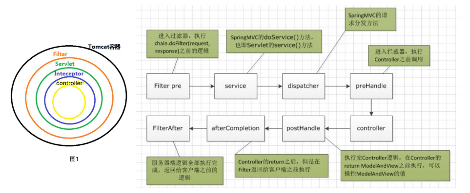
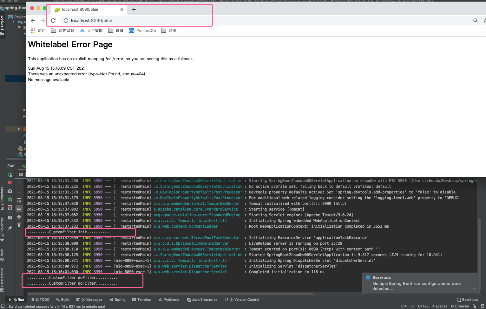
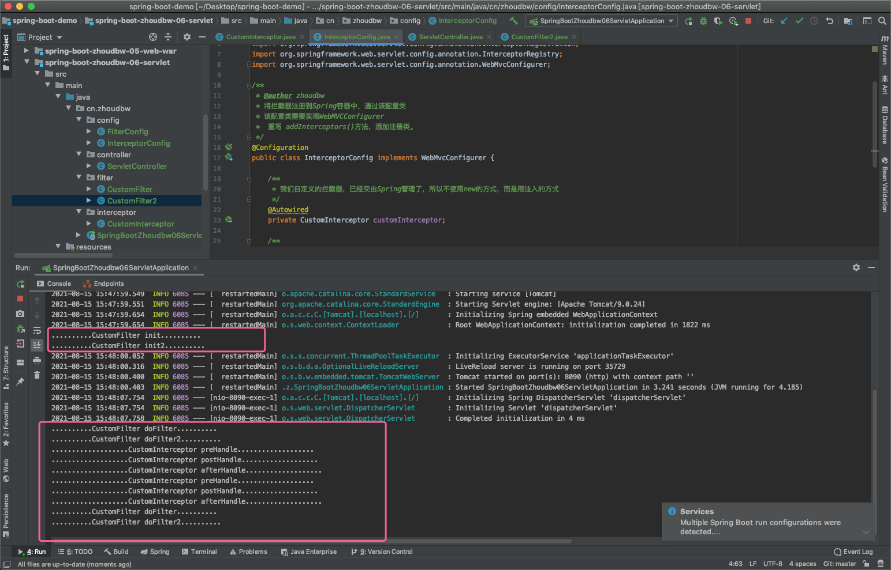
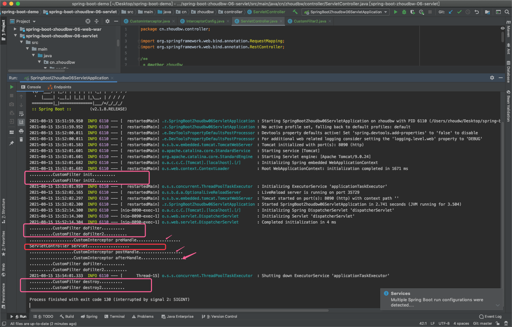

## 过滤器和拦截器

在我们进行真正的业务开发的时候，通常会有一些实际需求，比如：实现启动初始化信息、统计在线人数、在线用户数、过滤敏高词汇、访问权限控制(URL级别)等业务需求，通常这些业务需求我们提供了一种过滤和拦截的机制来实现它们。—— 这就是过滤器和拦截器。

过滤器和拦截器听起来似乎很相似，似乎都是在某个过程中，去阻碍往下一步执行，它们做的似乎都是这样的事情，那么它们的区别是什么呢？

### 过滤器和拦截器的执行链路



<div align="center">一图胜前言。（图转自互联网）</div>

我们看图1：

```
在一个Tomcat容器中，一笔请求过来的时候，
- 都是有过滤器（Filter）先过滤一遍看看，比如说看看URL的组成规范，这代表有了访问的权限，这样才可以走到Servlet中；
- Servlet会继续执行到拦截器（Interceptor）中，比如说现在登录，那么统计一下登录的人数；过来操作了，统计一下操作的频繁程度等等；
- 拦截之后才会进行真正的业务逻辑的处理，也就是我们常写的controller。
所以说，上图：先进行过滤，判断有没有访问的权限，然后才真正的访问到Servlet，访问到Servlet之后还会有一部分拦截说看看能不能进行某某某业务的使用，发现可以这样才会走真正的业务逻辑，也就是controller。
这就是过滤和拦截在两个不同阶段做的看起来相似但是还是有区别的事。本质上都是，在事情发展过程中，进行的判断（能不能向下执行进行的判断）
```

### **过滤器和拦截器的异同** 

过滤器（Filter）：当你有一堆东西的时候，你只希望选择符合你要求的某一些东西。定义这些要求的工具，就是过滤器。

> 放到web容器中可以这样理解，当一个服务发表到外网的时候，可能会有成千上百上万个url访问进来。有些url是正常的业务访问的url当然可以去处理，但是不排除有些url是机器模拟的，那么我们就要将这些url过滤出去不让其进入到Servlet，这样对Servlet是没有任何影响的，也就不影响Servlet的性能。

拦截器（Interceptor）：在一个流程正在进行的时候，你希望干预它的进展，甚至终止它进行，这是拦截器做的事情。 

> 拦截器是说，在已经过滤了之后，Servlet确实需要处理这个url了，拦截器会看，这个url是否符合我们的规范，比如说有没有登录啦，登录的用户能不能去处理这个业务处理，以及统计一些日志啦。在Servlet之后，在业务处理之前，再判断一次能不能向下进行。

相同点

* 都是aop编程思想的体现，可以在程序执行前后做一些操作。

不同点：

* 过滤器依赖于servlet容器，拦截器不依赖。

  > 过滤器本身是Servlet规范中的一部分，就是由Servlet容器回调完成的。而拦截器实际上是由Spring来提供的，通常通过动态代理的方式来完成。

* 过滤器的执行由Servlet容器回调完成，而拦截器通常通过动态代理的方式来执行。

* 触发时机不一样，过滤器是在请求进入Tomcat容器后，进入servlet前进行预处理的；拦截器是在进入servlet之后，进入controller之前处理的。

* 拦截器可以获取IOC容器中的各个bean，而过滤器就不行，拦截器归Spring管理。

### 过滤器Filter

在springboot中如何使用呢？首先我们可以自定以一个类，实现Filter接口。重写init()、doFilter()、destroy()方法。

1. 在Servlet3.0的时候，新增了@WebFilter注解，原先实现过滤器，需要在web.xml中进行配置，而现在通过此注解，服务启动时会自动扫描自动注册。 

2. springboot提供了FilterRegistrationBean注册Filter的bean，此类提供setOrder方法，可以为filter设置排序值， 可以让spring在加载的时候，按照web filter之前排序好的顺序，依次注册bean。

使用场景：判断用户是否登录、判断url是否有访问权限等。 

原理： 过滤器的实现基于回调函数。

#### Filter的Sprintboot实现方案

##### 实现方式一： 

1）创建类实现Filter接口；2）注入springboot容器（代码注入 / 通过注解@WebFilter注入）

```java
package cn.zhoudbw.filter;

import javax.servlet.*;
import java.io.IOException;

/**
 * @author zhoudbw
 * 自定义Filter
 * 在学习Struts的时候，Struts将Filter使用到了极致。
 * 我们会在web.xml中配置拦截器，比如说：
 * <filter>
 * <filter-name>struts2</filter-name>
 * <filter-class>com.zhoudbw.filter.CustomFilter</filter-class>
 * </filter>
 * <p>
 * <filter-mapping>
 * <filter-name>struts2</filter-name>
 * <url-pattern>/*</url-pattern>
 * </filter-mapping>
 * 这是最早期的时候我们使用Filter的时候，web.xml提供给我们的一种配置方式，
 * <p>
 * 我们这里并不需要再像早期那样，配置web.xml而是实现Filter接口，引入包，实现方法
 * import javax.servlet.Filter
 * init() doFilter() destory()
 */
public class CustomFilter implements Filter {
    @Override
    public void init(FilterConfig filterConfig) throws ServletException {
        System.out.println("..........CustomFilter init..........");
    }

    @Override
    public void doFilter(ServletRequest servletRequest,
                         ServletResponse servletResponse,
                         // 如果我们希望doFilter()向下继续执行，需要执行一下FilterChain这个过滤器链
                         FilterChain filterChain)
            throws IOException, ServletException {
        System.out.println("..........CustomFilter doFilter..........");
        // 执行完当前Filter后，继续向下执行Filter
        filterChain.doFilter(servletRequest, servletResponse);

    }

    @Override
    public void destroy() {
        System.out.println("..........CustomFilter destroy..........");
    }
}
```

```java
package cn.zhoudbw.cn.zhoudbw.config;

import cn.zhoudbw.filter.CustomFilter;
import org.springframework.boot.web.servlet.FilterRegistrationBean;
import org.springframework.context.annotation.Bean;
import org.springframework.context.annotation.Configuration;

/**
 * @author zhoudbw
 * 实现Filter接口，创建好一个Filter。
 * 那么怎么使用这个Filter呢？
 * SpringBoot给我们提供了一个类 —— FilterRegistrationBean，过滤器的注册bean
 * 我们创建配置类，将这个bean拿出来，然后将我们自己创建的Filter，通过这个注册过滤器的bean，set进去。
 * 这样就可以使用了。
 */
@Configuration
public class FilterConfig {
    /**
     * 创建注册过滤器的bean，传递需要注册的过滤器为泛型
     * 这个类，也就替代了 web.xml中配置的
     * <filter>
     *      <filter-name></filter-name>
     *      <filter-class></filter-class>
     * </filter>
     * <filter-mapping>
     *      <filter-name></filter-name>
     *      <url-pattern></url-pattern>
     * </filter-mapping>
     */
    @Bean
    public FilterRegistrationBean<CustomFilter> filterFilterRegistrationBean() {
        FilterRegistrationBean<CustomFilter> filterFilterRegistrationBean = new FilterRegistrationBean<>();
        // 注册我们自定义的Filter
        filterFilterRegistrationBean.setFilter(new CustomFilter());
        // 设置过滤规则 /* 表示全部过滤
        filterFilterRegistrationBean.addUrlPatterns("/*");
        // 决定注册的优先级，order越小，优先级越高
//        filterFilterRegistrationBean.setOrder(0)
        return filterFilterRegistrationBean;
    }
}
```



##### 实现方式二：

1）创建类实现Filter接口；@WebFilter(filterName="过滤器名字",urlPatterns={"/pattern"}) 

2）入口类增加注解@ServletComponentScan

```java
package cn.zhoudbw.filter;

import javax.servlet.*;
import javax.servlet.annotation.WebFilter;
import java.io.IOException;

/**
 * @author zhoudw
 * 使用@WebFilter注解，配置自定义过滤器名字和过滤模式
 * 并在入口类中配置扫描该类的注解ServletComponentScan
 */
@WebFilter(filterName = "customFilter2", urlPatterns = {"/*"})
public class CustomFilter2 implements Filter {
    @Override
    public void init(FilterConfig filterConfig) throws ServletException {
        System.out.println("..........CustomFilter init2..........");
    }

    @Override
    public void doFilter(ServletRequest servletRequest,
                         ServletResponse servletResponse,
                         // 如果我们希望doFilter()向下继续执行，需要执行一下FilterChain这个过滤器链
                         FilterChain filterChain)
            throws IOException, ServletException {
        System.out.println("..........CustomFilter doFilter2..........");
        // 执行完当前Filter后，继续向下执行Filter
        filterChain.doFilter(servletRequest, servletResponse);

    }

    @Override
    public void destroy() {
        System.out.println("..........CustomFilter destroy2..........");
    }
}
```

```java
package cn.zhoudbw;

import org.springframework.boot.SpringApplication;
import org.springframework.boot.autoconfigure.SpringBootApplication;
import org.springframework.boot.web.servlet.ServletComponentScan;

/**
 * @author zhoudbw
 */
@SpringBootApplication
@ServletComponentScan
public class SpringBootZhoudbw06ServletApplication {
    public static void main(String[] args) {
        SpringApplication.run(SpringBootZhoudbw06ServletApplication.class, args);
    }
}
```

### 拦截器Interceptor

原理： 拦截器（代理模式）的实现基于反射，代理又分静态代理和动态代理，动态代理是拦截器的简单实现。 被访问的目标方法通过代理类（方法）来执行，这样就可以在真正要执行的方法执行前、后做一些处理。 

使用场景：读取cookie得到用户信息并将用户对象放入请求、统计日志等。

#### 实现方式： 

1）创建拦截器类实现HandlerInterceptor接口 2）创建配置类实现WebMvcConfigurer接口

```java
package cn.zhoudbw.interceptor;

import org.springframework.stereotype.Service;
import org.springframework.web.servlet.HandlerInterceptor;
import org.springframework.web.servlet.ModelAndView;

import javax.servlet.http.HttpServletRequest;
import javax.servlet.http.HttpServletResponse;

/**
 * @author zhoudbw
 * 自定义拦截器
 *  实现HandlerInterceptor
 *  该接口有三个方法，请求之前、处理之中、处理之后
 *  default修饰，但是我们对其进行重写
 *
 *  拦截器，我们说是交给Spring管理的，那么需要是Spring中的一个组件
 *  我们将其看做是一种服务，用@Service声明该组件
 */
@Service
public class CustomInterceptor implements HandlerInterceptor {
    @Override
    public boolean preHandle(HttpServletRequest request, HttpServletResponse response, Object handler) throws Exception {
        System.out.println("...................CustomInterceptor preHandle...................");
        return true;
    }

    /**
     * 处理之后，我们看到这个方法既可以处理请求又可以处理响应，这也能看出来拦截器和过滤器的不同。
     * @param request  请求
     * @param response 响应
     * @param handler 处理器
     * @param modelAndView
     * @throws Exception
     */
    @Override
    public void postHandle(HttpServletRequest request, HttpServletResponse response, Object handler, ModelAndView modelAndView) throws Exception {
        System.out.println("...................CustomInterceptor postHandle...................");
    }

    @Override
    public void afterCompletion(HttpServletRequest request, HttpServletResponse response, Object handler, Exception ex) throws Exception {
        System.out.println("...................CustomInterceptor afterHandle...................");
    }
}
```

```java
package cn.zhoudbw.cn.zhoudbw.config;

import cn.zhoudbw.interceptor.CustomInterceptor;
import org.springframework.beans.factory.annotation.Autowired;
import org.springframework.context.annotation.Configuration;
import org.springframework.web.servlet.cn.zhoudbw.config.annotation.InterceptorRegistration;
import org.springframework.web.servlet.cn.zhoudbw.config.annotation.InterceptorRegistry;
import org.springframework.web.servlet.cn.zhoudbw.config.annotation.WebMvcConfigurer;

/**
 * @author zhoudbw
 * 将拦截器注册到Spring容器中，通过该配置类
 * 该配置类需要实现WebMVCConfigurer
 *  重写 addInterceptors()方法，添加注册类。
 */
@Configuration
public class InterceptorConfig implements WebMvcConfigurer {

    /**
     * 我们自定义的拦截器，已经交由Spring管理了，所以不使用new的方式，而是用注入的方式
     */
    @Autowired
    private CustomInterceptor customInterceptor;

    /**
     * 注册自定义的拦截器，并定义拦截规则
     * @param registry 拦截器的注册器
     */
    @Override
    public void addInterceptors(InterceptorRegistry registry) {
        // InterceptorRegistry拦截器的注册中心，我们需要将我们自定义的拦截器放入到注册中心中
        InterceptorRegistration interceptorRegistration = registry.addInterceptor(customInterceptor);
        // 指定拦截的规则 /** 表示全部拦截
        interceptorRegistration.addPathPatterns("/**");
    }
}
```



### 过滤器、拦截器和控制器之间的关系

添加controller类

```java
package cn.zhoudbw.controller;

import org.springframework.web.bind.annotation.RequestMapping;
import org.springframework.web.bind.annotation.RestController;

/**
 * @author zhoudbw
 */
@RestController
public class ServletController {
    @RequestMapping("/servlet")
    public String servlet() {
        System.out.println("ServletController servlet..................");
        return "hello servlet";
    }
}
```



### review


