## 文档

前面我们了解了如何去使用过滤器、怎么去使用拦截器、怎么去使用日志等等。在实际开发中，还有个重要的事情，就是文档的编写。因为我们提供好了一个接口之后，我们需要让调用的人知道，这个接口都有哪些对应的路径，这些路径都提供了哪些参数，请求过来的数据格式是什么，返回回去的数据格式是什么等等，这些都是文档所需要提供出来的。从前后端的交互到其他服务调用过来的请求，这些都需要有一个文档给这个调用方，让他知道我们提供了哪些服务，每个服务有什么作用，都有哪些参数。往往对于我们开发人员来说就要写一系列的文档，并且，去描绘每个接口怎么怎么样。

事实上，在使用了一段时间后，我们的接口是会变化的，随着接口的变化，文档往往来不及更新。因为这个信息不对称的问题，往往出现一些数据调用格式不一致等问题，被用户找上门，发现原来是文档没有更新，然后才来更新文档，这有个滞后的问题。

那么怎么让文档具有更多的便利性和实时性呢？swagger这个工具，提供给我们自动生成文档的方式。能让我们写完一个接口之后，通过一些代码和注解去生成一个可视化的文档。这个时候，如果接口更新了，那么文档也会随着更新。

### **Swagger**

Swagger 为我们提供了一套通过代码和注解自动生成文档的方法，这一点对于保证 API 文档的及时性将有很大的帮助。可以帮助我们设计、构建、记录以及使用 Rest API。 

`1. 引入swagger依赖`

```xml
<!--引入swagger依赖-->
<dependency>
    <groupId>io.springfox</groupId>
    <!--swagger2.0-->
    <artifactId>springfox-swagger2</artifactId>
    <version>2.9.2</version>
</dependency>
<!--引入swagger-ui依赖，目的在于让swagger生成的文档可视化更好，信息更加直观-->
<dependency>
    <groupId>io.springfox</groupId>
    <artifactId>springfox-swagger-ui</artifactId>
    <version>2.9.2</version>
</dependency>
```

`2. 将swagger配置注入spring`

```java
package cn.zhoudbw.config;

import org.springframework.context.annotation.Bean;
import org.springframework.context.annotation.Configuration;
import springfox.documentation.builders.PathSelectors;
import springfox.documentation.builders.RequestHandlerSelectors;
import springfox.documentation.spi.DocumentationType;
import springfox.documentation.spring.web.plugins.Docket;

/**
 * @author zhoudbw
 * 将Swagger注入Spring
 * @Configuration 首先声明是配置文件类
 * @EnableSwagger2 开启swagger功能
 */
@Configuration
@EnableSwagger2
public class SwaggerConfig {

    /**
     * 开启swagger功能，需要如下的基础配置，我们通过bean来注入
     * Docket 摘要。需要声明一个摘要让swagger能显示出来。
     * @return 返回摘要。通过new创建，
     * 需要的参数：
     *    1. 文档的类型 - 使用swagger2 - 故：DocumentationType.SWAGGER_2
     *    2. 文档通过一系列选择器组成 主要有两个 apis 和 path => .select()选择器，通过这个选择器可以创建我们需要的api和path
     *    select()设置apis() 和 paths().
     *    3. .apis() 指定生成哪些controller的接口，因为我们几乎所有的接口都是在controller的 @RequestMapping()上声明的
     *    4. .paths() 在controller查找出来的接口中进行筛选
     *    RequestHandlerSelectors.any() 表示选择所有controller（没有进行任何筛选）
     *    PathSelectors.any() 表示选择所有接口 （没有进行任何筛选）
     *    5. .build() 创建出Swagger的文档摘要
     *
     */
    @Bean
    public Docket api() {
        return new Docket(DocumentationType.SWAGGER_2).select()
                .apis(RequestHandlerSelectors.any())
                .paths(PathSelectors.any())
                .build();
    }
}
```

`3. 启动项目，访问`

```
 `未引入swagger-ui时：http://localhost:8080/v2/api-docs`
 `引入swagger-ui后：http://localhost:8080/swagger-ui.html `
```

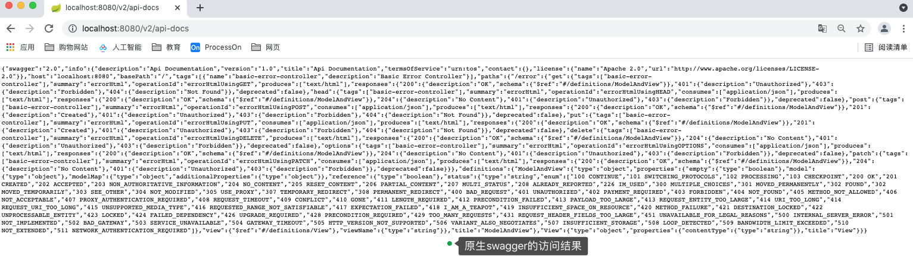

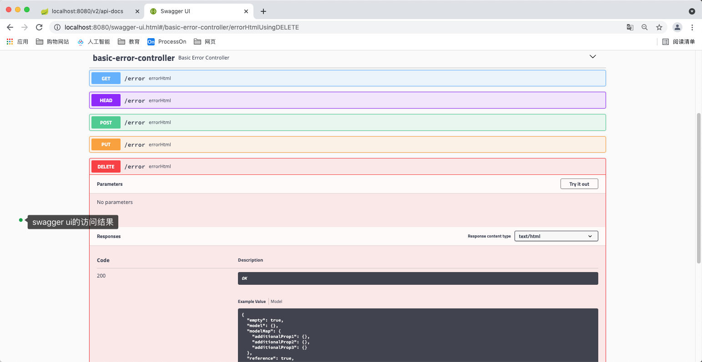

---

### 示例：添加controller后swagger生成的文档

```java
/**
 * @author zhoudbw
 * 业务控制类 返回JSON
 * @RequestMapping("/xxx") 放在类上，代表类里面的方法都是以此开头的。
 */

@RestController
@RequestMapping("/employee")
public class EmployeeController {

    @RequestMapping(method = RequestMethod.GET)
    public String employeeList() {
        return "employee-list";
    }


    @GetMapping("/toadd")
    public String toAdd() {
        return "add";
    }


    @PostMapping
    public String add(Employee employee) {
        return "add:employee";
    }


    @RequestMapping(path = "/toupdate/{name}", method = RequestMethod.GET)
    public String toUpdate(@PathVariable("name") String name) {
        // 视图update内的请求需要发送put请求。
        return "update";
    }

    @PutMapping
    public String update(Employee employee) {
        return "update:employee";
    }

    @DeleteMapping("/{name}")
    public String update(@PathVariable("name") String name) {
        return "delete:employee";
    }
}
```

生成的效果：

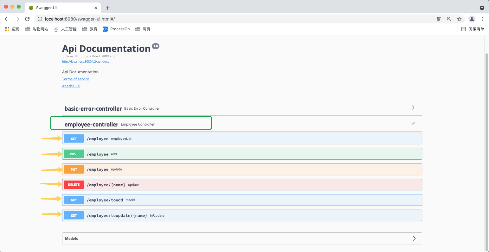

#### 美化

##### 修改文档头

1. **修改文档头，显示该文档的具体相关内容**

   ```java
   * 修改方式：在SwaggerConfig中声明apiInfo()
     	@Bean
       public Docket api() {
           return new Docket(DocumentationType.SWAGGER_2).select()
                   .apis(RequestHandlerSelectors.any())
                   .paths(PathSelectors.any())
                   .build()
                   .apiInfo(apiInfo()); 
                   //　通过apiInfo()传递设置好的apiInfo()到Docket内
       }
       
       private ApiInfo apiInfo() {
           // 需要通过ApiInfoBuilder来创建
           // 这个builder可以声明文档的title(标题)、description(描述信息)、version(版本信息)
           return new ApiInfoBuilder()
                   .title("spring-boot-zhoudbw-06-swagger")
                   .description("这是一个简答的swagger使用DEMO")
                   .version("1.0")
                   .build(); // 创建出来
       }
   ```

   结果显示
   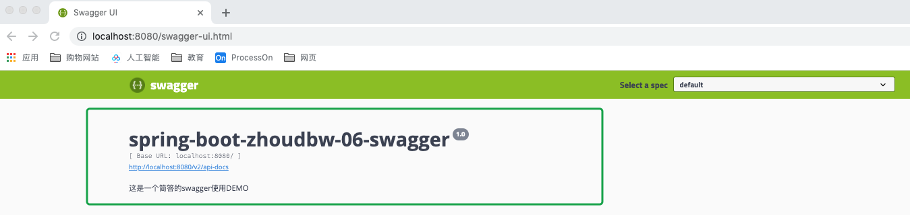

---

##### 隐藏多余的controller

2. 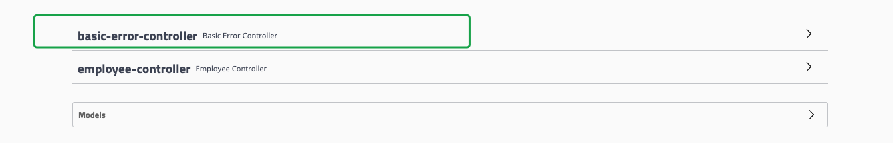

   Basic-error-controller这个使我们不需要的，那么如何将这个隐藏呢？

   ```java
   * 修改SwaggerConfig中的api()方法，将.apis(RequestHandlerSelectors.any())的RequestHandlerSelectors.any()选择所有controller，调整为选择指定包内的controller。通过.apis(RequestHandlerSelectors.basePackage("指定需要的controller所在的包路径")；
         @Bean
       public Docket api() {
           return new Docket(DocumentationType.SWAGGER_2).select()
   //                .apis(RequestHandlerSelectors.any())
                   .apis(RequestHandlerSelectors.basePackage("cn.zhoudbw.controller"))
                   .paths(PathSelectors.any())
                   .build()
                   .apiInfo(myApiInfo());
                   //　通过apiInfo()传递设置好的apiInfo()获取的ApiInfo对象到Docket内
       } 
   ```

   结果显示

   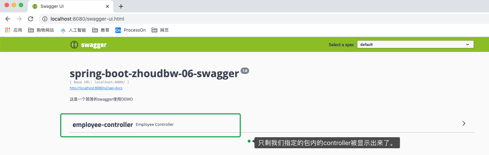

   ---

##### 对一系列和某一个接口介绍

3. **介绍一个具体的api，使用注解@Api**

```
@Api(): 该注解是注解在Controller上的，是对Controller的注解
  如下属性：
    tag: 标签属性，可以对该接口做简单的面熟
    description: 描述
@ApiOperation(): 该注解是注解在Controller的方法上的，是对具体方法的注解
```

```java
/**
 * @author zhoudbw
 * 业务控制类 返回JSON
 * @RequestMapping("/xxx") 放在类上，代表类里面的方法都是以此开头的。
 * @Api() 注解该controller，给定描述信息，文档生成会对controller生成的描述信息
 *           换言之，也就是声明一系列接口的功能，放在controller之上
 * @ApiOperation() 注解在controller方法上，用来说明一个具体的方法，文档生成时会对该方法生成描述
 *          换言之，声明具体接口的功能，放在controller的方法之上
 */

@RestController
@RequestMapping("/employee")
@Api(tags = "员工相关接口", description = "对员工进行增删改查的接口")
public class EmployeeController {

    @RequestMapping(method = RequestMethod.GET)
    public String employeeList() {
        return "employee-list";
    }


    @ApiOperation("跳转添加员工的接口")
    @GetMapping("/toadd")
    public String toAdd() {
        return "add";
    }


    @ApiOperation("添加员工的接口")
    @PostMapping
    public String add(Employee employee) {
        return "add:employee";
    }

    @ApiOperation("对员工信息进行修改")
    @PutMapping
    public String update(Employee employee) {
        return "update:employee";
    }
...
}
```

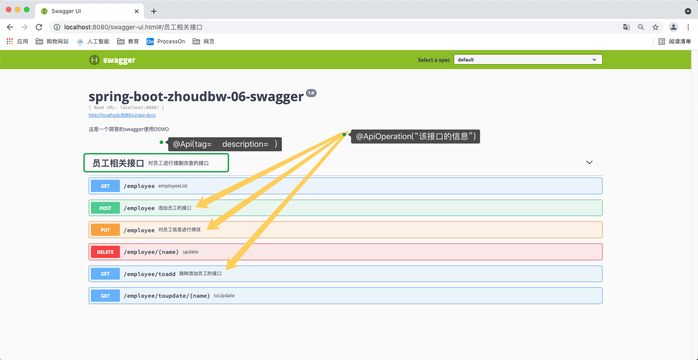

---

##### 接口参数的描述

4. **通过@Api() 和 @ApiOperation()我们知道了controller中一系列接口的作用，也知道了controller中某一个具体的接口的具体作用。但是还是存在缺陷，我们并不知道接口中具体参数的含义，比如下图：**

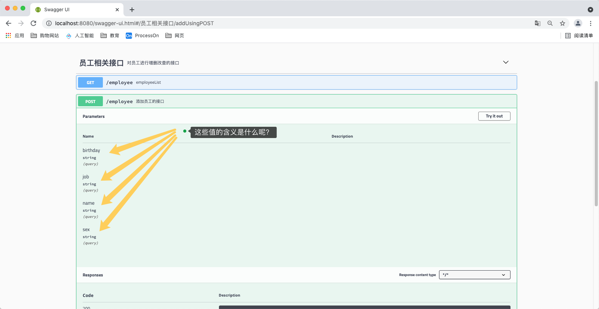

我们可以通过@ApiModel("描述信息") 和 @ApiModelProperty("描述信息")来声明接口中这些参数的含义。

```java
/**
 * @author zhoudbw
 * 实体类，代表员工
 * @ApiModel("描述") 声明实例
 * @APIModelProperty("描述") 声明实例属性，用于接口参数的描述显示
 */

@Getter
@Setter
@AllArgsConstructor

@ApiModel("员工")
public class Employee {

    @ApiModelProperty("名字")
    private String name;
    @ApiModelProperty("职业")
    private String job;
    @ApiModelProperty("生日")
    private String birthday;
    @ApiModelProperty("性别")
    private String sex;
}
```

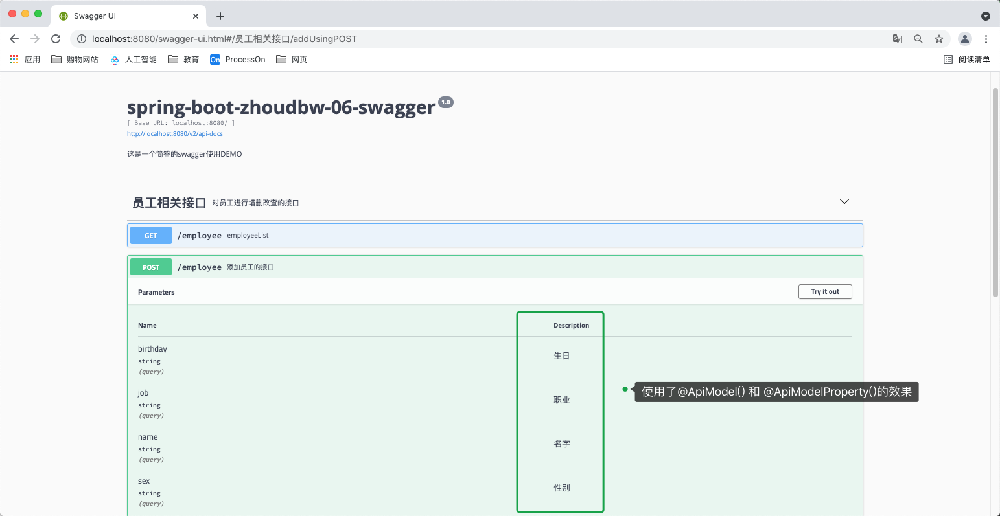

---

##### 隐藏无关接口

5. **如果我们不想显示显示某个接口怎么办，使用@ApiIgnore。下图我们将toadd和toupdate这两个接口不显示。**

```java
@ApiIgnore
@GetMapping("/toadd")
public String toAdd() {
  return "add";
}

/**
 * @ApiIgnore 文档中不显示该接口
 */
@ApiIgnore
@RequestMapping(path = "/toupdate/{name}", method = RequestMethod.GET)
public String toUpdate(@PathVariable("name") String name) {
  // 视图update内的请求需要发送put请求。
  return "update";
}
```

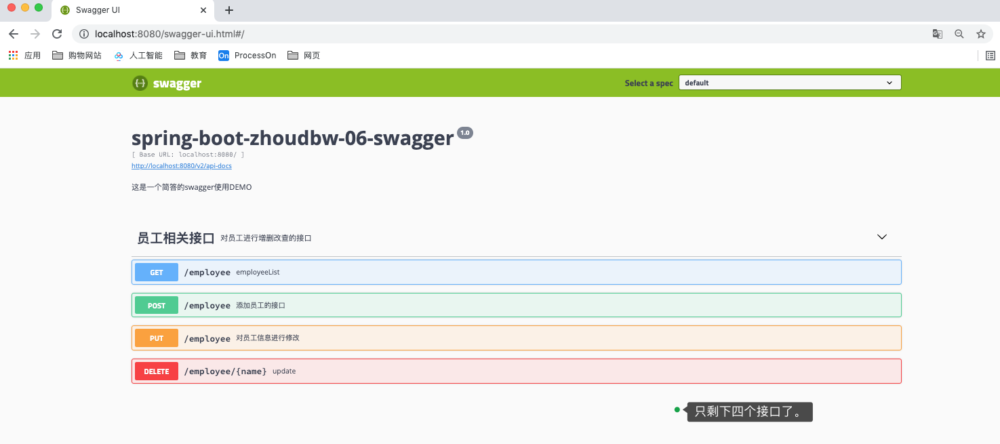

---

##### 只作用本身接口参数描述

6. **补充：@ApiImplicitParam("描述信息")，结果和@ApiModelProperty("描述信息")的显示结果一致，只不过前者会显示所有相关的，而后者之后显示在注解了的接口方法之上。**

```java
/**
 * @ApiImplicitParam 含蓄的介绍一下name 属性
 */
@ApiImplicitParam(name = "name",value = "姓名")
@ApiOperation("删除员工信息接口")
@DeleteMapping("/{name}")
public String update(@PathVariable("name") String name) {
  return "delete:employee";
}
```

---

#### 充当接口测试工具

补充：swagger的ui界面可以做一个简单的接口测试工具来使用。
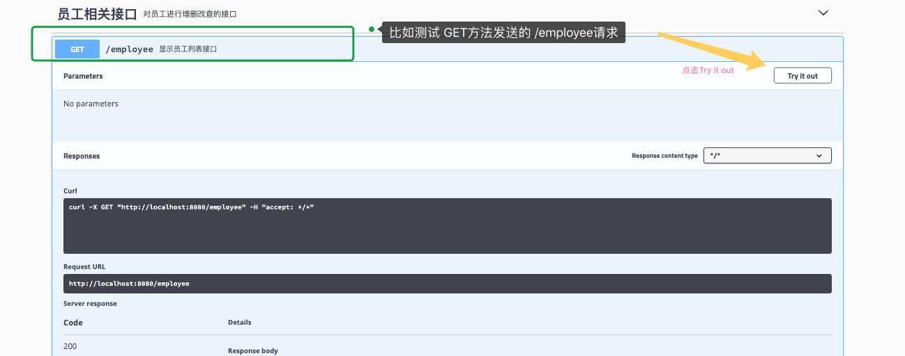

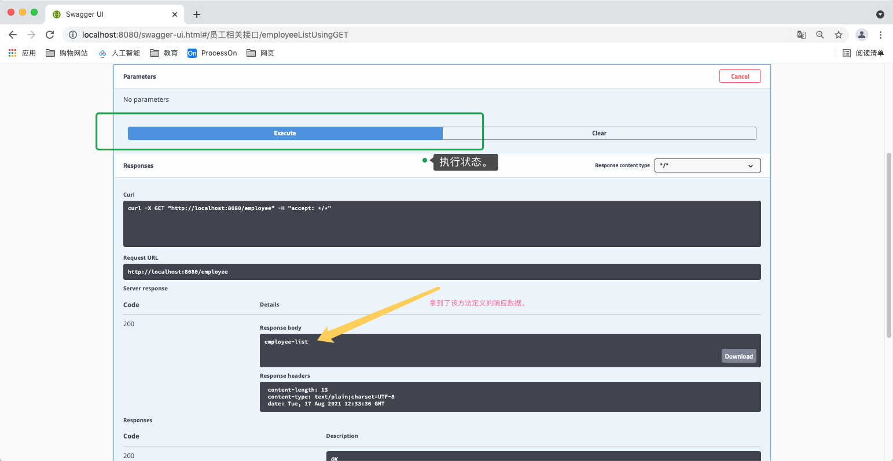

---

**swagger有很多的拓展功能，需要用到的时候，随查随用即可。**

