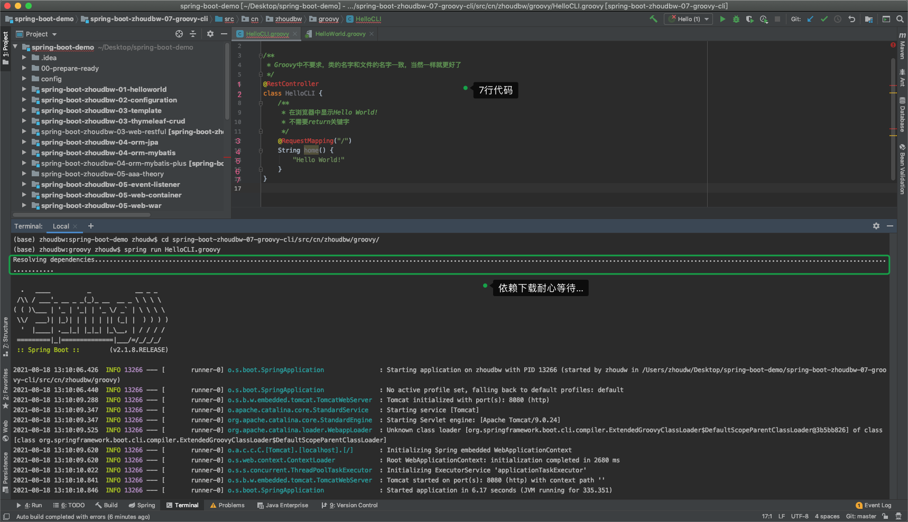
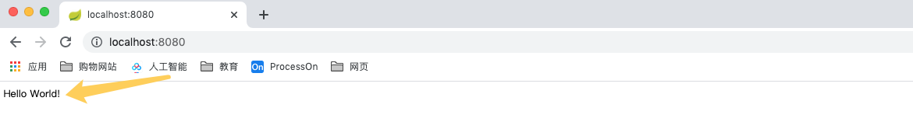
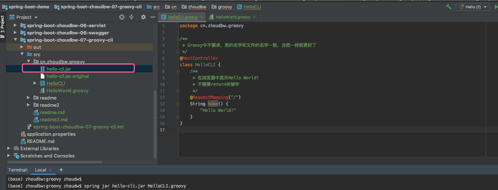
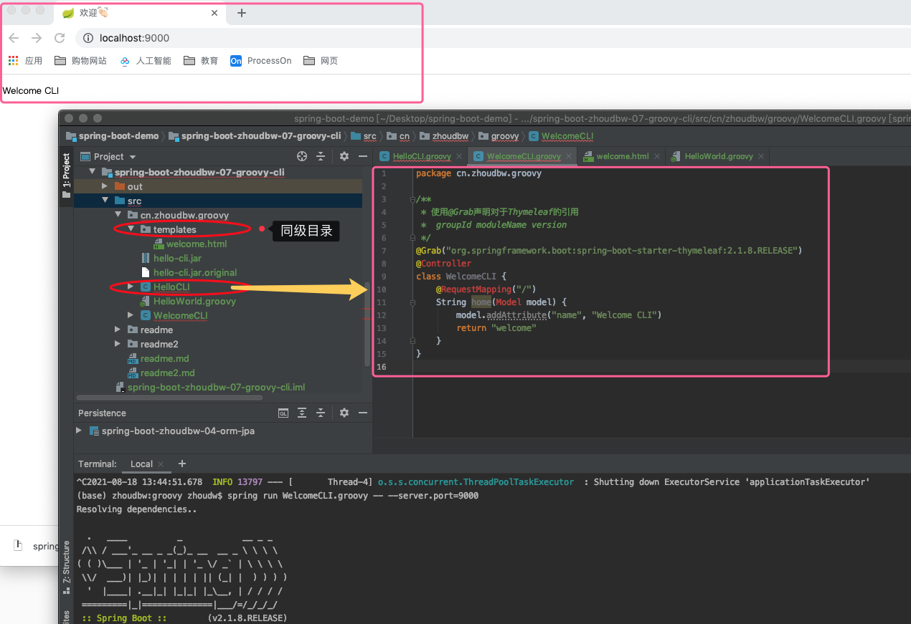

## Groovy 与 SpringBoot CLI

很有意思的知识点，虽然这些东西在近一两年不会使用到。因为这个功能还处在偏概念性的东西，还没有被广泛的使用，但是已经在SpringBoot的官方推荐中占据了很大的位置。

摘抄自spring-boot-reference-v2.1.8.pdf官方文档 【Part VII. Spring Boot CLI】

<div align="center">
  Part VII. Spring Boot CLI
</div>

```
The Spring Boot CLI is a command line tool that you can use if you want to quickly develop a Spring application. It lets you run Groovy scripts, which means that you have a familiar Java-like syntax without so much boilerplate code. You can also bootstrap a new project or write your own command for it.
```

### Groovy

Groovy是一种可以运行在JVM，托生于java的脚本语言。

#### Groovy简介

如果现在有人要开始完全重写 Java，那么 Groovy 就像是 Java 2.0。Groovy 并没有取代 Java，而是作为 Java 的补充，它提供了更简单、更灵活的语法，可以在运行时动态地进行类型检查。Groovy 的美妙之处还在于，它能够比编写纯粹的 Java 代码更快地完成所有工作。 

> 语言其实是我们程序员和计算机交流的工具，为什么呢？
>
> 比如说，我们现在常用的Java，为什么Java要这样设计让我们和计算机去交流呢？当我们了解了多种语言之后，我们就会知道，这是Java做的一种取舍。它通过强制类型(每次声明都需要指定类型，允许我们进行一部分的类型转换)，让语法变得更加的严格，这样出错率就小。不是强制类型，像Groovy这种松散的语法结构，它出错的情况就会多一些。
>
> 这就是一种语言在设计的时候做的一种取舍，在以后我们做架构的时候，更多的也是一种取舍，知道这种选择会带来什么益处和弊端，另一种选择会带来什么益处和弊端。之后，你会在这些选择中，选择更适合当前问题的解决方案。这其实就是架构师的工作。

Groovy 是 JVM 的一个替代语言，“替代”是指可以用 Groovy 在 Java 平台上进行 Java 编程，使用方式基本与使用 Java 代码的方式相同。可以将它想像成 Java 语言的一种更加简单、表达能力更强的变体。 

> Groovy的基本使用和Java是基本相同的，也就是说知道怎么写Java就知道怎么写Groovy(80%都知道怎么写)。只是它和Java的不同之处在于，它将一些认为复杂的、可以省略的语法简化了。所以可以说将它想像成 Java 语言的一种更加简单、表达能力更强的变体，所以才说跟2.0一样。
>
> 如果是2.0的话，那么是不是会被很多场景所使用呢？是的。近几年来Groovy也是很火爆的，这也是为什么SpringBoot为什么通过它提供这种CLI的方式。只不过这种火爆还局限大部分的概念上，还没有真正的通过它实现一种服务端的项目。

* Groovy 的松散的 Java 语法允许省略分号`(;)`和修饰符`(public protected default private)`。
* 除非另行指定，Groovy 默认所有内容都为 public。 

* Groovy 允许定义简单脚本，同时无需定义正规的 class 对象。 

* Groovy 在普通的常用 Java 对象上增加了一些独特的方法和快捷方式，使得它们更容易使用。 

* Groovy 语法还允许省略变量类型。 

* Groovy 代码还能在运行时轻松地改变自己。能够在运行时轻松地为对象指定新方法和属性。这一编程领域称为元编程。

> Groovy几乎将所有能够省略的，所有能够不去强制定义的都变成松散的结构了。

#### Groovy体验

##### HelloWorld

```groovy
* 创建Groovy项目
* 创建Hello.groovy
* HelloWorld编写：
  ```groovy
	println("Hello World")
  ```
* 一行代码就解决了HelloWorld，很便捷，这就是脚本语言带来的便利，就是简单快速。
* 这种使用和JavaScript也有一些相似，但是不同的在于Groovy是完全基于JVM生态的，和Java代码可以无缝的集成在一起。
```

##### 变量

**为什么要有类型定义？** 

在 Java 中，如果要声明一个 String 变量，则必须输入： String value = "Hello World"; 
但是，如果仔细想想，就会看出，等号右侧的字符已经表明 value 的类型是 String。
所以，Groovy 允许省略 value 前面的 String 类型变量，并用 def 代替。 def value = "Hello World" 

实际上，Groovy 会根据对象的值来判断它的类型。并且除了可以输出变量的值，还可以用以下调用输出它的类型： println(value.class)，括号可省略。

Groovy 缺少类型定义能够带来更高的灵活性 — 不需要接口或抽象类。

```groovy
* 指定类型运行HelloWorld
  ```
    String value = "Hello World"
    println(value)
  ``
* Groovy提供给我们通过def定义变量，不需要指定变量的类型。
  ```
    // groovy 通过变量内容猜测变量类型，像是js中的var
    def value = "Hello World"
    def value2 = 0210
    println(value)
    println(value2)
	```
* 声明之后对变量重新赋值
	```
    def value = "Hello World"
    value = 123
    print(value)
	```
* 查看groovy猜测我们的变量的类型
* 在groovy中也是一切皆对象
* 如果我们给出一个变量，groovy实在猜不出是什么类型，怎么办呢？在Java中所有类的父类Object。
* groovy也是这样，如果实在猜不出来那么就会给出一个Object类型，也就解决了类型问题。
	```
    def value = "Hello World"
    def value2 = 123
    println(value.class)   // class java.lang.String
    println(value2.class)  // class java.lang.Integer
	```
```

#### Groovy @Grab 

@Grab和CLI密切相关。我们想要将xml替换成注解，在SpringBoot项目中，我们已经将我们的业务都用注解替换了，只有一个地方我们还是用的xml配置，就是pom.xml，但是在Groovy中提供了这样的注解，可以替换pom.xml中的xml依赖。

Grab是一个内嵌在Groovy里的Jar包依赖管理器。Grab让你可以快速添加maven仓库依赖到你的classpath里，使脚本运行更加简单。最简单的一种用法是只需要在你的脚本里添加一个注解： 

```groovy
@Grab(group='org.springframework ', module=' spring-orm', version='3.2.5.RELEASE') 
* group   : 包名
* module  : 项目名
* version : 版本号
```

**@Grab也支持简洁版：** 

```groovy
@Grab('org.springframework:spring-orm:3.2.5.RELEASE') 
* 通过冒号分隔 : 包名:项目名:版本号
```

当然也可以在mvnrepository.com搜索到依赖包然后使用@Grab注解形式加到pom.xml实体里。
如果需要在同一个节点使用一个注解多次可以使用@Grapes注解，比如说：

```groovy
@Grapes ([ 
  @Grab(group='commons-primitives', module='commons-primitives', version='1.0'), 
  @Grab(group='org.ccil.cowan.tagsoup', module='tagsoup', version='0.9.7') 
])
```

### **SpringBoot CLI** 

#### CLI（Command Line Interface） 

基于这个很强大的脚本语言Groovy，SpringBoot CLI功能可以做什么呢？

Spring Boot CLI（Command Line Interface）是一个命令行工具，它让我们通过命令的方式，就可以快速构建Spring 原型应用（主要是集成Groovy）。通过Spring Boot CLI，我们可以通过编写Groovy脚本来快速的构建出Spring Boot应用，并通过命令行的方式将其运行起来。 

CLI可以检测到代码中使用的类，知道需要给classpath中添加的哪些起步依赖才能让程序运行起来。而且当添加完依赖之后就会完成自动配置，确保启用后DispatcherServlet和Spring MVC，这样就可以响应HTTP请求了。 

##### 安装Spring CLI

首先，让我们的环境支持这种使用方式 —— 安装CLI。

 **Installing the Spring Boot CLI**

通过文档，下载安装包，解压根据INSTALL.txt配置。

```http
https://repo.spring.io/release/org/springframework/boot/spring-boot-cli/2.1.8.RELEASE/spring-boot-cli-2.1.8.RELEASE-bin.zip
```

```
SPRING BOOT CLI - INSTALLATION
==============================

Thank you for downloading the Spring Boot CLI tool. Please follow these instructions
in order to complete your installation.
感谢您下载Spring Boot CLI工具 请按照这些说明以便完成安装。


Prerequisites 先决条件
-------------
Spring Boot CLI requires Java JDK v1.8 or above in order to run. 
Spring Boot CLI 需要Java JDK v1.8或以上版本才能运行。

Groovy v2.5.8 is packaged as part of this distribution, and therefore does not need to be installed (any existing Groovy installation is ignored).
Groovy v2.5.8 被打包为这个发行版的一部分，因此不需要安装(忽略任何现有的Groovy安装)。

The CLI will use whatever JDK it finds on your path, to check that you have an appropriate version you should run:
CLI将使用它在你的路径上找到的任何JDK，为了检查你有一个合适的版本，你应该运行:

	java -version

Alternatively, you can set the JAVA_HOME environment variable to point a suitable JDK.
或者，您可以设置JAVA_HOME环境变量以指向合适的JDK。


Environment Variables
---------------------
No specific environment variables are required to run the CLI, however, you may want to set SPRING_HOME to point to a specific installation. 
运行CLI不需要特定的环境变量，但是，您可能想要设置SPRING_HOME，为了指向一个特定的安装。

You should also add SPRING_HOME/bin to your PATH environment variable.
您还应该将SPRING_HOME/bin添加到PATH环境变量中。

* 从这里我们了解到，我们应该配置两个东西 ① SPRING_HOME  ② SPRING_HOME/bin


Shell Completion
----------------
Shell auto-completion scripts are provided for BASH and ZSH. Add symlinks to the appropriate
location for your environment. For example, something like:

  ln -s ./shell-completion/bash/spring /etc/bash_completion.d/spring
  ln -s ./shell-completion/zsh/_spring /usr/local/share/zsh/site-functions/_spring


Checking Your Installation
--------------------------
To test if you have successfully installed the CLI you can run the following command:
为了测试你是否已经成功安装CLI，可以执行以下命令:

	spring --version
```

##### Hello World案例

**Quick-start Spring CLI Example**

You can use the following web application to test your installation. To start, create a file called HelloCLI.groovy, as follows:

```groovy
/**
 * Groovy中不要求，类的名字和文件的名字一致，当然一样就更好了
 */
@RestController
class HelloCLI {
    /**
     * 在浏览器中显示Hello World!
     * 不需要return关键字
     */
    @RequestMapping("/")
    String home() {
        "Hello World!"
    }
}
```

Then run it from a shell, as follows: 

```bash
$ spring run HelloCLI.groovy
# 也可以指定端口运行
$ spring run HelloCLI.groovy -- --server.port=9000
```

> **Note**
>
> The first run of your application is slow, as dependencies are downloaded. Subsequent(随后的) runs are much quicker.

Open [localhost:8080](localhost:8080) in your favorite web browser. You should see the following output:

```
Hello World!
```





* 我们上述几行代码就实现了一个SpringBoot的项目，很神奇很便利。所以说，这是未来的一种方向，当然程序语言会朝着越来越便捷，越来越强壮的方向发展。

* Ctrl + C 停止服务。

* 补充：

  ```
  使用 spring jar jar包名字.jar *.groovy 命令打包
  比如：spring jar hello-cli.jar HelloCLI.groovy
  		 spring jar           命令头
  		 hello-cli            jar包名字
  		 .jar                 jar包后缀
  		 HelloCLI.groovy      打包的groovy文件
  ```

  

* 有了jar包之后，可以直接通过jar包启动项目:

  ```
  java -jar hello-cli.jar
  ```

### 丰富一点的小demo

我们返回一个HTML页面。返回HTML那么我们自然就想到了模板，既然是模板，那自然是放到templates这个文件夹下。

```abap
注意：templates文件夹，必须和启动的groovy文件同级。
```




我们再增加一点JS动态效果，通过@Grab()先引入JQuery的依赖。

```groovy
package cn.zhoudbw.groovy

/**
 * 使用@Grab声明对于Thymeleaf的引用
 * 使用@Grab声明对于JQuery的引用 丰富HTML页面
 *  groupId moduleName version
 * 
 * * 都不需要import包
 */
@Grab("org.springframework.boot:spring-boot-starter-thymeleaf:2.1.8.RELEASE")
@Grab("org.webjars:jquery:3.4.1")
@Controller
class WelcomeCLI2 {
    @RequestMapping("/")
    String home(Model model) {
        model.addAttribute("name", "Welcome CLI")
        return "welcome2"
    }
}
```

```html
<!DOCTYPE html>
<!--引入对thymeleaf的引用-->
<html lang="en" xmlns:th="http://www.thymeleaf.org">
<head>
    <meta charset="UTF-8">
    <title>欢迎👏🏻</title>
    <!--引入JQuery-->
    <script src="webjars/jquery/3.4.1/jquery.min.js"></script>
    <!--我们将要使用的JavaScript模块-->
    <script type="text/javascript">
        // name将会被 Hello CLI替换，那么我们对其做一点动画效果
        $(document).ready(function() {
            // 拿到p元素，增加慢放的动画
            $('p').animate({
                // 设置字体大小
                fontSize: '50px'
            }, 'slow'); // slow 慢放
        });
    </script>
</head>
<body>
<p th:text="${name}">名字</p>
</body>
</html>
```

<video src="readme/welcome2.mp4"></video>

### CLI原理

Spring Boot进一步延伸了@Grab注解声明对三方依赖库的技术，它会基于你的代码尝试推导你要引入 (或者说grab抓取) 哪个库。例如，如果WebApplication代码上使用了@RestController注解或@RequestMapping等等，它会找到这些注解所引用的库，然后将这些使用的库引入进来，所以"Tomcat"和"Spring MVC"将被获取（grabbed）。 

Spring Boot扩展了Groovy标准@Grab注解，使其能够允许你指定一个没有group或version的依赖， 例如@Grab('freemarker')。Spring Boot使用默认依赖元数据推断artifacts的group和version。 

为了帮助你减少Groovy代码量，一些import语句被自动包含进来了。不需要在Groovy脚本中添加一个public static void main(String[] args )方法。Spring Boot会使用你编译后的代码自动创建一个SpringApplication。 

生效代码位于Spring Boot CLI中的CompilerAutoConfiguration子类。