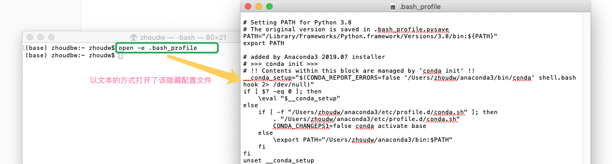
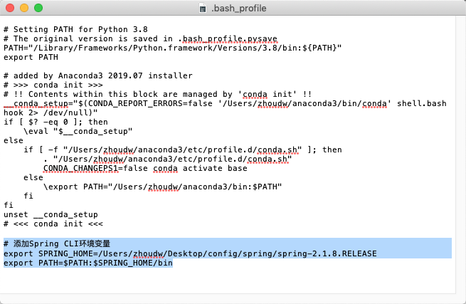
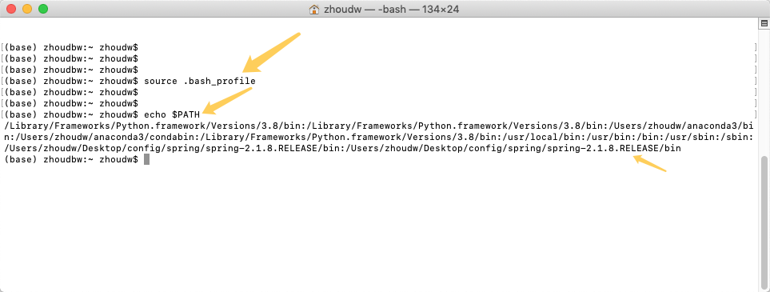
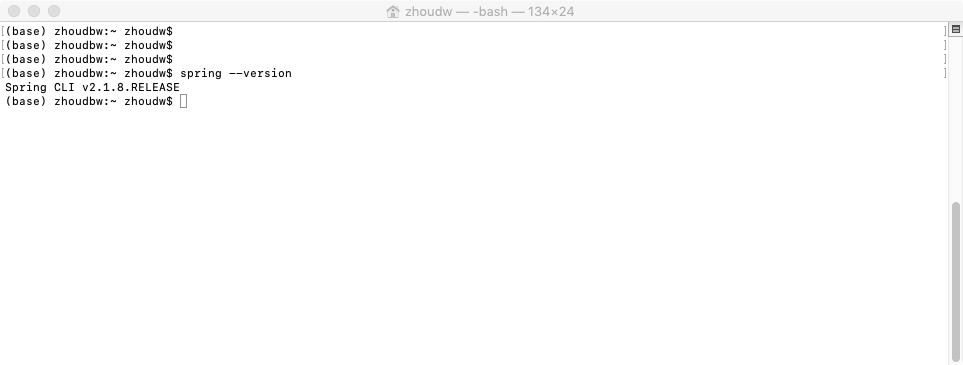

## Mac配置环境变量

这里刚好以配置Spring CLI 为例。

1. 打开终端
   

   

2. 如果是第一次配置环境变量，可以使用`touch .bash_profile` 创建一个`.bash_profile`的隐藏配置文件
   如果是编辑已存在的配置文件，则使用`open -e .bash_profile`，将以记事本的形式打开该配置文件。
   我这里已经存在 `.bash_profile`，故通过打开命令直接打开：
   

   

3. ```bash
   # 添加Spring CLI环境变量
   export SPRING_HOME=/Users/zhoudw/Desktop/config/spring/spring-2.1.8.RELEASE
   export PATH=$PATH:$SPRING_HOME/bin
   ```

   如果想要添加多个环境变量，接着文件的后方继续补充PATH即可。
   比如补充maven的环境变量：

   ```bash
   # 添加Maven的环境变量
   export MAVEN_HOME=/usr/local/apache-maven-3.5.0
   export PATH=$PATH:$MAVEN_HOME/bin
   ```

   上述提供的例子，提供参考，想要配置自己的环境变量，参考上述两个例子的写法即可。
   

   

4. 保存执行，`source .bash_profile`命令，然后通过`echo $PATH`查看环境变量的值
   

5. 测试Spring CLI 是否安装成功，运行`spring --version`
   

