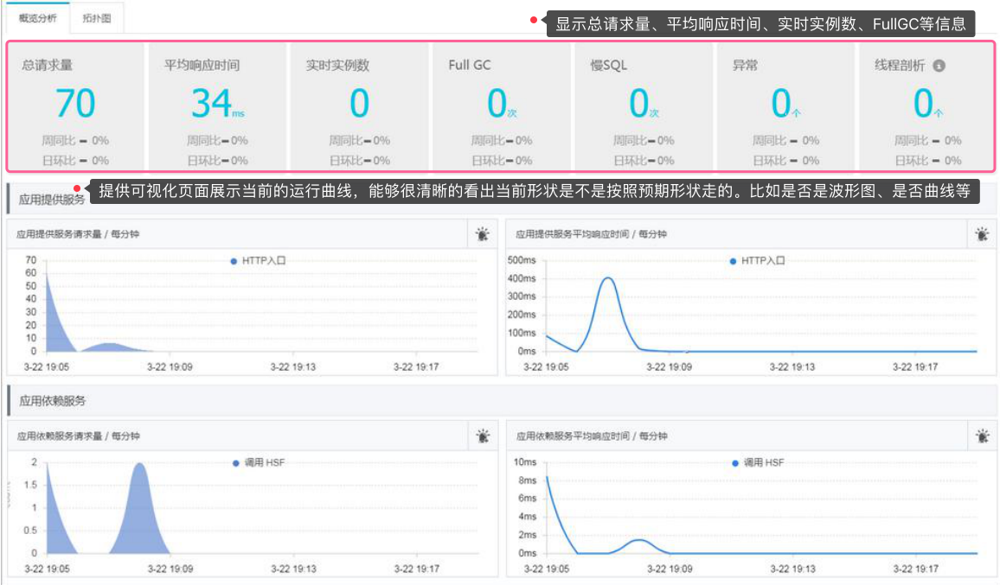
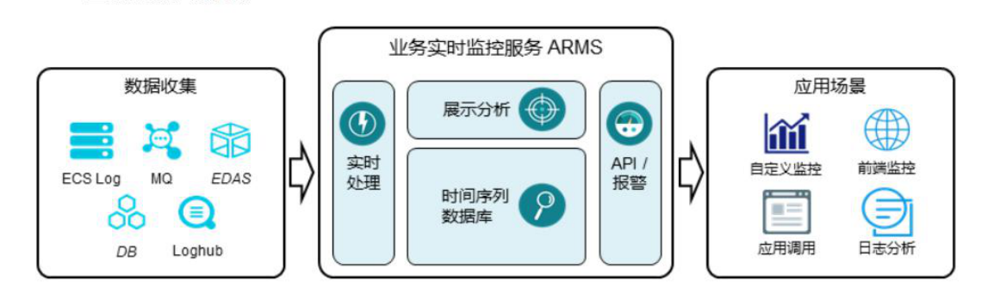
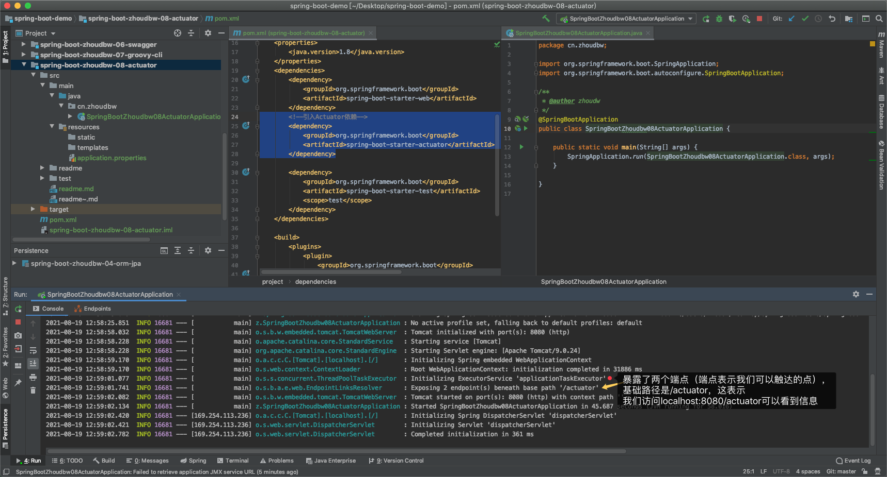
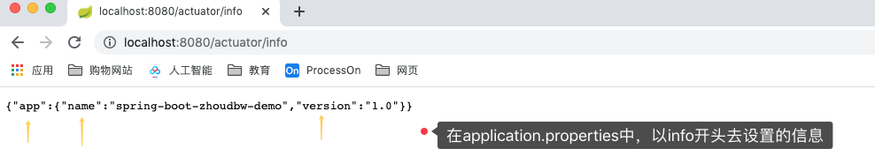
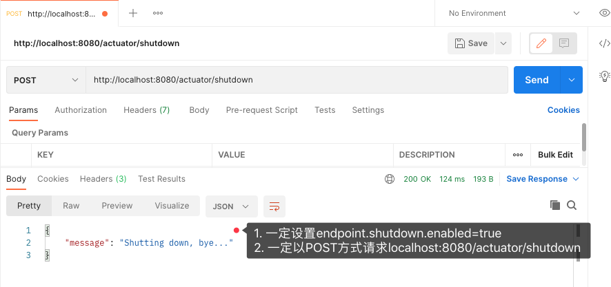
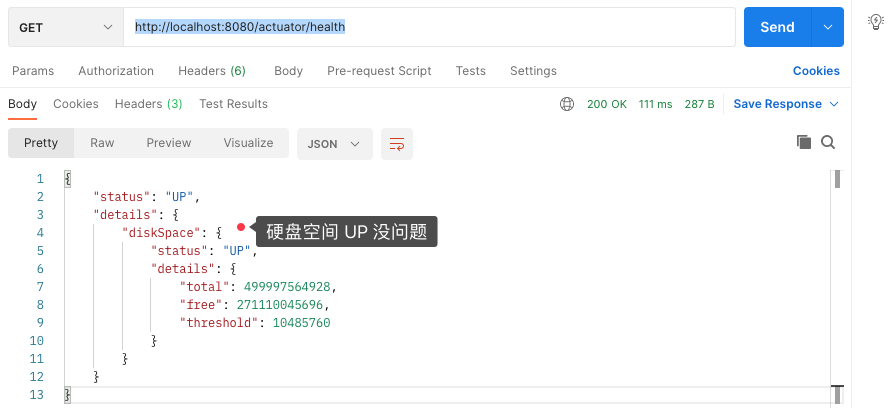
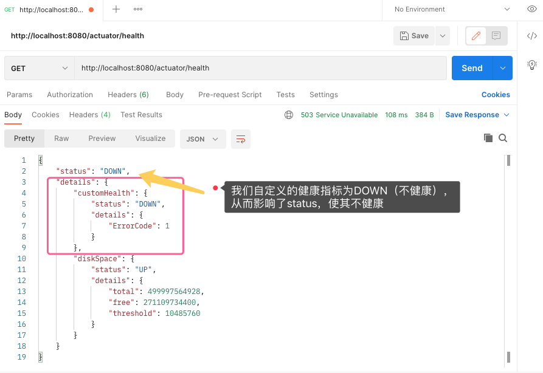
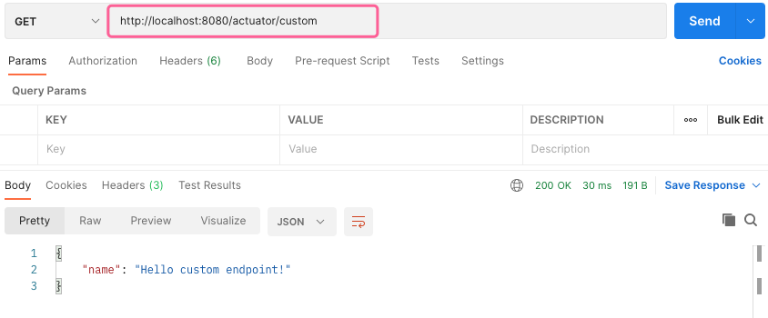
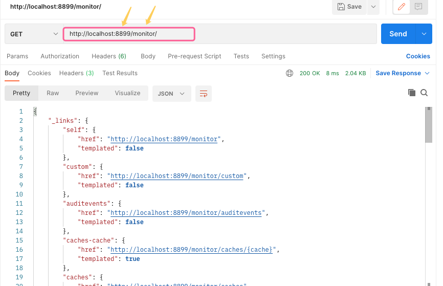
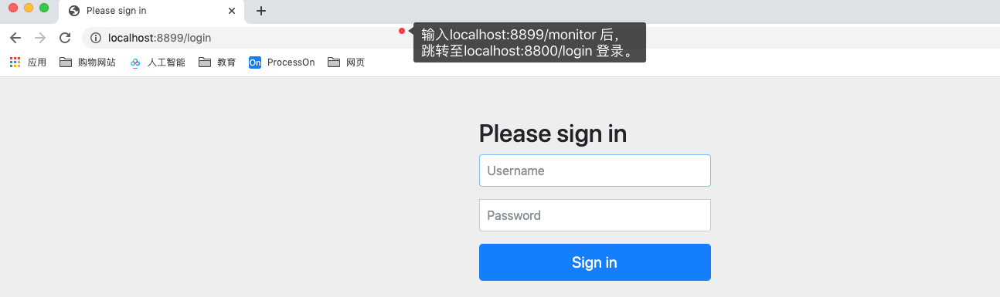

## SpringBoot监控

一个功能作为用户使用的过程中，它在程序员眼中是一个需求。那么从一个需求到一个用户可以使用的功能，都经历了什么过程呢？

设计（如何将这个功能从代码转化为一个可用的功能）、编码、测试、上线、维护（后来上线的功能不会影响到原先的功能）。维护我们经常通过测试，通过回归测试等手段，测试新上线的功能会不会影响原先的功能，会将整体的功能都测试一遍。再者便是通过监控，即使测试再完善，也有测试覆盖不到的地方，这个时候就需要通过监控来覆盖了。通过监控来知道这个功能有没有用户使用不良好的地方。监控其实是让新功能持续好用的一个重要条件。

### 监控简介

监控特别广泛、有特别重要的应用——大促（一般用于电商领域：大型促销活动，最大的大促：双11。）

- **双11之前大家都在做什么？** 之前两个月，开始双11的筹备，预计双11的流量，根据流量预测可能出现的问题、风险点，并给出解决方案。
   —— 复盘整个系统功能，只求做到"有备无患"。
- 这个时候"监控"就帮我们大忙了。通过"日志"给出一个"监控大盘"。这个监控大盘会展示什么呢？拿双11举例，会展示交易额、交易笔数、等等很多指标。像"多少分钟破多少交易额"这样的新闻都是通过这样的监控指标获得到的。
- 既然监控指标如此的重要，那么做一个好的监控系统也就非常的重要了。
- **双11当天大家都在做什么？** 在阿里的园区，灯火通明，通宵达旦的值守。值守做什么呢？紧张的看监控大盘。如果监控大盘一路路灯，就很轻松，看着监控大盘刷新，或者自己也为淘宝贡献点交易额。如果出现了红灯，就会马上排查这个红灯的影响程度。

#### 监控大盘图



### 监控原理

- 收集各种各样的日志（最主要的是系统的日志，其中系统的异常日志是最重要日志之一），
- 将这些日志放到监控服务系统中去，通过一些处理将其存入数据库中，将数据库中的数据进行展示并且分析，分析之后有可能触发一些报警，这个报警是根据设定的一些阈值判断的，
- 通过上面这些数据处理之后，就能看到自己想要看到的一些监控信息，可以显示在自定义监控上、应用调用上、前端展示上、等等，
- 监控的本质其实就是收集日志进行分析所产生的的结果。

#### 工作流程

ARMS工作流程如下图所示。



数据收集：ARMS支持通过配置从 ECS Log、MQ和Loghub上抓取日志。

任务定义：通过任务配置来定义实时处理、数据存储、展示分析、数据 API 和报警等任务，从而定义出自己的应用场景。 通过前端监控、应用监控等预设场景直接进行业务监控。 

应用场景：如上所述，除了自定义监控以外，ARMS 还有可直接使用的预设监控场景，包括前端监控、应用监控等

### SpringBoot提供的监控Actuator

Actuator是SpringBoot的四大神器之一。

```
**四大神器
	1. 自动配置
	2. 启动器starter（减少了对依赖的引入和管理）
	3. CLI（SpringBoot程序通过命令行和脚本使用工具）
	4. Actuator（监控工具）
```

#### Actuator简介

Actuator可以帮助监控和管理SpringBoot应用，比如健康检查、审计、统计和HTTP追踪等。所有的这些特性可以通过JMX或者HTTP endpoints来获得。 

Actuator同时还可以与外部应用监控系统整合，比如 Prometheus, Graphite, DataDog, Influx, Wavefront, New Relic等。这些系统提供了非常好的仪表盘、图标、分析和告警等功能，使得你可以通过统一的接口轻松的监控和管理你的应用。Actuator使用Micrometer来整合上面提到的外部应用监控系统。这使得只要通过非常小的配置就可以集成任何应用监控系统。 

#### Actuator体验

`1. 引入依赖`

```xml
<!--引入Actuator依赖-->
<dependency>
  <groupId>org.springframework.boot</groupId>
  <artifactId>spring-boot-starter-actuator</artifactId>
</dependency>
```

`2. 启动项目`



应用启动后，可以通过 http://localhost:8090/actuator来展示所有通过HTTP暴露的endpoints。 


默认只有health和info通过HTTP暴露了出来，因此我们能够看到的信息也就只有 health 和 info。例如：打开http://localhost:8090/actuator/health，会显示{"status":"UP"}，"UP"代表健康。

但是实际上EndPoint远不止这些。

##### EndPoint列表

```sql
GET /beans 						| 描述应用程序上下文里全部的 Bean，以及它们的关系 

GET /conditions 			| 就是 1.0 的 /autoconfig ，提供一份自动配置生效的条件情况 

GET /configprops 			| 描述配置属性(包含默认值)如何注入Bean 

GET /env 							| 获取全部环境属性（/{name} 根据名称获取特定的环境属性值） 

GET /health 					| 报告应用程序的健康指标，这些值由 HealthIndicator 的实现类提供 

GET /heapdump 				| dump 一份应用的 JVM 堆信息 

GET /info 						| 获取应用程序的定制信息，这些信息由info打头的属性提供 

GET /loggers 					| 显示和修改配置的loggers 

GET /metrics 					| 报告各种应用程序度量信息，比如内存用量和HTTP请求计数(支持/{name} ) 

GET /scheduledtasks 	| 展示应用中的定时任务信息 

GET /sessions 				| 如果我们使用了 Spring Session 展示应用中的 HTTP sessions 信息 

GET /mappings 				| 描述全部的 URI路径，以及它们和控制器(包含Actuator端点)的映射关系 

GET /threaddump 			| 获取线程活动的快照 

GET /caches 					| 显示可获取的缓存 
```

* 通过上述端点，即可访问该端点所映射的信息。

##### Endpoint操作

```properties
# 设置通过哪种方式暴露endpoints ,web代表以浏览器的形式可以访问到。
# 该属性的默认值为 health,info 故浏览器访问只能访问到health和info两个端点。
# management.endpoints.web.exposure.include=/health,/info
# 管理以web形式暴露的端点，包含所有
# 此处设置为 * ，代表所有
management.endpoints.web.exposure.include=*

# 关闭/打开某一个端点，比如关闭beans这个端点
# false代表关闭  true代表打开
management.endpoint.beans.enabled=false

# 希望在info端点看到我们设置的信息只需要以info开头，然后设置即可
info.app.name=spring-boot-zhoudbw-demo
info.app.version=1.0

# 有一个特殊的post操作命令/shutdown，可以关闭应用程序  —— 利用Postman演示
# 但前提是endpoint.shutdown.enabled需要设置为true
# 只有shutdown是POST请求，其他的都是GET请求
# 配置endpoint.shutdown.enabled=true，以保证shutdown可用
management.endpoint.shutdown.enabled=true

# 千万注意 endpoint 和 endpoints
```



---



#### health端点(最高频)

health 主要用来检查应用的运行状态。此接口提醒我们应用实例的运行状态，以及应用不”健康“的原因，比如数据库连接、磁盘空间不够等。 

访问：http://localhost:8080/actuator/health 响应：{ "status" : "UP"} 

我们可以设置，不仅仅只是看到status的值，通过如下配置：

```properties
# 查看health端点的更多细节 设置always表示总是能够看到健康细节
management.endpoint.health.show-details=always
```



* 从这些细节我们就能够感知到 status这个值应该是一个会中的值，这个值应该受一些指标的影响，很多指标都是健康，那么最终汇总结果就是健康。
* 原理如下：

默认情况下，最终的 SpringBoot 应用的状态是由 HealthAggregator 汇总而成的，汇总的算法是： 

1. 设置状态码顺序： setStatusOrder(Status.DOWN, Status.OUT_OF_SERVICE, Status.UP, Status.UNKNOWN);。 

2. 过滤掉不能识别的状态码（即过滤掉不在`1.`中枚举的状态码）。 

3. 如果无任何状态码，整个 SpringBoot 应用的状态是 UNKNOWN。 

4. 将所有收集到的状态码按照 `1.` 中的顺序排序。 

5. 返回**有序状态码序列中的第一个状态码**，作为整个 Spring Boot 应用的状态。 

那么HealthAggregator想要汇总，必须要有状态码，那么状态码哪里来呢？Spring Boot Actuator 有几个预定义的健康指标比如DataSourceHealthIndicator, DiskSpaceHealthIndicator, MongoHealthIndicator, RedisHealthIndicator等。health 通过上述算法，合并这些健康指数检查应用的健康情况。它使用这些健康指标作为健康检查的一部分。 

**如果我们不想让某一个指标作为我们我们健康检查的一部分，可以在配置文件中关闭特定的健康检查指标：** 

```properties
management.health.<id>.enabled=false 默认，所有的这些健康指标被当作健康检查的一部分。 
```

**那么是否可以自定义健康指标呢？可以。**

#### **自定义健康指示器**

```java
* 自定义健康指示器时，需要实现HealthIndicator，重写health()方法即可。
* 调用withDetail()方法向健康记录里添加其他附加信息。
* 有多个附加信息时，可多次调用withDetail()方法，每次设置一个健康记录的附加字段。
package cn.zhoudbw.health;

import org.springframework.boot.actuate.health.Health;
import org.springframework.boot.actuate.health.HealthIndicator;
import org.springframework.stereotype.Component;

/**
 * @author zhoudw
 * 自定义健康指标，最为/health结果汇总的一部分
 * 实现 HealthIndicator接口
 *  实现 health()方法
 * 自定义的健康指标需要被Spring识别到，使用@Component，声明是Spring组件
 */
@Component
public class CustomHealth implements HealthIndicator {
    /**
     * 通过health来自定义健康指标
     * @return 返回该指标的健康状态
     */
    @Override
    public Health health() {
        // errorCode==1 表示不健康， ==0 表示健康
        int errorCode = 1; 
        // errorCode的值，可以对我们需要的指标进行check，然后赋值获取。
        if (errorCode != 0) {
            // 通过withDetail()方法设置细节信息，并返回不健康状态
            return Health.down().withDetail("ErrorCode", errorCode).build();
            /**
             * 设置能够看到health的具体细节
             * management.endpoint.health.show-details=always
             */
        }

        // 默认返回健康状态
        return Health.up().build();
    }
}
```



#### 自定义端点（endpoint）

```java
package cn.zhoudbw.endpoint;

import org.springframework.boot.actuate.endpoint.annotation.Endpoint;
import org.springframework.boot.actuate.endpoint.annotation.ReadOperation;
import org.springframework.stereotype.Component;
import org.springframework.web.bind.annotation.ResponseBody;

import java.util.HashMap;
import java.util.Map;

/**
 * @author zhoudbw
 * 自定义端点
 * @Component 被Spring接收并处理，首先是一个组件，
 * @EndPoint(id = "端点名") SpringBoot提供，允许我们自定义端点. 声明是一个端点，通过id来命名
 */
@Component
@Endpoint(id = "custom")
public class CustomEndPoint {
    /**
     * 该方法将会是我们访问该端点时执行的。
     * 会显示该方法返回值的结果
     * 注意：端点返回的结果需是JSON类型，所以我们这里返回值定为Map
     * 
     * @ReadOperation 代表我们访问该端点时，会找到该注解，从而找到对应的方法
     *                端点访问时的处理方法，通过@ReadOperation注解查找
     * @ResponseBody 返回JSON数据
     */
    @ReadOperation
    @ResponseBody
    public Map<String, String> custom() {
        Map<String, String> result = new HashMap<>();
        result.put("name", "Hello custom endpoint!");
        return result;
    }
}
```



---

我们的端点全部暴露出来，我们可以访问端点查看这些端点的信息，这样显然不够安全。那么我们怎么既保证我们能够查看到信息，有保证安全呢？

### **Actuator 安全**

1. 方式一：

   ```properties
   # 在application.properties中指定actuator的端口以及url地址 
   # 安全相关
   # 启用独立的端口来访问端点，但是项目还是按照项目启动端口启动
   management.server.port=8899
   # 代表启用单独的url地址来监控,此时在想要访问监控应该通过localhost:8899/monitor来访问 
   management.endpoints.web.base-path=/monitor
   ```

   

2. 方式二：

   ```java
   开启security功能，配置访问权限验证，这时再访问actuator功能时就会弹出登录窗口，需要输入账号密码 验证后才允许访问。
   1）引入spring-boot-starter-security依赖
     <!--引入security依赖-->
     <dependency>
         <groupId>org.springframework.boot</groupId>
         <artifactId>spring-boot-starter-security</artifactId>
     </dependency>
   
   2）2）在application.properties配置账户和密码 
     spring.security.user.name=zhoudbw 
     spring.security.user.password=zhoudbw
   ```

   