## SpringBoot与缓存

为了方便演示SpringBoot与缓存的知识，我们这里先来引入**H2数据库**。

### H2数据库

H2数据库是一个很小型的，用Java开发的嵌入式数据库。它本身是一个类库（jar包），可以直接嵌入到应用项目中。最大的用途在于可以同应用程序打包在一起发布，这样可以非常方便地存储少量结构化数据。天然就是演示很便捷，而且和SpringBoot的集成是非常好的。

1. 引入依赖

   ```xml
    <!--h2数据库的依赖-->
    <dependency>
        <groupId>com.h2database</groupId>
        <artifactId>h2</artifactId>
        <scope>runtime</scope>
    </dependency>
   ```

2. 使用h2很便捷，我们并不需要实际的去创建表，也并不需要实际的去增加数据，我们可以在/src/main/resources目录下直接写两个文件：

   ```sql
    schema.sql 用来创建、更改表结构
   ```

   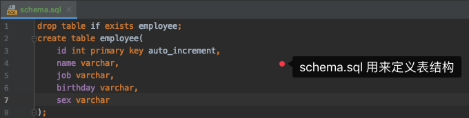

   ```sql
    data.sql 用来增加、修改、删除数据
   ```

   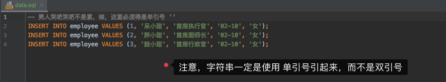

3. 启动项目，分别访问 localhost:8080/employee     localhost:8080/employee/1

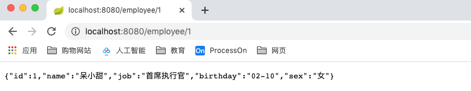

### 缓存

缓存是帮我们中间存储便于我们查询使用的一个中间处理过程。缓存最早是用在CPU中，因为CPU的处理速度非常快，硬盘的处理速度又非常慢，这样CPU先去查找缓存看有没有所需资源，没有然后再去查找RAM。后来慢慢的在数据库中出现缓存，同样的，会先去查找缓存，若缓存中没有该资源，就会去找数据库。

缓存技术，用来存储不经常改变的数据，以提高系统性能和增加系统吞吐量。 

缓存有三大重要因素：命中率、缓存更新策略、缓存最大数据量。 

```abap
1 缓存命中率 = 当前缓存命中的总量/总查询量(命中的量和未命中的量) （期望能够达到85%及以上） 
	* 我们评价缓存设计是好是坏就是通过缓存命中率的高低来判断的。如果缓存命中率过低，也会带来一定的风险和问题。
	* 命中指的是，现在所需的资源，是否来自缓存，也就是是否命中了缓存。
	
2 更新策略（当缓存存满时的处理方式） 
	1）FIFO，先进先出，最先记录缓存的最先被清理。 
	2）LFU，最少使用的元素被清理，记录缓存中的数据被使用的次数，如果过少就别清理掉。 
	3）LRU，最近最少使用的元素被清理，通过两个因素来判断该资源的缓存是否被清理。
		1.时间：数据什么时候被使用了
		2.次数：如果这个数据被使用的次数较多，但是是很久以前被使用，那么清理。
		* 保留的是近期被高频使用的数据。
  
3 最大数据量指
	1.缓存中能处理元素的最大个数;
	2.使用的最大存储空间。 
	* 超过最大数据量，根据更新策略清除数据。
```

### Spring缓存

Spring Cache，是一种基于注解的缓存技术，本质上不是缓存的实现方案，而是对缓存使用的抽象。 既提供了基于内存实现的缓存管理器，可以用于单体应用系统，也集成了 EhCache、Redis 等缓存服务器，可以用于大型系统或者分布式系统。 

通过@EnableCaching注解开启缓存，然后就会去自动化配置合适的缓存管理器（CacheManager）， Spring Boot根据下面的顺序去侦测缓存提供者： ①Generic    ②JCache ( JSR-107)    ③EhCache 2. x    ④Hazelcast    ⑤Infinispan    ⑥Redis    ⑦Guava    ⑧Simple 

也可以手动去配置，对应配置为：spring. cache.t ype=SIMPLE(默认)

#### 缓存使用

在 Spring 管理的 Bean 中使用缓存注解，通常放在 Service 类上。

```java
@CacheConfig，在类上设置当前缓存的一些公共设置，比如缓存名称； 
@Caching，作用在方法上，综合上面的各种操作，在有些场景上，调用业务会触发多种缓存操作。 
// 常用：
对缓存的查询和添加操作  @Cacheable，作用在方法上，触发缓存读取操作。表明该方法的结果是可以缓存的，如果缓存存在，则目标方法不会被调用，直接取出缓存。可以为方法声明多个缓存，如果至少有一个缓存有缓存项，则其缓存项将被返回； 

对缓存的删除操作  @CacheEvice，作用在方法上，触发缓存失效操作，删除缓存项或者清空缓存；属性allEntries是boolean类型，表示是否需要清除缓存中的所有元素，默认为false。用beforeInvocation可以改变触发清除操作的时间，为true时，Spring会在调用该方法之前清除缓存中的指定元素。 

对缓存的修改操作  @CachePut，作用在方法上，触发缓存更新操作，添加该注解后总是会执行方法体，并且使用返回的结果更新缓存，同 Cacheable 一样，支持 condition、unless、key 选项，也支持 KeyGenerator； 


注意，直接使用 SpEL 表达式来指定缓存项的 Key 比自定义一个 KeyGenerator 更为简单。
```

 ```java
 /**
  * @author zhoudw
  * @EnableCache 启动缓存
  */
 @SpringBootApplication
 @EnableCaching
 public class SpringBootZhoudbw09CacheApplication {...}
 ```

```java
* serviceImpl中添加缓存
    /**
     * @Cacheable 作用：
     * 若缓存中不存在该资源，则通过方法查询，查询到之后存入缓存中，
     * 若缓存中存在该资源，则直接通过缓存查到资源。
     */
    @Cacheable("employees")
    @Override
    public Employee getEmployeeById(int id) {
        System.out.println("查询第" + id + "号员工");
        return employeeMapper.getEmployeeById(id);
    }
```

结果：

```java
* 第一次，查询：
  因为是第一次查询，缓存中并没有该资源，所以通过方法去查询，
  查询返回之后，将其结果存入缓存之中。
* 如下图：
```

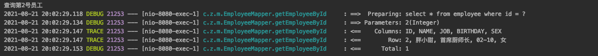

```java
* 第二次，查询：
  因为缓存中已经存在了，所以再次访问 http://localhost:8080/employee/2
	无日志打印，因为查询来自缓存，没有执行方法。
```

##### @Cacheable 增加 / 查询

可以指定三个属性，value、key和condition。

| 参数      | 解释                                                         | example                                                      |
| --------- | ------------------------------------------------------------ | ------------------------------------------------------------ |
| value     | 缓存的名称，在 spring 配置文件中定义，必须指定至少一个       | @Cacheable(value="mycache")                                  |
| key       | 缓存的 key，可以为空。如果指定，则要按照 SpEL 表达式编写；如果不指定，则缺省按照方法的所有参数进行组合 | @Cacheable (value="testcache",key="#userName")               |
| condition | 缓存的条件，可以为空。使用 SpEL 编写，返回 true 或者 false， 只有为 true 才进行缓存 | @Cacheable (value="testcache",condition="#userName.length()>2") |

```java
    @SuppressWarnings("all")
    /**
     *对@Cacheable中参数的使用演示
     * value ： 缓存的名字
     * key ：缓存的键
     * 这个key是作为键，存入cachename中，也就是value中的。
     * condition ： 存储缓存需要满足什么条件
     * unless 和condition相反 ：不满足给定条件是存储缓存
     */
//    @Cacheable(value = "employees", key = "#id", condition = "#id > 1")
    @Cacheable(value = "employees", key = "#id", unless = "#id > 1")
    @Override
    public Employee getEmployeeById(int id) {
        System.out.println("查询第" + id + "号员工");
        return employeeMapper.getEmployeeById(id);
    }
```

---

##### @CachePut 修改

```java
* 修改数据库、修改缓存
  
  ---
  * EmployeeController代码
  	/**
     * 更改员工信息
     */
    @GetMapping("/update")
    public Employee updateEmployee(Integer id, String name, String job, String birthday, String sex) {
        Employee employee = new Employee(id, name, job, birthday, sex);
        // 更新数据库
        employeeService.updateEmployee(employee);
        return employeeService.updateEmployee(employee);
    }

	---
  * EmployeeService代码
    /**
     * 修改Employee
     * @param newEmployee 新的employee，也就是存储了修改信息的employee
     * @return 返回Employee
     * 注意，返回值必须是Employee这个对象。
     * 因为使用缓存时，会把方法的返回值放入缓存中存储。
     * 此时的返回值是特殊的，不再是原先我们做修改时返回的void or int or boolean 了。
     */
    Employee updateEmployee(Employee newEmployee);

	---
  * EmployeeServiceImpl代码
    /**
     * 更改员工信息。
     * @CachePut 将该方法的返回值放入缓存用于更新已经存在的缓存。
     *  缓存的名字，需要一致，要不然就是两个空间了，就不存在修改一说了。
     *  缓存的键，需要一致。保证在同一个空间了，需要保证能够对应上是同一个，这样才能够留一个。
     * 如果缓存中存在该员工的值，那么也要对应修改。
     */
    @CachePut(cacheNames = "employees", key = "#newEmployee.id")
    @Override
    public Employee updateEmployee(Employee newEmployee) {
        System.out.println("更新第" + newEmployee.getId() + "号员工");
        // 更新数据库
        employeeMapper.updateEmployee(newEmployee);
        // 返回已有的修改员工
        return newEmployee;
    }

	---
  * EmployeeMapper代码
    /**
     * 修改员工信息
     * @param newEmployee 这个传递的员工内的信息就是我们要修改数据库的信息
     * @return 此时可以返回int了，因为我们传递来的employee实际上我们需要修改的employee信息。
     */
    @Update("update employee set name=#{name}, job=#{job}, birthday=#{birthday}, sex=#{sex} where id=#{id}")
    int updateEmployee(Employee newEmployee);
```

结果：

1. 查询一遍 id=1的员工记录
   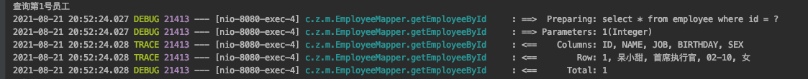
2. 更新 id=1的员工记录
   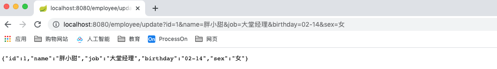
   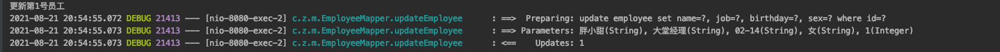
3. 查询 id=1的员工记录
   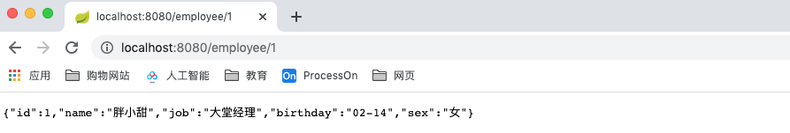
4. 查询到了更新的记录，但是查看日志并没有打印。所以说，我们查询到的记录来自缓存。在我们更新数据的时候，缓存也更新了，所以我们再次查询的时候后，直接就是查到缓存中的内容。
   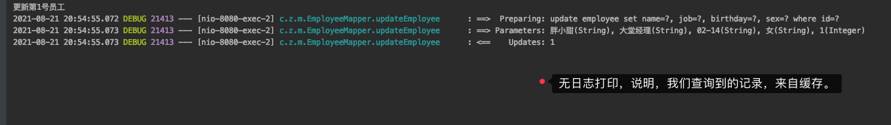

##### @CacheEvice 删除

1. 查看现在所有的记录
   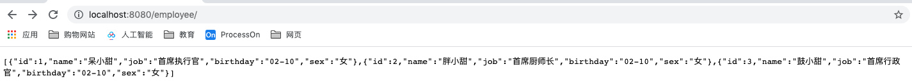
2. 删除2号员工
   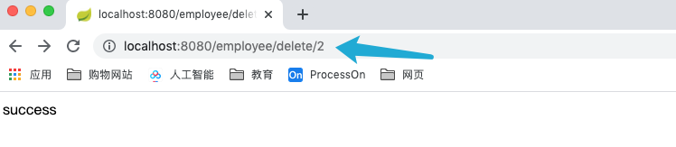
3. 查看现在所有的记录
   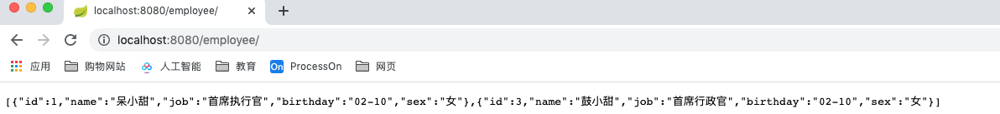

```java
* EmployeeController
    /**
     * 删除员工信息
     * 传id值，通过id来删除
     */
    @GetMapping("/delete/{id}")
    public String deleteEmployee(@PathVariable(name = "id")int id) {
        employeeService.deleteEmployee(id);
        return "success";
    }

---
* EmployeeService
    /**
     * 根据id删除员工
     * @param id 员工id 唯一标识
     */
    void deleteEmployee(int id);

---
* EmployeeServiceImpl
    /**
     * 删除删除员工，同时删除缓存中的数据
     *
     * @param id 员工id 唯一标识
     * @CacheEvict evict驱逐，从缓存中删除该记录
     */
    @CacheEvict(cacheNames = "employees", key = "#id")
    @Override
    public void deleteEmployee(int id) {
        System.out.println("删除第" + id + "号员工");
        employeeMapper.deleteEmployee(id);
    }

---
* EmployeeMapper
    /**
     * 从数据库中根据id删除员工信息
     * @param id
     * @return
     */
    @Delete("delete from employee where id = #{id}")
    int deleteEmployee(int id);
```

###### @CacheEvict源码，查看另外的属性

```java
@Target({ElementType.TYPE, ElementType.METHOD})
@Retention(RetentionPolicy.RUNTIME)
@Inherited
@Documented
public @interface CacheEvict {

	@AliasFor("cacheNames")
	String[] value() default {};

	@AliasFor("value")
	String[] cacheNames() default {};

	String key() default "";

	String keyGenerator() default "";

	String cacheManager() default "";

	String cacheResolver() default "";

	String condition() default "";

  /**
   对这个属性做重点说明：
   allEntries 设置为true时，表示从缓存中删除所有的内容
   默认是false 不删除缓存中的所有内容  
  */
	boolean allEntries() default false;

  /**
  对这个属性做重点说明：
  beforeInvocation 设置为false 表示在方法执行之后执行删除缓存的操作
  beforeInvocation 设置为true  表示在方法执行之前执行删除缓存的操作
  当设置为false时，方法执行出错，那么缓存中的内容是删除不了的。 
  */
	boolean beforeInvocation() default false;
}
```

##### 说明：

从上面的案例来说，@Cacheable 和 @CachePut 以及 @CacheEvict都有属性 cacheNames ，那么当都需要使用这个注解的时候，可不可以将其抽离出来，作为一个独一的，可以供所有的注解使用的属性呢？ —— 可以，通过 @CacheConfig。利用这个注解，可以设置通用的属性值。

```java
/**
 * @author zhoudbw
 * @CacheConfig 设置通用属性值。 设置
 */
@CacheConfig(cacheNames = "employees")
@Service
public class EmployeeServiceImpl implements EmployeeService {...}
```

@Caching组合注解

```java
@Target({ElementType.TYPE, ElementType.METHOD})
@Retention(RetentionPolicy.RUNTIME)
@Inherited
@Documented
public @interface Caching {

	Cacheable[] cacheable() default {};

	CachePut[] put() default {};

	CacheEvict[] evict() default {};

}
```

如果一个方法需要 @Cacheable 、@CachePut、@CacheEvict一起使用的时候就可以使用这个注解。设置方式：

```java
@Caching(cacheable = {...}, put = {...}, evict = {...})
* 设置方式和我们上面的设置方式是一样的。
```


