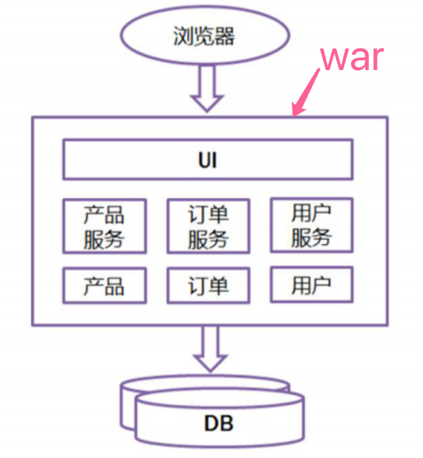
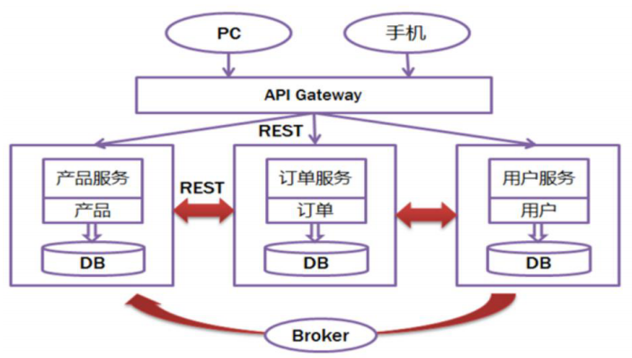

## 微服务

一解释就懂，一问就不知，一讨论就打架。微服务的提出者Martin Fowler，敏捷开发的创始人。

### 微服务的发展

**为什么要提出微服务？**

首先要从最早的单体应用说起：



浏览器发送一个请求过来，有个很大的war包，部署在容器上。这个war包可以做：产品服务、订单服务、用户服务，这些服务也只是一个个模块，不同的模块连接不同的业务逻辑，连接同一个数据库。这是早期的状态。

随着流量的增加、并发的增加，一个单独的单体应用是支撑不了更多的用户和更多的访问的。这个时候就走向了分布式和集群。并且会根据模块拆分成不同的服务。比如说：产品服务，那么作为一个单独的应用；订单服务，那么作为一个单独的应用；用户服务，那么作为一个单独的应用。

早期，浏览器发送多个请求，不同的请求去寻找对应的应用，再去连接不同的DB。

这也带来了一个问题，有多个服务，服务和服务之间的关联关系是从浏览器端分发的，这就有了负载均衡的问题，以及不方便管理的问题。从实践看来这种方式是不够合理的。那么我们想要统一的做一个入口管理怎么办呢？添加了一个网关（Gateway）。从浏览器发送过来的请求，都会经过一层网关，然后从网关发送不同的服务，进行处理。

后来也就发展成了这样的情况：



多个访问源，不在仅仅是PC端，访问源先经过网关(网关进行一些安全的校验、负载均衡的分发)，然后网关回去查询调用的是哪层服务，调用产品给产品、调用订单给订单、调用用户给用户，并且这多个服务之间是有关联关系的（这个关联关系包括一些监控、健康检查等等）。发展到这个阶段也就有点类似于微服务了。

### 微服务

#### 微服务概念

微服务是一种分布式系统架构，是一种思想，是一种设计原则。 所以需要了解是如何从单体应用，走向分布式应用，这样才能理解微服务给我们带来什么。

SpringBoot为什么能够和微服务那么好的集成？微服务，就是将一个大的服务拆分成多个小的服务。SpringBoot天然的支持一个新应用的搭建以及少量代码的部署，这些都是SpringBoot的优势，所以能够更好的支持微服务，成为了搭建微服务框架的一个通用标准。基于Spring Boot 的特性、我们可以快速构建独立的微服务。是Java 领域最优秀的微服务架构落地技术。

与此同时，在我们使用SpringBoot搭建微服务之后，我们就需要更多的去关注多个服务的治理，也就是怎么确保服务是健康的，遇到问题怎么去处理等等。SpringCloud就是全局的服务治理框架，SpringCloud提供给我们服务治理的方案。

这就是微服务和SpringBoot和SpringCloud之间，相辅相成的关联关系。

#### 微服务架构

1）服务提供者，向注册中心注册服务，声明服务列表和地址，完成发布。 

- 比如说，提供一个订单的服务，那么会向注册中心注册这个服务，声明服务列表和地址，这叫做服务的发布。这是在启动的时候做的一系列动作。

2）服务消费者，请求注册中心，查询地址，按照约定的协议发起请求，然后解析结果。 

- 服务消费者会请求注册中心，比如说现在想要使用订单服务，那么注册中心就会查询订单服务的地址，然后将请求按照约定的协议发送给订单服务，然后订单服务通过注册中心会返回给服务消费者一个结果，这样就可以解析一个结果了。

3）服务调用过程中，经过的链路信息会被记录下来，用于监控和追踪。 

- 上述过程将链路信息会被记录下来，用于后续的监控和追踪。

微服务：服务提供者，向注册中心注册服务，然后服务消费者，去注册中心找这个服务，同时在服务调用过程中，记录下所有的信息，这样构成了微服务的架构。

#### 微服务要素

从上述我们发现，微服务其实是由几个要素组成的，包括：服务描述、注册中心、服务框架、服务监控、服务追踪、服务治理。 

**服务描述**：常用方式RESTful API (可以集成Swagger)、 XML、IDL文件（常用于跨语言服务调用） 

```
服务描述，也就是我们需要提供什么样的服务，我们要提前定义好。并且要有一个描述的信息。
* 对于服务的描述，我们经常使用的方式就是RESTful的API，这个API可以集成Swagger这样的文档生成工具，这样我们就能看到提供了多少个接口以及功能。
```

**注册中心**：服务的发布和订阅，当提供者发生变化，注册中心会通知到消费者。 

```
有了服务的描述，注册中心对服务进行发布和管理，可以使其被消费。这样才能正常的运转。
* 通过注册中心对服务进行发布和订阅。
* 注册中心还有一个便利，当服务的提供者发生变化的时候，注册中心会通知给消费者，告知服务发生了变化。
* 注册中心就相当于提供了一个大管家的作用。
```

**服务框架**：通信协议、数据传输方式、数据压缩格式(json protobuf等) 

```
有了注册中心还要有服务框架本身，也就是说还要有了注册中心去调用服务、接收返回结果这样的流程。我们称之为服务框架，其中涉及了一些通信协议、数据传输方式、数据压缩格式等等内容。
* 通过具体的框架，规定服务者和消费者之间是如何通信的、数据如何传输、具体数据格式是什么、等等。以确保可以互通有无。
* 至此一个服务就可以运转起来了。
* 但是健康的运转才是我们要达到的目标。
```

**服务监控**：指标收集 - > 数据处理 - > 数据展示 

```
* 监控，通过日志的指标收集，中间数据的处理，最后变成了所需要的监控指标的展示。
* 其实就是上述的三个步骤，只不过这个过程中有很多自定义的东西。
```

**服务追踪**：消费者调用前，会在本地生成一个requestId，调用时将此i d作为参数传递，提供者会记录此id , 如果再请求其他服务，会再生成一个requestId，和前一个requestId一起传递下去。最终无论请求多少个服务，都能够通过最初的requestId追踪到。

```
* 比如，当发现某一项健康指标出现问题，那么我们需要看为什么出现了问题，这就是一个定位问题的过程。
* 如何去查看这个问题？
	* 当一个功能涉及到很多的链路的时候：
		* 服务A   调用   服务B   调用   服务C ...
		*         ————→        ————→
    * 这种情况，定位是非常难的，这个时候就需要 服务A 生成一个id也就是requestId；
      在A去调用 服务B 的时候将这个requestId作为参数传递给B，同时B也生成一个requestId；
      在B去调用 服务C 的时候将A的requestId、B的requestId作为参数传递给C，同时C也生成一个requestId；
      如此下去...
    * 这样就能通过一个初始的id，去跟踪整个链路，不管其中调用了多少服务，都可以通过第一个id找到。
* 这就是追踪的一个实验方案。
```

**服务治理**： 监控是为了发现问题，追踪是为了定位问题，治理是为了解决问题。 

```
有了服务的基础功能之后，还要有服务监控、服务追踪、服务治理以维护服务的正常运转。
```

```
* 有了监控我们知道服务是否健康，有了追踪知道哪里不健康。
* 接下来就需要去解决不健康的问题。
* 这就是一个发现问题、定位问题、解决问题的过程。
```

常见的问题有：单机故障(自动摘除节点)、单IDC故障(自动切换流量)、依赖服务不可用(熔断)。

* 单机故障

  ```
  服务部署到多个节点上，比如：
  * 服务A ，部署到 1、2、3、4四个节点上。
  * 这个时候节点4挂掉了（不可用）。
  * 这就是单机故障，也叫单节点故障。
  ---
  怎么办呢？
  * 这个时候我们需要将这个坏的节点拿掉。
  * 负载均衡会均匀的发送给各个节点，这个时候当然要将这个节点拿掉，不让请求再发送给这个节点（不给该节点流量了）。
  * 这就是一种自动摘除节点的治理方案。
  ```

* 单IDC故障

  ```
  我们获取听说过某个公司的光缆被挖，导致服务不可用，这我们称为单IDC故障。
  * 也就是 流量 ———————×———→ 服务。
  * 怎么处理呢？
  ---
  * 这个中途发生了故障，这个时候就需要去切换不同的流量，使其走不同的链路，已达到服务保障
  * 流量 ————————×————————→ 服务
  					  故障
  					  
  * 流量 ————————————————→ 服务
              正常
  ```

* 依赖服务不可用

  ```
  比如，
  * 服务A依赖服务B，也就是说，请求服务A，需要先访问服务B，服务B得到结果给服务A，然后服务A处理才能得到最终结果。
  * 这就是一个依赖关系。
  * 如果A去访问B，发现B访问不了，那么用户看到的就是服务A不可用了。
  * 显然是不能让用户看到这样的，那怎么办呢？
  ---
  熔断措施。
  * 发现B不可访问了，那么就不访问B。
  * 返回其他的数据、或者部分的数据、或者是一些提醒。
  * 不能让A导致不可用。
  ```

```abap
* 服务描述、注册中心、服务框架、服务监控、服务追踪、服务治理。 
先要定义服务，然后交给注册中心管理，通过服务框架运转服务。
通过监控、追踪、治理是保证服务能够健康运转的基石。
这就是微服务的六大要素。
```

#### 容器化和Devops

```
微服务将每个服务细粒到了每个微小的服务中去了。
带来的问题就是：测试和发布工作量增加；不同微服务所需要的运行环境不同，扩容缩容时非常繁琐。 
* 原先单体应用上线一个服务就可以了，变成微服务之后，要上线N多个服务。
* 不同的微服务可能需要不同的运行环境，这在扩充节点和减少节点的时候就很繁琐。
	* 比如说，原先只有10个节点就能够支持正常的服务，但是双十一期间：
		* 峰值是平时的数倍，那么就需要扩充节点，增加到22个节点部署。这就是扩容。
		* 双十一过后，将节点数量降低，这就是缩容。
	* 根据流量的变化对节点的数量进行伸缩，这就是扩容和缩容的状态。

针对上述问题我们怎么去解决呢？
容器化和Devops ↓↓↓
```

- Devops可以理解为开发和运维的结合（开发  + 运维 = Devops），也就是，服务的开发者同时负责测试、上线发布及故障处理等运维工作。
- 怎么实现Devops呢？ ↓↓↓ Docker容器技术。 

- Docker容器技术，容器的本质是linux操作系统里的进程，解决运行时隔离的问题。与此同时，Docker镜像不只可以打包应用程序本身，还可以打包应用程序的所有依赖，甚至是操作系统，极大地解决了环境迁移问题，这样就解决了微服务中不同的服务所依赖的环境不同，扩容缩容不便利的问题。 

- ```
  Docker镜像分层机制： 
  1）基础环境层：操作系统版本、时区语言等。 
  2）运行环境层：比如，jdk版本等。 
  3）web容器层：tomcat容器的jvm参数等。 
  4）业务代码层：实际的业务代码版本。
  ```

## SpringBoot与微服务及SpringCloud的关系 

### SpringCloud

SpringCloud是一个基于SpringBoot实现的云应用开发工具， 它为基于JVM的云应用开发中的配置管理、服务发现、断路器、智能路由、微代理、控制总线、全局锁、决策竞选、分布式会话和集群状态管理等操作提供了一种简单的开发方式。

Spring → SpringBoot → SpringCloud

SpringCloud简化分布式系统的开发，做到

```
1.配置管理 
2.服务注册与发现 
3.熔断、服务追踪
```

**在应用程序从单机向集群向云的发展过程中，springcloud能更轻松的开发出基于云的应用程序。**

